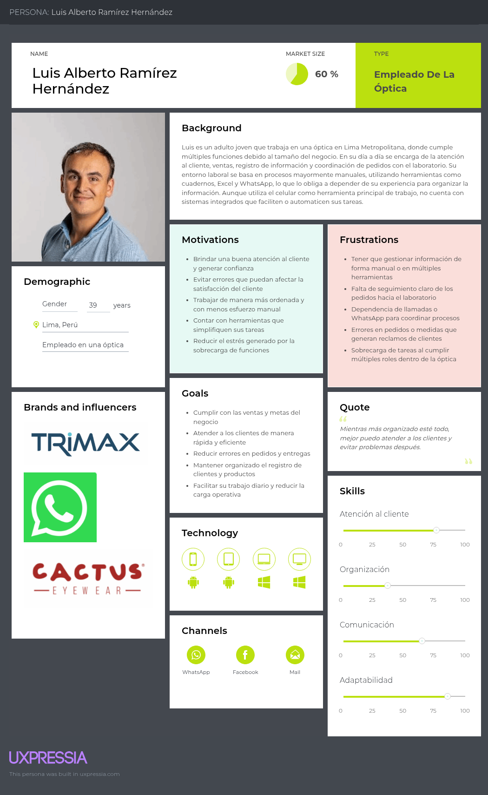
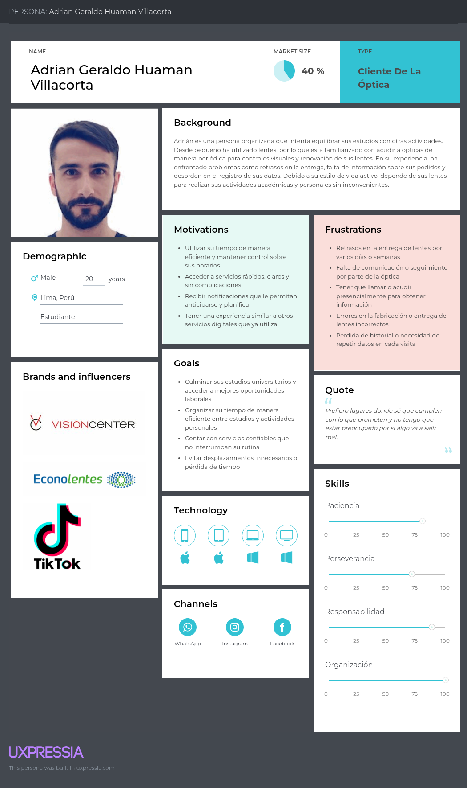
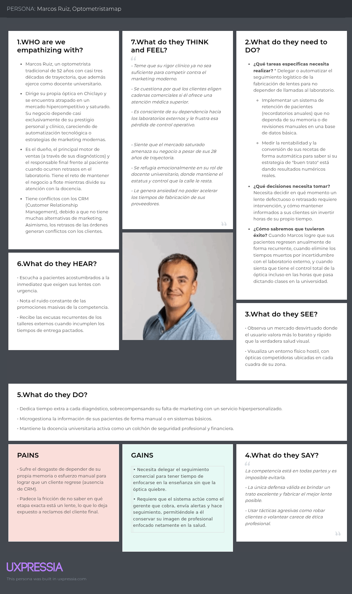
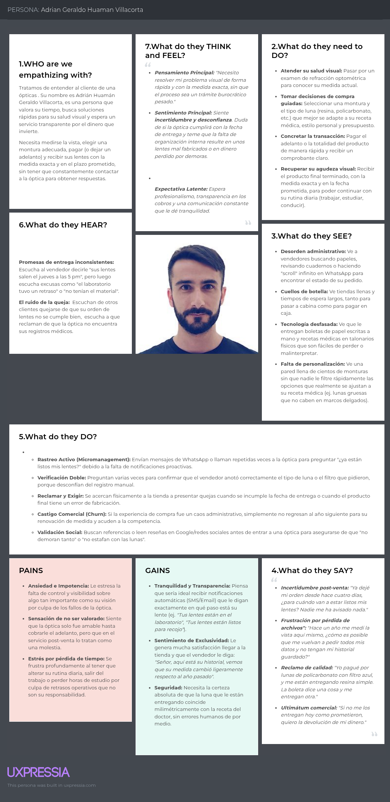

# Capítulo II: Requirements Elicitation & Analysis

## Competidores
#### Optical CRM
Optical CRM es un software orientado a la gestión comercial de ópticas, centrado en la administración de clientes, ventas e inventario básico. Su propuesta se basa en ofrecer múltiples funcionalidades comerciales en un solo sistema a bajo costo, lo que lo hace accesible para negocios que buscan una solución rápida sin alta inversión. Está dirigido principalmente a ópticas pequeñas y medianas que priorizan la organización del área de ventas sobre la complejidad operativa. Su fortaleza radica en la facilidad de implementación y en su precio reducido; sin embargo, su enfoque está limitado al área comercial, por lo que no resuelve problemas operativos más complejos como la trazabilidad de órdenes de trabajo, la integración con el área clínica ni la coordinación con laboratorios de producción.

#### RevolutionEHR
RevolutionEHR es un sistema en la nube especializado en la gestión clínica de optometría, diseñado para digitalizar la atención médica y mejorar la administración de pacientes en consultorios y clínicas oftalmológicas. Su principal ventaja competitiva radica en la profundidad de su módulo clínico, que permite registrar información médica detallada y optimizar el flujo de atención. Se posiciona como líder en soluciones clínicas mediante contenido digital y demostraciones orientadas a profesionales de la salud. Sin embargo, no integra de forma completa los procesos comerciales ni logísticos, lo que obliga a las ópticas a depender de sistemas adicionales para cubrir la gestión de ventas, el control de inventario y la coordinación con laboratorios, generando precisamente los silos de información que OptiFlow busca eliminar.

#### Glasson
Glasson es una plataforma de gestión en la nube diseñada específicamente para negocios ópticos, que combina en un mismo entorno la administración clínica y comercial. Está orientada a ópticas y consultorios optométricos de tamaño pequeño a mediano que buscan digitalizar su operación sin implementar soluciones genéricas de ERP. Su fortaleza principal es haber sido construida exclusivamente para el sector óptico, lo que le permite manejar terminología y flujos propios de la industria con una curva de aprendizaje reducida. No obstante, no ofrece trazabilidad real de las órdenes de trabajo hacia laboratorios externos ni un tablero de estados tipo Kanban, y carece de integración profunda entre la receta clínica y la generación automatizada de órdenes de producción, limitando su utilidad en ópticas con alto volumen operativo.

## Análisis Competitivo

**OBJETIVO DEL ANÁLISIS**

El objetivo es comparar OptiFlow con soluciones existentes para identificar en qué aspectos compite directamente y en cuáles se diferencia, validando su propuesta como un sistema integrado frente a herramientas que solo cubren funciones parciales del negocio óptico.

| | **OPTIFLOW** | **OPTICAL CRM** | **REVOLUTIONEHR** | **GLASSON** |
|---|---|---|---|---|
| **Overview** | OptiFlow es una plataforma web ERP/CRM orientada a ópticas con alto volumen de atención, que centraliza en un solo sistema la gestión clínica, comercial y operativa. Su propuesta se basa en eliminar la fragmentación entre consultorio, ventas e interacción con laboratorio, digitalizando procesos que actualmente se manejan de forma manual. | Optical CRM es un software orientado a la gestión comercial de ópticas, centrado en la administración de clientes, ventas e inventario básico. Su enfoque principal es mejorar la organización del área de ventas. | RevolutionEHR es un sistema en la nube especializado en la gestión clínica de optometría, diseñado para digitalizar la atención médica y mejorar la administración de pacientes. | Glasson es una plataforma de gestión en la nube diseñada específicamente para negocios ópticos, que abarca tanto la administración clínica como la comercial. Está orientada a modernizar la operación de consultorios y tiendas ópticas integrando en un mismo entorno la agenda, el historial del paciente y la gestión de ventas. |
| **Ventaja competitiva** | Su principal valor es la integración de todo el flujo operativo en un único sistema. A diferencia de otras soluciones, no separa la atención clínica de la venta ni de la producción, sino que conecta estos procesos de manera continua, lo que permite reducir errores, mejorar la trazabilidad y optimizar la toma de decisiones. | Su principal ventaja es ofrecer múltiples funcionalidades comerciales en un solo sistema a bajo costo, lo que lo hace accesible para negocios que buscan una solución rápida sin alta inversión. | Destaca por su profundidad en la gestión clínica, permitiendo registrar información médica detallada y optimizar el flujo de atención en consultorios. | Su principal fortaleza radica en estar construido exclusivamente para el sector óptico, lo que le permite combinar funcionalidades clínicas y comerciales con terminología y flujos propios de la industria, sin requerir configuraciones complejas. |
| **Mercado objetivo** | Está dirigido a ópticas medianas que manejan un alto volumen de pacientes y operaciones diarias, donde los procesos manuales generan ineficiencias visibles. | Ópticas pequeñas y medianas que priorizan la gestión de ventas y clientes sobre la complejidad operativa. | Consultorios y clínicas de optometría que requieren un sistema robusto para la gestión de pacientes y procesos médicos. | Ópticas y consultorios optométricos de tamaño pequeño a mediano que buscan digitalizar su operación sin implementar soluciones genéricas de ERP. |
| **Estrategias de marketing** | Se enfoca en ventas directas a empresas mediante demostraciones del sistema, implementación de pilotos gratuitos para validar resultados y crecimiento a través de referidos dentro del sector óptico. | Utiliza demostraciones bajo solicitud y se posiciona a través de su bajo precio como una alternativa accesible. Además, aprovecha canales directos como WhatsApp para captar clientes. | Se posiciona como líder en soluciones clínicas mediante contenido digital, posicionamiento en buscadores y demostraciones del producto orientadas a profesionales de la salud. | Se posiciona mediante contenido educativo en su blog dirigido a profesionales del sector visual, presencia en buscadores y demostraciones web bajo solicitud. Aprovecha la percepción de especialización sectorial como argumento central de venta. |
| **Productos y servicios** | Incluye historia clínica electrónica, gestión de ventas, control de inventario, generación de órdenes de trabajo y seguimiento de estas mediante un sistema visual de estados, además de notificaciones al cliente. | Incluye CRM, punto de venta, facturación e inventario básico. Sin embargo, no incorpora herramientas avanzadas para la gestión clínica ni para la producción de lentes. | Incluye historia clínica electrónica, agenda de citas, facturación y herramientas para la gestión de pacientes. No está orientado a la gestión comercial ni logística completa. | Incluye agenda de citas, historia clínica electrónica, punto de venta, gestión de pacientes y comunicaciones básicas con el cliente. No cuenta con un módulo logístico avanzado ni con trazabilidad de órdenes de trabajo hacia laboratorios externos. |
| **Precios y costos** | Maneja un modelo de suscripción mensual tipo SaaS con planes de pago escalonados según la cantidad de sucursales, usuarios y volumen de transacciones procesadas. No cuenta con versión gratuita, dado que su propuesta de valor está orientada a ópticas medianas con operaciones de alto volumen que requieren un sistema robusto y completo. | Ofrece un modelo de bajo costo con planes accesibles y sin cargos complejos, lo que facilita su adopción. | Modelo de suscripción con costo elevado en comparación con otras soluciones, lo que limita su acceso en mercados más sensibles al precio. | Modelo de suscripción mensual con diferentes planes según el tamaño del negocio. Su precio es competitivo frente a soluciones clínicas más robustas orientadas al mercado anglosajón. |
| **Canales de distribución** | Aplicación web accesible desde navegadores en computadoras y tablets, sin dependencia de instalación local. | Disponible en la nube mediante navegador y en algunos casos versión de escritorio. | Plataforma web en la nube con acceso desde distintos dispositivos y soporte móvil. | Plataforma web en la nube, accesible desde navegador sin instalación local, con soporte en múltiples dispositivos. |
| **Fortalezas** | Integra procesos que normalmente funcionan de forma separada, lo que reduce la duplicidad de información y los errores operativos. Además, está diseñado en función de problemas reales identificados en ópticas, como el uso de herramientas informales y la falta de seguimiento de pedidos. | Es fácil de implementar y permite mejorar rápidamente la organización comercial. Su precio lo convierte en una opción atractiva para negocios con presupuesto limitado. | Ofrece una gestión clínica sólida y confiable, con funcionalidades diseñadas específicamente para el trabajo médico. | Está diseñado desde su origen para el sector óptico, lo que reduce la curva de aprendizaje. Combina la parte clínica y comercial en una misma interfaz, ofreciendo una experiencia más cohesionada que los sistemas genéricos. |
| **Debilidades** | Al ser una solución en desarrollo, aún no cuenta con validación en el mercado ni base de clientes. Asimismo, su funcionamiento depende de que los usuarios adopten el sistema en todas las etapas del proceso. | Su enfoque está limitado al área comercial, por lo que no resuelve problemas operativos más complejos como la trazabilidad de órdenes o la integración con el área clínica. | No integra de forma completa los procesos comerciales ni logísticos, lo que genera dependencia de otros sistemas para cubrir esas áreas. | No ofrece trazabilidad real de las órdenes de trabajo hacia el laboratorio ni un tablero de estados tipo Kanban. Tampoco cuenta con integración profunda entre la receta clínica y la generación automatizada de órdenes de producción. |
| **Oportunidades** | Existe una clara necesidad de digitalización en el sector óptico, especialmente en negocios que han crecido sin adoptar sistemas integrados. Esto abre espacio para soluciones que optimicen la operación completa. | Puede expandirse en mercados donde el precio es el principal factor de decisión, especialmente en negocios pequeños que buscan digitalizarse parcialmente. | El crecimiento de la digitalización en salud impulsa la adopción de sistemas clínicos, especialmente en mercados desarrollados. | La creciente demanda de digitalización en el sector óptico latinoamericano representa un mercado en expansión, especialmente en países donde aún predominan los procesos manuales. |
| **Amenazas** | La entrada de competidores con mayor desarrollo o recursos podría limitar su crecimiento. Además, la resistencia al cambio en procesos tradicionales puede dificultar la adopción inicial. | Soluciones más completas pueden reemplazarlo al ofrecer integración entre áreas, lo que responde mejor a necesidades operativas más complejas. | Soluciones integradas que combinan clínica, ventas y operación pueden desplazarlo al ofrecer mayor eficiencia en el manejo total del negocio. | Plataformas que integren de forma más completa el ciclo clínico, comercial y de producción pueden desplazarlo al resolver problemas operativos que Glasson no atiende, como el seguimiento de pedidos y la coordinación con laboratorios. |

## Estrategias y tácticas frente a competidores

- <b>Integración total del flujo operativo como diferenciador central:</b>
  Como estrategia principal, OptiFlow se diferencia al unificar en un solo sistema la gestión clínica, comercial y logística de laboratorio. Esto permite afrontar directamente la debilidad de competidores como RevolutionEHR, que ofrece una sólida gestión clínica pero carece de integración con ventas y producción, y de Glasson, que combina clínica y comercial pero no resuelve la trazabilidad hacia laboratorios externos. La táctica consiste en demostrar, mediante pilotos gratuitos en ópticas medianas, cómo la conexión directa entre la receta del optómetra, la venta en mostrador y la orden de trabajo al laboratorio elimina los errores de transcripción y los silos de información que generan pérdidas económicas.

- <b>Trazabilidad de órdenes de trabajo como ventaja exclusiva:</b>
  Frente a soluciones como Optical CRM y Glasson, que no cuentan con un módulo logístico avanzado ni con un tablero de seguimiento de órdenes, OptiFlow incorpora un sistema Kanban que permite visualizar en tiempo real el estado de cada pedido en el laboratorio. La táctica se centra en posicionar esta funcionalidad como la respuesta directa al principal punto de dolor identificado en las entrevistas: la falta de comunicación proactiva sobre el avance de fabricación, que obliga a los clientes a llamar o acudir físicamente a la óptica para conocer el estado de sus lentes.

- <b>Modelo de adquisición basado en resultados demostrables:</b>
  A diferencia de RevolutionEHR, cuyo modelo de suscripción elevado representa una barrera de entrada significativa en mercados sensibles al precio como el latinoamericano, OptiFlow adopta una estrategia de entrada mediante pilotos gratuitos y ventas directas B2B. La táctica consiste en cuantificar y evidenciar resultados concretos durante el periodo piloto, como la reducción de trabajos rehechos y la mejora en la tasa de conversión de recetas a ventas, para convertir esos datos en el argumento principal de cierre comercial.

- <b>Especialización vertical frente a soluciones genéricas:</b>
  Frente a Optical CRM, que ofrece funcionalidades comerciales básicas sin comprensión profunda del negocio óptico, OptiFlow aprovecha su conocimiento del sector para diseñar flujos que responden a la lógica específica de una óptica: la relación entre la complejidad clínica de la receta, la venta retail de la montura y la fabricación en el laboratorio. La táctica consiste en resaltar esta especialización durante las demostraciones comerciales, evidenciando cómo las validaciones automáticas del sistema, como el bloqueo de órdenes sin receta o las alertas de stock cruzadas con cotizaciones activas, son imposibles de replicar con herramientas genéricas.

- <b>Aprovechamiento de la brecha de digitalización en el mercado latinoamericano:</b>
  Ante la amenaza de competidores con mayor desarrollo como RevolutionEHR y Glasson, que se orientan principalmente al mercado anglosajón, OptiFlow identifica como oportunidad estratégica la baja penetración de soluciones integradas en ópticas medianas de Lima Metropolitana y otras ciudades del Perú. La táctica consiste en posicionarse tempranamente en este segmento desatendido, construyendo una base de clientes local antes de que competidores internacionales adapten sus productos al contexto latinoamericano, y aprovechando el conocimiento del mercado peruano como barrera de entrada diferencial.
## Entrevistas

### Diseño de entrevistas

Preguntas generales:

1.       Datos de perfil: ¿Podrías indicarme tu nombre,  edad, estado civil y ocupación exacta?

2.       Contexto personal: ¿En qué distrito resides y cuáles dirías que son tus principales objetivos profesionales este año? (dudo sobre esta ultima pregunta)

3.       Entorno digital: ¿Qué dispositivos (móvil, tablet, laptop) usas más en tu vida diaria y cuáles son tus canales digitales o marcas preferidas para informarte sobre el sector?

### Registro de entrevistas

**PRIMER SEGMENTO OBJETIVO**

<u>Entrevista 1:</u>

Entrevistador: 

Datos del entrevistado

- **Nombre:** 
- **Apellidos:** 
- **Edad:** 
- **Distrito:** 
- **Inicio:**
- **Duración:** 
- **Link de la entrevista individual:** 
  
  **Resumen descriptivo:**

<u>Entrevista 2:</u>

Entrevistador: 

Datos del entrevistado

- **Nombre:** 
- **Apellidos:** 
- **Edad:** 
- **Distrito:** 
- **Inicio:**
- **Duración:** 
- **Link de la entrevista individual:** 
  
  **Resumen descriptivo:**

<u>Entrevista 3:</u>

Entrevistador: 

Datos del entrevistado

- **Nombre:** 
- **Apellidos:** 
- **Edad:** 
- **Distrito:** 
- **Inicio:**
- **Duración:** 
- **Link de la entrevista individual:** 
  
  **Resumen descriptivo:**

**SEGUNDO SEGMENTO OBJETIVO**

<u>Entrevista 1:</u>

Entrevistador: Luciana Mechan

Datos del entrevistado

- **Nombre:** Carla 
- **Apellidos:** Gallardo Morales
- **Edad:** 19 años
- **Distrito:** La Molina
- **Inicio:** 01:32:52
- **Duración:** 00:10:24
- **Link de la entrevista individual:** [Ver grabación aquí](https://upcedupe-my.sharepoint.com/:v:/g/personal/u20241b843_upc_edu_pe/IQAZEDLQjb3TQI-KfPgpdzw_ATQXFe5OTK8RGiCotvF5-TU?nav=eyJyZWZlcnJhbEluZm8iOnsicmVmZXJyYWxBcHAiOiJTdHJlYW1XZWJBcHAiLCJyZWZlcnJhbFZpZXciOiJTaGFyZURpYWxvZy1MaW5rIiwicmVmZXJyYWxBcHBQbGF0Zm9ybSI6IldlYiIsInJlZmVycmFsTW9kZSI6InZpZXcifX0%3D&e=jkQVAh)

**Resumen descriptivo:**

La entrevistada Carla Gallardo, de 19 años, residente en La Molina y estudiante universitaria de ingeniería, presenta un perfil digitalmente activo, utilizando principalmente la computadora y el teléfono móvil en su rutina diaria. Sus canales preferidos de interacción incluyen WhatsApp, Instagram y TikTok, siendo este último incluso utilizado como medio de búsqueda de información. Sus objetivos se centran en el ámbito académico, buscando avanzar en su carrera y aplicar sus conocimientos en el futuro profesional, lo que evidencia una necesidad de eficiencia y organización en los servicios que utiliza.

En cuanto a su experiencia en ópticas, describe el proceso como generalmente simple, iniciando con la medición visual y seguido por la elección de monturas según su estilo personal. Sin embargo, identifica que el tiempo puede incrementarse cuando no encuentra modelos de su agrado. Asimismo, el tiempo de entrega de los lentes varía dependiendo del establecimiento, pudiendo ser inmediato o tardar algunos días, lo cual resulta crítico debido a su dependencia de los lentes para sus actividades académicas. En relación con el seguimiento del pedido, indica que no existe visibilidad del proceso, ya que solo se le comunica una fecha de entrega sin actualizaciones intermedias, lo que evidencia una falta de comunicación proactiva por parte de las ópticas.

Finalmente, la entrevistada menciona experiencias negativas como errores en la medida de los lentes, así como la importancia de factores como la higiene, la calidad del servicio y el cumplimiento de las especificaciones solicitadas. Considera inaceptable la falta de limpieza o errores en el producto final. Además, destaca que en establecimientos más digitalizados se conserva su historial, mientras que en ópticas pequeñas este suele perderse. También señala la ausencia de seguimiento posterior a la compra, lo que refleja oportunidades de mejora en fidelización. En conjunto, se trata de una usuaria con expectativas de eficiencia, transparencia y control, influenciada por experiencias digitales modernas y con baja tolerancia a errores o desorganización.

<u>Entrevista 2:</u>

Entrevistador: Mía Capillo

Datos del entrevistado

- **Nombre:** Isabella Lourdes
- **Apellidos:** Martinez Parra
- **Edad:** 19
- **Distrito:** La Molina
- **Inicio:** 01:24:15
- **Duración:** 00:11:44
- **Link de la entrevista individual:** https://upcedupe-my.sharepoint.com/:v:/g/personal/u20241c101_upc_edu_pe/IQD6_x6LnGFrRI1oRJKsXr-0AX0ZlYAGWkN-V3deJtd0eJw?e=VoLxyX 

  
  **Resumen descriptivo:**

La entrevistada Isabella Martínez Parra, de 19 años, residente en La Molina y estudiante universitaria, presenta un perfil altamente familiarizado con la tecnología, la cual integra en su vida diaria. Sus hábitos de consumo incluyen marcas reconocidas y una interacción constante con herramientas digitales, lo que eleva sus expectativas sobre la eficiencia y modernidad de los servicios que recibe. Su principal objetivo es el rendimiento académico, el cual se ve directamente comprometido ante cualquier falla en su salud visual, evidenciando una dependencia crítica de sus lentes para actividades cotidianas como tomar apuntes o visualizar proyecciones en clase.

En cuanto a su experiencia en ópticas, prefiere el uso de citas programadas para garantizar un proceso ágil. Si bien considera que la elección de monturas y la atención del oftalmólogo suelen ser fluidas, identifica el tiempo de entrega como el factor más crítico y problemático. Ha tenido experiencias negativas donde el incumplimiento de fechas y la falta de soluciones proactivas la llevaron a abandonar establecimientos de forma definitiva. Además, señala una carencia de visibilidad durante la fabricación del producto, teniendo que ser ella quien contacte a la óptica para obtener actualizaciones, lo que refleja una gestión de comunicación reactiva por parte de los proveedores.

Finalmente, Isabella destaca errores técnicos, como medidas incorrectas en el producto final, como una falla inaceptable que agrava su situación académica. Valora positivamente que las ópticas mantengan un historial clínico para facilitar sus controles anuales y sugiere la implementación de plataformas digitales de seguimiento en tiempo real. En conjunto, se trata de una usuaria que demanda competencia técnica y puntualidad extrema, con una clara inclinación hacia procesos digitalizados que le brinden autonomía y seguridad sobre el estado de su compra.

<u>Entrevista 3:</u>

Entrevistador: 

Datos del entrevistado

- **Nombre:** 
- **Apellidos:** 
- **Edad:** 
- **Distrito:** 
- **Inicio:**
- **Duración:**  
- **Link de la entrevista individual:** 
  
**Resumen descriptivo:**

**Enlace del video único de las entrevistas:** [ver grabación aquí](https://upcedupe-my.sharepoint.com/:v:/g/personal/u20241b843_upc_edu_pe/IQBQcjn6Xii8QZurFaFX-gjHAb6EPimDCPRiufDcZfNdTk8?e=DQ8O6O&nav=eyJyZWZlcnJhbEluZm8iOnsicmVmZXJyYWxBcHAiOiJTdHJlYW1XZWJBcHAiLCJyZWZlcnJhbFZpZXciOiJTaGFyZURpYWxvZy1MaW5rIiwicmVmZXJyYWxBcHBQbGF0Zm9ybSI6IldlYiIsInJlZmVycmFsTW9kZSI6InZpZXcifX0%3D)

### Análisis de entrevistas

En la presente sección se desarrolla el análisis de las entrevistas realizadas a los segmentos objetivo definidos para la solución: empleados de ópticas y clientes. Este análisis tiene como finalidad identificar, con sustento en la evidencia recogida, las características objetivas y subjetivas más representativas de cada segmento, expresadas en términos porcentuales, de modo que sirvan como base para la construcción de los arquetipos (User Personas). 

### Segmento: Empleados de la óptica
Para este segmento se realizaron tres entrevistas a profesionales que desempeñan funciones dentro de ópticas, incluyendo roles como optometristas, vendedores y administradores. A partir del análisis de las respuestas, se identifican patrones comunes tanto en el uso de tecnología como en la gestión operativa del negocio.
En primer lugar, se observa que el 100% de los entrevistados utiliza el teléfono celular como principal herramienta de trabajo, especialmente para la comunicación con pacientes y laboratorios, así como para el uso de aplicaciones y redes sociales. Esto se evidencia en el uso recurrente de plataformas como WhatsApp y llamadas telefónicas para coordinar pedidos y resolver consultas . No obstante, en relación con los sistemas de gestión, solo el 33% de los entrevistados cuenta con una plataforma digital integrada que permite gestionar información en tiempo real, mientras que el 67% restante utiliza herramientas básicas como Excel, Word o incluso registros manuales.
Asimismo, el 100% de los entrevistados indicó que desempeña múltiples funciones dentro de la óptica, abarcando desde la atención al cliente hasta la gestión administrativa y clínica. Este fenómeno evidencia una baja especialización de roles y una alta carga operativa, lo cual impacta directamente en la eficiencia del negocio . En esa misma línea, el 67% de los entrevistados manifestó que la gestión del inventario se realiza de manera manual o visual, basándose en la observación directa del stock, mientras que solo un 33% cuenta con un sistema digital que permite un control más preciso.
Por otro lado, en cuanto a la comunicación con los laboratorios, el 100% de los participantes utiliza canales informales como llamadas telefónicas o mensajería instantánea, lo cual evidencia la ausencia de mecanismos estructurados para el seguimiento de pedidos. Esta situación genera limitaciones en la trazabilidad de los procesos y puede dar lugar a retrasos o errores en la entrega.
Desde una perspectiva subjetiva, se identifica que el 100% de los entrevistados considera que el principal indicador de eficiencia del negocio es la satisfacción del cliente o paciente, destacando la importancia de cumplir con sus expectativas y brindar un servicio de calidad . Sin embargo, también se evidencian problemáticas recurrentes, como la falta de automatización de procesos, la dependencia del conocimiento empírico para la toma de decisiones y los inconvenientes en la coordinación con laboratorios, especialmente en casos de medidas complejas.
Finalmente, los entrevistados expresaron la necesidad de implementar mejoras tecnológicas que permitan automatizar tareas como el seguimiento de pedidos y el envío de recordatorios a los clientes, así como centralizar la información en un sistema digital. En consecuencia, se concluye que este segmento presenta un nivel de digitalización heterogéneo, con una clara oportunidad de mejora en la integración de procesos y en la optimización de la gestión operativa.

### Segmento: Clientes de la óptica
Para el segmento de clientes se realizaron tres entrevistas a usuarios que han adquirido lentes en ópticas, lo cual permitió identificar sus percepciones, expectativas y principales puntos de dolor durante el proceso de compra.
En primer lugar, se evidencia que el 100% de los entrevistados posee un alto nivel de familiaridad con la tecnología, utilizando de manera constante dispositivos como teléfonos móviles y computadoras, así como plataformas digitales y redes sociales . Este comportamiento influye directamente en sus expectativas respecto al servicio ofrecido por las ópticas.
En cuanto al proceso de compra, el 67% de los entrevistados manifestó haber experimentado retrasos en la entrega de sus lentes, en algunos casos de varios días o incluso semanas, lo cual generó insatisfacción y pérdida de confianza en el establecimiento . Además, el 100% indicó que no recibe actualizaciones proactivas sobre el estado de su pedido, siendo el propio cliente quien debe comunicarse con la óptica para obtener información .
Asimismo, el 67% de los entrevistados reportó problemas relacionados con la gestión del historial clínico, ya sea por la pérdida de información o por la necesidad de registrarse nuevamente en cada visita, lo cual evidencia deficiencias en la gestión de datos . Estas situaciones generan fricción en la experiencia del usuario y afectan la percepción de profesionalismo del servicio.
Desde una perspectiva subjetiva, los clientes valoran principalmente la rapidez en la atención, el cumplimiento de los tiempos de entrega, la claridad en la información proporcionada y el conocimiento del personal. En contraste, los factores que determinan el abandono de una óptica incluyen los retrasos en la entrega, los errores en la medida de los lentes y la falta de comunicación efectiva, siendo estos aspectos mencionados por la totalidad de los entrevistados .
Adicionalmente, se identificó que los problemas en la entrega de lentes tienen un impacto significativo en la vida diaria de los clientes, especialmente en actividades académicas y laborales, debido a la dependencia directa del producto para el desarrollo de sus actividades .
En relación con sus expectativas, el 100% de los entrevistados manifestó su interés en contar con un sistema de seguimiento digital del pedido, similar a los utilizados en el comercio electrónico, que les permita conocer el estado de sus lentes en tiempo real y recibir notificaciones automáticas durante el proceso .
En conclusión, el segmento de clientes se caracteriza por ser altamente digital, con una baja tolerancia a fallas en el servicio y una fuerte expectativa de transparencia, rapidez y acceso a la información. Estas características evidencian una clara necesidad de modernización en los procesos de las ópticas para alinearse con las demandas actuales del mercado.

### Conclusión del análisis
A partir del análisis de ambos segmentos, se identifica una brecha significativa entre la forma en que operan actualmente las ópticas y las expectativas de los clientes. Mientras que los empleados trabajan mayoritariamente con procesos manuales o poco integrados, los clientes demandan una experiencia digital, automatizada y con seguimiento en tiempo real. Esta desalineación representa una oportunidad clave para el diseño de soluciones tecnológicas que permitan optimizar la gestión interna y mejorar la experiencia del usuario final. 

## Needfinding

### User Personas
En esta sección se presentan las fichas de User Persona construidas a partir del análisis de las entrevistas realizadas a los segmentos objetivo, así como de la revisión de prácticas y soluciones existentes en el mercado. A partir de esta información, se identificaron patrones comunes en comportamientos, necesidades, motivaciones y frustraciones de los usuarios, los cuales permitieron definir arquetipos representativos.

Cada User Persona sintetiza estas características con el objetivo de facilitar la comprensión de los usuarios y orientar el diseño de la solución propuesta, asegurando que esta responda de manera efectiva a sus expectativas y problemáticas reales.

## Empleados de la óptica

## Clientes de la óptica

### User Task Matrix

| Task Matrix (Tareas) | Paciente: Frecuencia | Paciente: Importancia | Admin/Empleado: Frecuencia | Admin/Empleado: Importancia |
| :--- | :--- | :--- | :--- | :--- |
| **Acceso y Seguridad (Login)** | Seguido | Alta | Seguido | Crítica |
| **Agendar/Reprogramar cita** | A veces | Alta | A veces | Alta |
| **Realizar examen / Historia Clínica** | A veces | Alta | Seguido | Crítica |
| **Consultar stock en tiempo real** | A veces | Mediana | Seguido | Alta |
| **Generar cotización desde Receta** | A veces | Mediana | Seguido | Alta |
| **Realizar pagos, adelantos y saldos** | A veces | Alta | Seguido | Alta |
| **Tracking de orden (WhatsApp/Web)** | Seguido | Alta | A veces | Mediana |
| **Gestión de Kanban (Laboratorio)** | - | - | Seguido | Crítica |
| **Abastecer/Actualizar catálogo** | - | - | A veces | Alta |
| **Supervisar ventas y métricas (BI)** | - | - | Seguido | Alta |
| **Cierre de Caja y Auditoría** | - | - | Seguido | Crítica |
| **Gestión de Urgencias (SOS)** | - | - | A veces | Alta |

### User Journey Mapping

[Mapas de viaje del usuario que ilustran las etapas, acciones, emociones y puntos de dolor en la experiencia actual.]

### Empathy Mapping
Empleado de la óptica: Marco Ruiz

Cliente de la óptica: Adrian Geraldo Huamán Villacorta

## Big Picture Event Storming

[Modelado colaborativo de los eventos del dominio a alto nivel, identificando actores, comandos, políticas y sistemas externos.]

## Ubiquitous Language

### Cliente(Cliente)
 Persona que acude a la óptica para recibir una evaluación visual o adquirir productos ópticos. Es el sujeto central del historial clínico y el destinatario final del pedido. En el contexto comercial puede ser considerado cliente, pero en el contexto clínico se denomina Patient.

### Optical Employee (Empleado de la óptica)
 Usuario interno del sistema que opera las funcionalidades del negocio, incluyendo atención clínica, ventas, inventario y gestión de órdenes.

### Clinical Record (Historia Clínica)
 Registro de las evaluaciones visuales de un paciente a lo largo del tiempo. Contiene prescripciones, diagnósticos y observaciones clínicas, y sirve como referencia para la atención médica y la toma de decisiones comerciales.

### Prescription (Receta Óptica)
Resultado del examen visual que contiene los valores necesarios para la corrección de la visión (como sphere, cylinder y axis). Es utilizada como base para generar cotizaciones y órdenes.

### Anamnesis (Anamnesis)
 Registro de síntomas y antecedentes del cliente antes de realizar el examen visual.

### Appointment (Cita)
 Reserva de fecha y hora para la atención clínica de un paciente en la óptica. Puede encontrarse en estados como agendada, confirmada, completada o cancelada.

### Frame (Montura)
 Producto físico que sostiene los lentes. Forma parte del inventario de la óptica y posee atributos como marca, modelo, material y color.

### Lens (Luna / Lente)
 Componente óptico fabricado de acuerdo con la prescripción del paciente. Puede variar en material, tratamiento y tipo según las necesidades visuales.

### Quotation (Cotización)
 Propuesta comercial que combina la prescripción del paciente con una montura y lentes seleccionados, indicando el precio total y las condiciones de pago.

### Sale (Venta)
 Acuerdo comercial mediante el cual el paciente adquiere productos ópticos. Representa la transición entre la atención clínica y el proceso de fabricación.

### Deposit (Adelanto)
Pago parcial realizado por el paciente al confirmar una venta, que permite iniciar el proceso de fabricación de los lentes.

### Outstanding Balance (Saldo Pendiente) 
Monto restante que el paciente debe pagar luego de realizar un adelanto. Debe ser cancelado antes o al momento de la entrega.

### Work Order (Orden de Trabajo)
 Registro que contiene las especificaciones necesarias para la fabricación de los lentes, incluyendo la prescripción, la montura seleccionada y los detalles del producto.

### Order Status (Estado del Pedido)
 Indicador que refleja la etapa en la que se encuentra un pedido, como en fabricación, en control de calidad o listo para entrega.

### Laboratory (Laboratorio)
 Entidad responsable de fabricar los lentes de acuerdo con las especificaciones de la orden de trabajo.

### Rework (Retrabajo / Refabricación)
 Proceso de fabricación nuevamente de un lente debido a errores o incumplimiento de las especificaciones originales.

### Inventory (Inventario)
 Conjunto de monturas disponibles en la óptica, junto con su cantidad y características. Permite conocer la disponibilidad de productos para la venta.

### Stock (Stock)
Cantidad disponible de un producto específico. 

### Conversion Rate (Tasa de Conversión)
Indicador que mide la relación entre cotizaciones generadas y ventas concretadas. 

### Notification (Notificación)
 Comunicación enviada al paciente para informarle sobre cambios relevantes en el estado de su pedido o disponibilidad de sus lentes.

### Optical Center (Centro Óptico / Óptica)
 Establecimiento donde se integran la atención clínica, la venta de productos ópticos y la coordinación con el laboratorio.