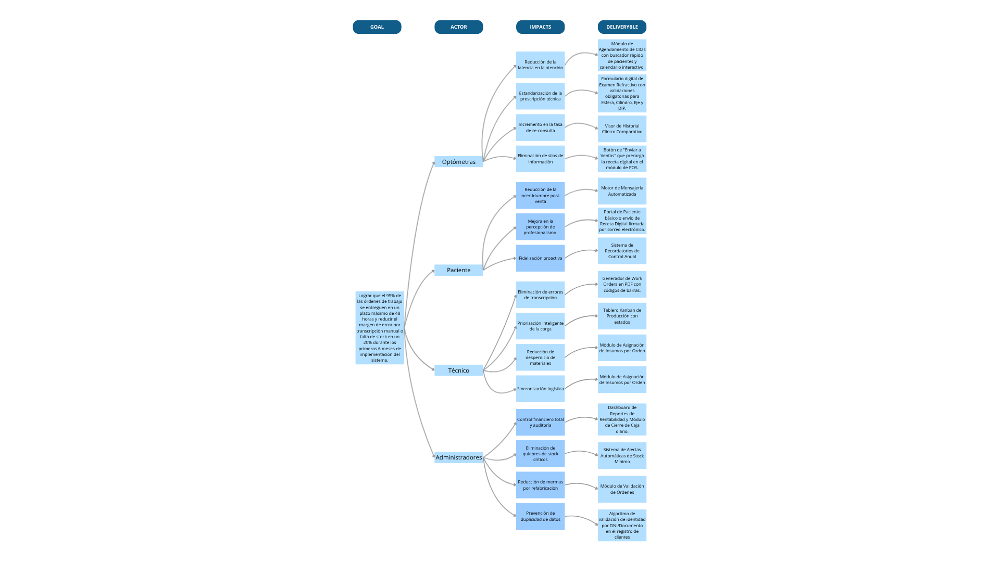

# Capítulo III: Requirements Specification

## Impact Mapping

{width=100%}

## Epics

| ID Épica | Título de la Épica | Descripción formal (Formato de Historia de Usuario) | Historias / Tareas contenidas |
|---|---|---|---|
| EP-01P | Portal Web y Autoservicio del Paciente | Como cliente, quiero gestionar mi perfil, consultar el estado de mis órdenes, y solicitar información comercial, para que pueda autogestionar mi atención y compras de manera remota sin depender del personal de la óptica. | US-05P, US-06P, US-07P, US-30P |
| EP-02G | Gestión Clínica y Optometría | Como empleado de la óptica, quiero registrar la anamnesis, historias clínicas, cargar exámenes externos y registrar clientes, para que pueda centralizar el historial médico completo del cliente y garantizar la exactitud en la fabricación. | US-08G, US-09G, US-10G, US-11G, US-12G |
| EP-03F | Flujo Comercial, Finanzas y Fidelización (CRM) | Como empleado de la óptica, quiero gestionar cotizaciones, aplicar descuentos, cobrar saldos, registrar devoluciones, cerrar la caja diaria y automatizar notificaciones o encuestas, para que pueda agilizar las ventas, cuadrar las finanzas diarias de la tienda y fomentar la retención de los clientes. | US-13F, US-14F, US-15F, US-16F, US-17F, US-18F, US-19F |
| EP-04L | Logística, Inventario y Laboratorio | Como empleado de la óptica, quiero administrar el catálogo, consultar stock, recibir alertas de escasez, registrar mermas e insumos, y actualizar el avance de órdenes, para que se asegure el reabastecimiento oportuno y un control exacto de toda la cadena de producción de los lentes. | US-20L, US-21L, US-22L, US-23L, US-24L, US-25L, US-26L, US-27L, US-28L |
| EP-05A | Administración, Analítica y Plataforma Backend | Como empleado de la óptica, quiero gestionar los roles de acceso, visualizar reportes (dashboards) de ventas/productividad y disponibilizar los servicios de integración (APIs), para que pueda proteger el sistema, tomar decisiones estratégicas basadas en datos y asegurar la comunicación técnica entre módulos. | US-03A, US-04A, US-29A, US-37A |
| EP-06S | Seguridad y Acceso del Empleado | Como empleado de la óptica, quiero autenticarme con mis credenciales y recuperar mi contraseña de forma autónoma, para que pueda acceder al sistema de manera segura según el rol que me corresponde. | US-01S, US-02S, US-36S |
| EP-07LA | Landing Page y Presencia Digital | Como visitante o usuario prospecto, quiero navegar por una página web pública informativa para conocer los beneficios, módulos y planes del sistema antes de adquirirlo o iniciar sesión. | US-31LA, US-32LA, US-33LA, US-34LA, US-35LA |

## User Stories
| ID US | Título de la US | Descripción de la Historia de Usuario | Criterios de Aceptación (Escenarios BDD) | Relacionado con (Epic ID) |
|---|---|---|---|---|
| US-01S | Autenticación de Usuarios | Como empleado de la óptica, quiero iniciar sesión con mis credenciales para acceder a las funcionalidades del sistema según mi rol. | **Escenario 1:** Inicio de sesión exitoso. Dado que el empleado de la óptica se encuentra en la vista de Login, cuando el empleado selecciona su cargo en el selector de rol (Administrador, Optometrista, Asesor de Ventas, Técnico de Laboratorio o Recepcionista), ingresa su correo electrónico y contraseña válidos, y presiona "Iniciar Sesión", entonces el sistema valida las credenciales y lo redirige al Dashboard principal.    **Escenario 2:** Error por credenciales incorrectas. Dado que el empleado de la óptica tiene el formulario de acceso abierto con una contraseña incorrecta, cuando el empleado de la óptica ingresa los datos y presiona "Iniciar Sesión", entonces el sistema muestra el mensaje "Credenciales inválidas" y mantiene la vista actual. | EP-06S |
| US-02S | Recuperación de Contraseña | Como empleado de la óptica, quiero restablecer mi clave mediante un enlace a mi correo para recuperar mi cuenta autónomamente. | **Escenario 1:** Envío exitoso de enlace de recuperación. Dado que el empleado de la óptica teclea su correo oficial válido en el portal, cuando el empleado de la óptica oprime "Recuperar cuenta", entonces el sistema crea un token criptográfico de un solo uso y lo remite en formato hipertexto a su bandeja.    **Escenario 2:** Error por correo no registrado. Dado que el empleado de la óptica introduce un correo apócrifo ajeno a la empresa, cuando el empleado de la óptica solicita la recuperación del acceso, entonces el sistema se abstiene de crear llaves e informa que el usuario no ha sido localizado en los registros. | EP-06S |
| US-03A | Gestión de Roles | Como empleado de la óptica, quiero asignar roles específicos a cada usuario para garantizar que accedan únicamente a las funciones de su competencia. | **Escenario 1:** Asignación de rol exitosa. Dado que el empleado de la óptica cuenta con privilegios de administrador y escoge el rol de "Técnico" para un trabajador, cuando el empleado de la óptica guarda la configuración, entonces el sistema restringe el acceso de dicho trabajador exclusivamente al módulo de laboratorio.    **Escenario 2:** Restricción de acceso por permisos. Dado que el empleado de la óptica posee un rol limitado a ventas sin privilegios gerenciales, cuando el empleado de la óptica intenta acceder al panel de configuración de roles, entonces el sistema bloquea la entrada advirtiendo que carece de permisos.    **Escenario 3:** Creación de nuevo rol personalizado. Dado que el administrador se encuentra en el módulo de Configuración > Gestión de Roles, cuando el administrador presiona "Agregar Rol", define el nombre del rol, selecciona un color identificador y marca los permisos correspondientes de la lista disponible, y presiona "Crear Rol", entonces el sistema registra el nuevo rol y lo muestra en la lista de roles con los permisos asignados. | EP-05A |
| US-04A | Auditoría de Inventario | Como empleado de la óptica, quiero inspeccionar un registro histórico de las alteraciones manuales de stock para evitar robos. | **Escenario 1:** Consulta de log exitosa. Dado que el empleado de la óptica funge de auditor gerencial segmentando sus indagaciones bajo la etiqueta "Alteración de Stock", cuando el empleado de la óptica demanda la consulta, entonces el sistema despacha una matriz revelando el nombre del autor, hora, fecha y cantidad manipulada.    **Escenario 2:** Error por falta de registros. Dado que el empleado de la óptica acota su rastreo estadístico a una semana de vacaciones sin operaciones de inventario, cuando el empleado de la óptica manda ejecutar la visualización en la bitácora, entonces el sistema contesta dibujando un cuadro sin filas e imprimiendo "Ninguna manipulación humana registrada". | EP-05A |
| US-05P | Seguimiento de Orden Web | Como cliente de la óptica, quiero consultar el estado de mis lentes para saber cuándo recogerlos sin llamar a la sucursal. | **Escenario 1:** Consulta de estado exitosa. Dado que el cliente de la óptica se encuentra en la aplicación web, cuando el cliente de la óptica busca su orden por número en la barra de búsqueda, entonces el sistema muestra un tablero Kanban mostrando el estado y las etapas de la orden.    **Escenario 2:** Error por datos de orden incorrectos. Dado que el cliente de la óptica está en la barra de búsqueda, cuando el cliente de la óptica escribe el número de orden en la barra, entonces el sistema muestra el mensaje indicando que no se encontró una orden con esos datos. | EP-01P |
| US-06P | Gestión de Perfil de Usuario | Como cliente de la óptica, quiero actualizar mis datos de contacto para asegurar que las notificaciones lleguen correctamente. | **Escenario 1:** Actualización de datos exitosa. Dado que el cliente de la óptica se encuentra en su perfil personal, cuando el cliente de la óptica modifique datos y presione "Guardar Cambios", entonces el sistema actualiza la base de datos y muestra un mensaje de éxito.    **Escenario 2:** Datos incorrectos. Dado que el cliente de la óptica se encuentra en el apartado de su perfil, cuando el cliente de la óptica modifica sus datos incorrectamente y presiona guardar, entonces el sistema impide la acción y resalta el campo indicando error de formato. | EP-01P |
| US-07P | Consulta de Saldo | Como cliente de la óptica, quiero consultar el saldo pendiente de mi pedido para saber cuánto debo llevar al momento del recojo. | **Escenario 1:** Consulta con saldo pendiente. Dado que el cliente de la óptica revisa su historial en la plataforma web sobre un pedido con deuda pendiente mayor a cero, cuando el cliente de la óptica abre los detalles de su pedido, entonces el sistema retorna matemáticamente el monto del adelanto y la deuda exacta por pagar.    **Escenario 2:** Consulta con pago completo. Dado que el cliente de la óptica pagó la totalidad de sus lentes al inicio de su pedido, cuando el cliente de la óptica accede a los detalles de su orden, entonces el sistema muestra el saldo restante como cero y la etiqueta inmutable de "Totalmente cancelado". | EP-01P |
| US-08G | Registro de Historia Clínica | Como empleado de la óptica, quiero registrar los resultados del examen visual digitalmente para centralizar la información médica del paciente. | **Escenario 1:** Guardado exitoso de receta. Dado que el empleado de la óptica se encuentra en la ficha médica, cuando el empleado de la óptica rellena la información del cliente y presiona "Guardar Examen", entonces el sistema almacena la historia clínica y genera un ID único de receta.    **Escenario 2:** Error por valor de Eje fuera de rango. Dado que el empleado de la óptica llena el formulario clínico introduciendo un valor mayor a 180 en el Eje, cuando el empleado de la óptica presiona "Guardar Examen", entonces el sistema impide el guardado y muestra un error de validación en el campo. | EP-02G |
| US-09G | Registro de Anamnesis | Como empleado de la óptica, quiero registrar la anamnesis clínica de un nuevo paciente durante su alta en el sistema, para tener contexto clínico desde el primer contacto. | **Escenario 1:** Registro exitoso de anamnesis al agregar paciente. Dado que el empleado de la óptica se encuentra en el modal "Agregar Paciente" con los datos principales ya completados, cuando el empleado expande la sección "Anamnesis Clínica (opcional)" y completa al menos el motivo de consulta y síntomas visuales, y presiona "Registrar", entonces el sistema crea el paciente y vincula la anamnesis ingresada a su nuevo expediente clínico de manera permanente.    **Escenario 2:** Registro de paciente sin anamnesis. Dado que el empleado de la óptica se encuentra en el modal "Agregar Paciente" y no expande ni completa la sección de anamnesis clínica, cuando el empleado presiona "Registrar", entonces el sistema crea al paciente exitosamente y deja el expediente clínico sin anamnesis registrada, mostrando la opción de completarla posteriormente desde la pestaña HCE.    **Escenario 3:** Anamnesis completa con todos los campos. Dado que el empleado de la óptica expande la sección "Anamnesis Clínica (opcional)" en el modal "Agregar Paciente" y rellena los siete campos disponibles (motivo de consulta, síntomas visuales, antecedentes oculares, antecedentes generales, medicamentos actuales, antecedentes familiares y hábitos visuales), cuando el empleado presiona "Registrar", entonces el sistema almacena la anamnesis completa vinculada al nuevo expediente y la presenta íntegra en la pestaña HCE del perfil del paciente. | EP-02G |
| US-10G | Historial de Receta | Como empleado de la óptica, quiero consultar el historial de recetas de un paciente para tener acceso a sus expedientes clínicos anteriores como respaldo. | **Escenario 1:** Consulta exitosa del historial. Dado que el empleado de la óptica se encuentra en el perfil de un paciente que tiene recetas anteriores registradas, cuando el empleado accede a la sección de historial de recetas, entonces el sistema muestra la lista de recetas almacenadas con la fecha y los datos de cada examen previo.    **Escenario 2:** Historial sin registros. Dado que el empleado de la óptica accede al historial de recetas de un paciente sin atenciones previas registradas, cuando el empleado consulta esa sección, entonces el sistema muestra un mensaje indicando que no existen recetas registradas para ese paciente. | EP-02G |
| US-11G | Carga de Exámenes Externos | Como empleado de la óptica, quiero registrar exámenes visuales en la HCE del paciente tanto de forma manual como cargando un PDF externo, para consolidar toda la información clínica en un solo lugar. | **Escenario 1:** Registro manual de examen desde HCE. Dado que el empleado de la óptica se encuentra en la pestaña HCE del perfil del paciente, cuando el empleado presiona "Registrar Nuevo Examen", selecciona la opción "Ingreso Manual", completa los datos del examen visual (esfera, cilindro, eje, adición y agudeza visual) y presiona "Guardar", entonces el sistema almacena el examen en la historia clínica y lo muestra en la tabla de exámenes de la HCE.    **Escenario 2:** Carga de examen mediante PDF desde HCE. Dado que el empleado de la óptica se encuentra en la pestaña HCE del perfil del paciente, cuando el empleado presiona "Registrar Nuevo Examen", selecciona la opción "Cargar PDF", adjunta un archivo PDF válido con peso dentro del límite permitido y confirma, entonces el sistema adjunta el documento al expediente clínico del paciente y lo muestra como archivo disponible en la HCE.    **Escenario 3:** Rechazo por archivo PDF demasiado pesado. Dado que el empleado de la óptica intenta cargar un PDF de 30 megabytes desde la opción "Cargar PDF" en la HCE del paciente, cuando el empleado confirma la carga, entonces el sistema rechaza el archivo, muestra un mensaje indicando el tamaño máximo permitido y habilita el campo para intentar con otro archivo. | EP-02G |
| US-12G | Registro de Clientes | Como empleado de la óptica, quiero poder registrar clientes al momento que solicitan una orden en la óptica, para tenerlos registrados en la base de datos. | **Escenario 1:** Registro exitoso de un nuevo cliente. Dado que el empleado de la óptica se encuentra en el módulo de creación de órdenes y completa el formulario de nuevo paciente con todos los datos obligatorios (ej. DNI, nombres, fecha de nacimiento y correo/teléfono), cuando el empleado de la óptica presiona el botón "Registrar", entonces el sistema almacena el perfil en la base de datos, genera su ID de paciente y lo vincula automáticamente a la orden de trabajo actual para poder continuar con el flujo.    **Escenario 2:** Error por cliente duplicado (DNI ya existente). Dado que el empleado de la óptica intenta registrar a un nuevo cliente introduciendo un número de DNI que ya pertenece a un perfil guardado en el historial, cuando el empleado de la óptica presiona el botón "Registrar", entonces el sistema detecta la duplicidad, bloquea la creación del nuevo registro y lanza un aviso de colisión sugiriendo vincular la orden al perfil existente del paciente. | EP-02G |
| US-13F | Gestión de Ventas | Como empleado de la óptica, quiero registrar la venta de un cliente, para poder registrarla en la base de datos y enviar la orden de producción. | **Escenario 1:** Registro de venta. Dado que el empleado de la óptica tiene una montura, receta, método de pago y monto asignado en la pasarela de pagos, cuando el empleado de la óptica presiona "Crear venta + orden de lab", entonces el sistema genera la boleta y crea la orden de trabajo automáticamente.    **Escenario 2:** Error por datos insuficientes. Dado que el empleado de la óptica no ingresa los datos suficientes, cuando el empleado de la óptica presiona "Crear venta + orden de lab", entonces el sistema muestra una alerta de "Por favor completa todos los campos". | EP-03F |
| US-14F | Registro de Pago de Saldo | Como empleado de la óptica, quiero registrar el pago del saldo pendiente al entregar los lentes para cerrar formalmente la transacción. | **Escenario 1:** Registro de pago completo. Dado que el empleado de la óptica tiene en pantalla un pedido con deuda y recibe el pago por el monto exacto faltante, cuando el empleado de la óptica confirma el cobro, entonces el sistema actualiza la orden a estado "Entregado" y emite el comprobante final.    **Escenario 2:** Error por campos incompletos en el método de pago. Dado que el empleado de la óptica intenta registrar el pago del saldo pendiente sin completar todos los campos requeridos del método de pago, cuando el empleado de la óptica presiona pagar, entonces el sistema muestra el mensaje "Por favor complete los campos" e impide continuar con la transacción hasta que se subsane la información faltante. | EP-03F |
| US-15F | Aplicación de Descuentos | Como empleado de la óptica, quiero ingresar códigos de descuento en la boleta para cerrar ventas promocionales. | **Escenario 1:** Aplicación de descuento promocional. Dado que el empleado de la óptica formula el presupuesto e ingresa un código alfanumérico promocional del 15% en estado válido, cuando el empleado de la óptica aplica el valor, entonces el sistema disminuye automáticamente la deuda y muestra el monto rebajado en la factura.    **Escenario 2:** Bloqueo de descuento excesivo. Dado que el empleado de la óptica funge de vendedor básico ingresando un descuento no autorizado del 50%, cuando el empleado de la óptica intenta aplicarlo al carrito, entonces el sistema bloquea el flujo levantando un popup que exige el código PIN del gerente. | EP-03F |
| US-16F | Pagos con Múltiples Métodos | Como empleado de la óptica, quiero dividir el cobro entre efectivo y tarjeta para facilitar la transacción al paciente. | **Escenario 1:** Pago mixto exitoso. Dado que el empleado de la óptica declara en el módulo de check-out un cobro dividido que equivale matemáticamente al 100% de la deuda, cuando el empleado de la óptica lo confirma, entonces el sistema acepta ambas fuentes consolidando el dinero y cerrando el ticket.    **Escenario 2:** Suma no coincide. Dado que el empleado de la óptica digita en el mostrador valores divididos cuya sumatoria total no empata con la deuda de las gafas, cuando el empleado de la óptica intenta finalizar el trato, entonces el sistema rechaza la operación e indica numéricamente la diferencia de dinero restante. | EP-03F |
| US-17F | Devolución de Orden | Como empleado de la óptica, quiero registrar la devolución de una venta desde la pantalla principal de ventas para revertir la transacción cuando el cliente devuelve el producto. | **Escenario 1:** Devolución registrada exitosamente. Dado que el empleado de la óptica se encuentra en la pantalla principal de ventas y selecciona una orden entregada, cuando el empleado presiona el botón "Devolución", entonces el sistema registra la devolución y la marca en el historial de ventas.    **Escenario 2:** Intento de devolución sobre una orden no entregada. Dado que el empleado de la óptica selecciona una orden que aún no ha sido marcada como entregada, cuando el empleado presiona el botón "Devolución", entonces el sistema deshabilita la acción e indica que solo se pueden devolver órdenes ya entregadas. | EP-03F |
| US-18F | Notificaciones de Recojo | Como cliente de la óptica, quiero recibir un aviso automático cuando mis lentes estén listos para ahorrar tiempo de viaje. | **Escenario 1:** Envío de correo automático. Dado que el empleado de la óptica gestiona un pedido de un cliente que posee un correo electrónico válido, cuando el empleado de la óptica marca la orden como "Listo en Tienda", entonces el sistema dispara automáticamente un correo electrónico al cliente con la dirección de la sede y el saldo a pagar.    **Escenario 2:** Correo electrónico inválido. Dado que el empleado de la óptica atiende una orden finalizada de un cliente que registró un correo con formato erróneo, cuando el empleado de la óptica aprueba la orden como lista, entonces el sistema detecta el rebote del correo y marca la notificación como "Fallida" en el panel de CRM. | EP-03F |
| US-19F | Encuestas de Satisfacción | Como cliente de la óptica, quiero poder responder una encuesta de satisfacción al finalizar mi compra para calificar tanto la atención recibida como la calidad de los productos adquiridos. | **Escenario 1:** Encuesta de servicio al cliente completada exitosamente. Dado que el cliente acaba de finalizar su compra y el sistema muestra un pop-up de encuesta de servicio al cliente, cuando el cliente selecciona una calificación de 1 a 5 estrellas, indica si recomendaría el servicio a familiares o amigos, y opcionalmente agrega comentarios adicionales, entonces el sistema registra las respuestas y cierra el pop-up mostrando un mensaje de agradecimiento.    **Escenario 2:** Encuesta de calidad de producto completada exitosamente. Dado que el cliente se encuentra en la pantalla de encuestas tras recibir sus lentes, cuando el cliente selecciona una calificación de 1 a 5 estrellas sobre la calidad del producto, indica si recomendaría los productos a familiares o amigos, y opcionalmente agrega comentarios adicionales, entonces el sistema registra las respuestas y confirma el envío.    **Escenario 3:** Cliente omite la encuesta. Dado que al cliente le aparece el pop-up de encuesta al finalizar la compra, cuando el cliente cierra el pop-up sin responder, entonces el sistema descarta la encuesta sin bloquear el flujo de la aplicación. | EP-03F |
| US-20L | Consulta de Inventario en Tiempo Real | Como empleado de la óptica, quiero consultar el stock de monturas para informar al cliente sobre la disponibilidad inmediata. | **Escenario 1:** Búsqueda de stock exitosa. Dado que el empleado de la óptica se encuentra en el módulo de inventario contando con un nombre, proveedor, SKU o categoría, cuando el empleado escribe algunos de dichos datos en la barra de búsqueda, entonces el sistema muestra una lista con el SKU, color y cantidad física disponible de los productos buscados.    **Escenario 2:** Producto agotado. Dado que el empleado de la óptica revisa un modelo específico en el catálogo cuyo stock actual es cero, cuando el empleado de la óptica intenta agregarlo al carrito, entonces el sistema deshabilita el botón de venta y muestra un mensaje que indica que no hay stock. | EP-04L |
| US-21L | Alertas de Bajo Stock | Como empleado de la óptica, quiero recibir alertas automáticas cuando el stock cae por debajo del umbral para reabastecer a tiempo. | **Escenario 1:** Generación de alerta por stock mínimo. Dado que un cliente de la óptica se encuentra en la tienda y su compra reduce el stock de un ítem al límite de emergencia, cuando el empleado de la óptica procesa la transacción en el sistema, entonces el sistema inyecta una alerta visual automática recomendando el reabastecimiento al staff.    **Escenario 2:** Configuración de umbral de stock. Dado que el empleado de la óptica administra el inventario decidiendo fijar un límite mínimo de 5 unidades para una montura, cuando el empleado de la óptica guarda los cambios, entonces el sistema adopta este valor numérico como disparador para futuras alertas de stock.    **Escenario 3:** Reposición de stock desde alerta. Dado que el empleado de la óptica visualiza una alerta de bajo stock para un artículo en el panel de inventario, cuando el empleado presiona "Reponer", ingresa la cantidad a añadir y confirma la operación, entonces el sistema suma las unidades al stock actual y registra la operación en la bitácora de auditoría. | EP-04L |
| US-22L | Registro de Nuevo Producto | Como empleado de la óptica, quiero registrar nuevas monturas en el inventario para mantener el catálogo actualizado. | **Escenario 1:** Registro exitoso de producto. Dado que el empleado de la óptica posee la información técnica y un SKU inédito de un nuevo modelo de gafas, cuando el empleado de la óptica ingresa los datos y guarda, entonces el sistema persiste el artículo y lo activa para el módulo de ventas.    **Escenario 2:** Rechazo por producto duplicado. Dado que el empleado de la óptica registra mercadería nueva tecleando un SKU que ya pertenece a otro lote anterior, cuando el empleado de la óptica presiona el botón de registro, entonces el sistema detecta la colisión e invalida la operación por duplicidad. | EP-04L |
| US-23L | Gestión de Variantes | Como empleado de la óptica, quiero registrar diferentes tipos de materiales de lunas para ampliar las opciones del catálogo. | **Escenario 1:** Adición de nueva variante de material. Dado que el empleado de la óptica administra los atributos del catálogo insertando una nueva resina especializada inédita, cuando el empleado de la óptica guarda los cambios, entonces el sistema la despliega como opción seleccionable en la pasarela de ventas.    **Escenario 2:** Error por duplicidad de material. Dado que el empleado de la óptica modifica los insumos creando una variante con un nombre idéntico a uno ya existente, cuando el empleado de la óptica intenta guardar el registro, entonces el sistema bloquea la acción previniendo la ambigüedad de la base de datos. | EP-04L |
| US-24L | Búsqueda Avanzada | Como empleado de la óptica, quiero aplicar múltiples filtros cruzados para ubicar modelos específicos requeridos por el paciente. | **Escenario 1:** Filtrado por material y marca. Dado que el empleado de la óptica asesora a un comprador seleccionando los atributos compatibles "Carey" y "Gucci", cuando el empleado de la óptica ejecuta el filtro, entonces el sistema limpia la grilla revelando exclusivamente los marcos que cumplen la intersección de ambas opciones.    **Escenario 2:** Búsqueda sin coincidencias. Dado que el empleado de la óptica satura el buscador web con parámetros cruzados altamente excluyentes y sin inventario asociado, cuando el empleado de la óptica lanza el rastreo en el catálogo, entonces el sistema emite el mensaje "Inventario incompatible" y ofrece un botón de limpieza. | EP-04L |
| US-25L | Control de Órdenes y Tablero Kanban | Como empleado de la óptica, quiero gestionar el estado de las órdenes de laboratorio mediante un tablero Kanban para reflejar el progreso de fabricación en tiempo real y dar visibilidad a todo el equipo. | **Escenario 1:** Cambio a En Proceso. Dado que el empleado de la óptica visualiza una orden recién solicitada en el panel, cuando el empleado de la óptica actualiza el estado a "En Proceso", entonces el sistema actualiza el registro en la base de datos y sella la hora de inicio en la tarjeta.    **Escenario 2:** Avance a Control de Calidad. Dado que el empleado de la óptica finaliza la fase física de biselado en una orden sin problemas, cuando el empleado de la óptica arrastra la tarjeta visual a la columna "Control de Calidad" o actualiza el estado desde el panel, entonces el sistema registra el salto de etapa y el timestamp correspondiente al técnico.    **Escenario 3:** Retroceso por error detectado. Dado que el empleado de la óptica halla imperfecciones en un lente armado durante la revisión de calidad, cuando el empleado de la óptica mueve la tarjeta de vuelta a "En Proceso", entonces el sistema pinta el ticket de rojo advirtiendo inmediatamente un estado de retrabajo.    **Escenario 4:** Cambio a Listo. Dado que el empleado de la óptica tiene la fabricación de los lentes terminada, cuando el empleado de la óptica actualiza el estado a "Listo", entonces el sistema registra la hora de finalización y habilita el pedido para entrega en mostrador.    **Escenario 5:** Cambio a Entregado. Dado que el empleado de la óptica despacha físicamente los lentes correspondientes a una orden en estado "Listo", cuando el empleado de la óptica actualiza el estado de la orden a "Entregado", entonces el sistema marca el pedido como finalizado, sella la hora exacta de entrega y proporciona la opción de retirar la orden del panel de tareas pendientes.    **Escenario 6:** Cambio a vista de tabla. Dado que el empleado de la óptica se encuentra en el módulo de Órdenes de Laboratorio visualizando el tablero Kanban, cuando el empleado presiona el selector "Tabla" en el panel de vista, entonces el sistema presenta todas las órdenes en formato tabular con las columnas N° Orden, Paciente, Laboratorio, Tipo, Fecha de Ingreso, Fecha de Entrega, Prioridad y Estado. | EP-04L |
| US-26L | Motivos de Retrabajo | Como empleado de la óptica, quiero tipificar los errores cuando un lente se malogra para medir las pérdidas del laboratorio. | **Escenario 1:** Registro de causa de refabricación. Dado que el empleado de la óptica marca un producto terminado como defectuoso seleccionando la justificación técnica "Falla de pulido", cuando el empleado de la óptica confirma la acción, entonces el sistema da de baja la mica, extrae un nuevo insumo y contabiliza la merma.    **Escenario 2:** Reporte de mermas mensuales. Dado que el empleado de la óptica busca corregir procesos examinando el desempeño de la producción mensual, cuando el empleado de la óptica accede a los reportes de calidad, entonces el sistema expone un diagrama agrupando las causas de errores de laboratorio más repetitivas. | EP-04L |
| US-27L | Gestión de Urgencias | Como empleado de la óptica, quiero marcar un ticket como máxima prioridad para que los técnicos pausen otras labores. | **Escenario 1:** Priorización en el tablero Kanban. Dado que el empleado de la óptica posee el rango requerido y procesa un mandato urgente de un paciente viajero, cuando el empleado de la óptica oprime el interruptor de SOS antes de enviar a laboratorio, entonces el sistema embadurna de color rojo la tarjeta y la traslada a la primera posición del kanban.    **Escenario 2:** Error por falta de autorización. Dado que el empleado de la óptica es novato careciendo de privilegios de jefatura e intenta priorizar infundadamente un ticket regular, cuando el empleado de la óptica marca la orden de urgencia, entonces el sistema paraliza el proceso exigiendo la contraseña del gerente como única medida valedera. | EP-04L |
| US-28L | Control de Insumos | Como empleado de la óptica, quiero que la creación de micas descuente materia prima base (bloques) para que compras sepa cuándo pedir más. | **Escenario 1:** Descuento de insumo exitoso. Dado que el empleado de la óptica posee lentes listos y estantes llenos de bases plásticas habilitadas para el mecanizado, cuando el empleado de la óptica hace sonar el inicio de labor en su terminal de torno, entonces el sistema sustrae sigilosamente un par de micas en bruto restándolas del inventario maestro.    **Escenario 2:** Alerta por falta de materia prima. Dado que el empleado de la óptica está desprovisto de crudos por agotamiento de almacén intentando procesar un nuevo pedido físico, cuando el empleado de la óptica intenta arrancar el maquinado dándole a aceptar, entonces el sistema emite una alerta congelando la travesía e impidiendo toda maniobra logística. | EP-04L |
| US-29A | Dashboard de Ventas | Como empleado de la óptica, quiero ver métricas de conversión, ingresos y rendimiento del negocio en un panel centralizado para evaluar el desempeño general de la óptica. | **Escenario 1:** Visualización de KPIs principales. Dado que el empleado accede al panel de Reportes con datos del periodo registrados, cuando carga el dashboard, entonces el sistema muestra las tarjetas de ingresos totales, tasa de conversión receta-venta, tiempo promedio de entrega y saldos pendientes, cada una con su variación respecto al periodo anterior.    **Escenario 2:** Consulta de resumen de conversión y ventas por producto. Dado que el empleado se encuentra en la pestaña "Resumen", cuando visualiza el panel, entonces el sistema muestra el gráfico de barras de recetas vs. ventas cerradas por mes, el porcentaje de conversión del mes actual, el gráfico circular de distribución de ventas por categoría de producto y la tendencia de ingresos mensuales de los últimos 6 meses.    **Escenario 3:** Consulta de saldos pendientes e ingresos por categoría. Dado que el empleado accede a la pestaña "Ventas y Finanzas", cuando visualiza el panel, entonces el sistema muestra el desglose de saldos pendientes agrupados por antigüedad (0–7, 8–15, 16–30 y 31+ días), el gráfico de barras de ingresos por categoría de producto y la tendencia de la tasa de conversión receta-venta en el periodo.    **Escenario 4:** Consulta de productividad del laboratorio. Dado que el empleado accede a la pestaña "Productividad Lab", cuando visualiza el panel, entonces el sistema muestra el tiempo promedio de producción, la tasa de entregas a tiempo, la tasa de retrabajo y el gráfico de causas de retrabajo más frecuentes.    **Escenario 5:** Consulta de rendimiento del personal. Dado que el empleado accede a la pestaña "Rendimiento Personal", cuando visualiza el panel, entonces el sistema muestra la tabla de cotizaciones generadas versus ventas cerradas por empleado con su tasa de conversión individual y los ingresos atribuidos, acompañada de un gráfico de barras comparativo. | EP-05A |
| US-30P | Inicio de Sesión de Cliente con DNI | Como cliente de la óptica, quiero iniciar sesión en el portal web utilizando mi DNI para acceder a mi perfil y ver mis órdenes. | **Escenario 1:** Inicio de sesión exitoso. Dado que el cliente de la óptica se encuentra en la vista de Login del portal de autoservicio y cuenta con un perfil registrado, cuando el cliente de la óptica ingresa su número de DNI y presiona "Ingresar", entonces el sistema valida la coincidencia del documento en la base de datos, genera el token de sesión y carga la vista del dashboard del paciente.    **Escenario 2:** Error por DNI no registrado. Dado que el cliente de la óptica intenta acceder a la plataforma web sin haber sido registrado previamente en la sucursal, cuando el cliente de la óptica ingresa su DNI y dispara la acción de "Ingresar", entonces el sistema deniega el acceso, resalta el input en rojo y muestra un mensaje indicando "Documento no registrado". | EP-01P |
| US-31LA | Propuesta de Valor (Hero Section) | Como visitante, quiero ver la propuesta de valor principal al inicio de la página para entender rápidamente de qué trata el sistema. | **Escenario 1:** Carga exitosa de sección principal. Dado que el visitante accede al dominio principal de la web, cuando la página termina de cargar, entonces el sistema muestra el titular, una imagen descriptiva del software y el botón principal de "Ver Planes". | EP-07LA |
| US-32LA | Catálogo de Características | Como visitante, quiero explorar los módulos del sistema en la web para saber qué problemas específicos resuelve en mi óptica. | **Escenario 1:** Visualización de módulos. Dado que el visitante navega por el cuerpo de la landing page, cuando hace scroll hacia la sección de características, entonces el sistema muestra una cuadrícula informativa detallando módulos como ventas, laboratorio e inventario. | EP-07LA |
| US-33LA | Consulta de Planes y Precios | Como visitante, quiero ver los planes de suscripción disponibles para comparar opciones según el tamaño y presupuesto de mi óptica. | **Escenario 1:** Comparativa de planes. Dado que el visitante se encuentra en la landing page, cuando presiona el enlace "Precios" en la navegación, entonces el sistema hace scroll automático y muestra la tabla comparativa con los costos y límites funcionales de cada plan. | EP-07LA |
| US-34LA | Formulario de Contacto General | Como visitante, quiero enviar un mensaje con dudas generales al equipo comercial para recibir atención directa. | **Escenario 1:** Envío de dudas exitoso. Dado que el visitante llena su nombre, correo y consulta en el formulario de la web, cuando presiona el botón "Enviar", entonces el sistema muestra un banner de éxito confirmando la recepción y notifica al equipo de soporte.    **Escenario 2:** Intento de envío con campos vacíos. Dado que el visitante omite escribir su correo electrónico en el formulario de contacto, cuando intenta enviar el mensaje, entonces el sistema frena la acción y resalta el campo de correo en color rojo. | EP-07LA |
| US-35LA | Redirección a Login | Como empleado de la óptica, quiero encontrar un botón de acceso claro en la web principal para entrar a mi cuenta sin escribir la URL completa del sistema. | **Escenario 1:** Acceso a plataforma. Dado que un usuario ya registrado visita la landing page, cuando presiona el botón "Iniciar Sesión" en la esquina superior derecha, entonces el sistema lo redirige a la vista de autenticación de la aplicación web. | EP-07LA |
| US-36S | Registro de Empleado | Como administrador de la óptica, quiero registrar nuevos empleados en el sistema para gestionar el acceso y las responsabilidades del personal. | **Escenario 1:** Registro exitoso de empleado. Dado que el administrador se encuentra en el módulo de Empleados, cuando completa el formulario con nombre, cargo, departamento y correo del nuevo empleado y presiona "Agregar Empleado", entonces el sistema registra al empleado, le asigna los permisos predeterminados según el cargo seleccionado y lo muestra en la tabla de personal activo.    **Escenario 2:** Gestión de permisos individuales. Dado que el administrador abre el perfil de un empleado existente y accede a la pestaña "Permisos", cuando el administrador activa o desactiva permisos individuales de la lista y presiona "Guardar", entonces el sistema actualiza los privilegios de acceso del empleado, reflejando los cambios en su próximo inicio de sesión. | EP-06S |
| US-37A | Configuración General del Sistema | Como administrador, quiero gestionar la información del negocio, la política de seguridad y las opciones de copia de seguridad del sistema para mantener la plataforma actualizada y protegida. | **Escenario 1:** Actualización de información del negocio. Dado que el administrador se encuentra en el módulo de Configuración en la sección de información del negocio, cuando el administrador modifica los datos (nombre, dirección, teléfono u otros campos disponibles) y presiona "Guardar cambios", entonces el sistema persiste la información actualizada y muestra un mensaje de éxito.    **Escenario 2:** Configuración de política de seguridad. Dado que el administrador accede a la sección de seguridad en Configuración, cuando el administrador define los parámetros de política (como expiración de sesión o requisitos de contraseña) y guarda los cambios, entonces el sistema aplica la nueva política a todos los usuarios en su próximo inicio de sesión.    **Escenario 3:** Configuración de copias de seguridad. Dado que el administrador accede a la sección de datos y respaldo en Configuración, cuando el administrador define la frecuencia y destino de las copias de seguridad de la base de datos y presiona "Guardar", entonces el sistema programa las copias automáticas según la configuración establecida y muestra la fecha y hora de la próxima ejecución. | EP-05A |
| TS-01 | API Endpoint para Seguimiento | Como desarrollador, deseo implementar un endpoint REST para la consulta de estados de órdenes para integrar la web con el sistema de rastreo. | **Escenario 1:** Respuesta exitosa del servicio (200 OK). Dado que el servidor recibe una petición GET a /api/orders/{id}/status, cuando el ID proporcionado existe en la base de datos, entonces el sistema responde con un JSON que contiene el orderStatus y la estimatedDate.    **Escenario 2:** Error por recurso no encontrado (404). Dado que se realiza una petición al API, cuando el ID de la orden no existe, entonces el sistema retorna un código HTTP 404 con un mensaje de "Recurso no encontrado".    **Escenario 3:** Error por petición mal formada (400). Dado que se invoca el endpoint, cuando el parámetro ID no es numérico, entonces el sistema responde con un código HTTP 400 de "Bad Request". | EP-10 |
| TS-02 | Seguridad por Tokens JWT | Como desarrollador, deseo implementar autenticación basada en JWT para asegurar que solo personal autorizado acceda a la data sensible. | **Escenario 1:** Generación de token exitosa. Dado que las credenciales han sido validadas por el servidor, cuando el proceso de login finaliza, entonces el sistema genera un token firmado con una expiración de 8 horas y lo envía en la cabecera de respuesta.    **Escenario 2:** Error por token inválido (401). Dado que el frontend intenta consumir el API, cuando el token enviado en el header está alterado o mal formado, entonces el sistema deniega el acceso con un error de "No autorizado".    **Escenario 3:** Error por token expirado. Dado que el usuario ha dejado la aplicación abierta por más de 8 horas, cuando realiza una nueva acción, entonces el sistema detecta la expiración y lo desconecta automáticamente de la sesión. | EP-10 |
| TS-03 | API Endpoint para Registro y Consulta de Pacientes | Como desarrollador, deseo implementar un endpoint REST para el registro y consulta de pacientes, para que el frontend pueda crear y recuperar historias clínicas desde el servicio backend. | **Escenario 1:** Creación de paciente exitosa. Dado un HTTP POST al recurso /patients con un payload que incluye nombre, fecha de nacimiento y correo, cuando el servidor procesa la solicitud, entonces retorna un código 201 con el objeto del paciente creado incluyendo el ID generado.    **Escenario 2:** Rechazo por datos incompletos. Dado un HTTP POST al recurso /patients con un campo obligatorio ausente en el payload, cuando el servidor valida la solicitud, entonces retorna un código 400 con un detalle de los campos faltantes.    **Escenario 3:** Consulta de paciente existente. Dado un HTTP GET al recurso /patients/{id} con un ID válido y existente, cuando el servidor procesa la solicitud, entonces retorna un código 200 con los datos del paciente en formato JSON. | EP-10 |
| TS-04 | API Endpoint para Gestión de Órdenes de Trabajo | Como desarrollador, deseo implementar endpoints REST para crear y actualizar el estado de las órdenes de trabajo, para que el módulo Kanban del frontend se mantenga sincronizado con el estado real de fabricación en el laboratorio. | **Escenario 1:** Creación de orden de trabajo. Dado un HTTP POST al recurso /work-orders con un payload válido que incluye el ID de venta y los parámetros de la receta, cuando el servidor procesa la solicitud, entonces retorna un código 201 con la orden creada en estado 'Pendiente de Fabricación'.    **Escenario 2:** Actualización de estado válida. Dado un HTTP PATCH al recurso /work-orders/{id}/status con un estado válido dentro del flujo de la orden, cuando el servidor actualiza el registro, entonces retorna un código 200 con la orden actualizada y la marca de tiempo del cambio.    **Escenario 3:** Rechazo por estado inválido. Dado un HTTP PATCH al recurso /work-orders/{id}/status con un valor de estado no reconocido por el sistema, cuando el servidor valida la solicitud, entonces retorna un código 422 con una descripción del error de validación.    **Escenario 4:** Rechazo por orden inexistente. Dado un HTTP PATCH al recurso /work-orders/{id}/status con un ID inexistente, cuando el servidor procesa la solicitud, entonces retorna un código 404 indicando que la orden no fue encontrada. | EP-10 |

## Product Backlog

| # Orden | User Story Id | Título | Descripción | Story Points (1 / 2 / 3 / 5 / 8) |
| :--- | :--- | :--- | :--- | :--- |
| 1 | US-01S | Autenticación de Usuarios | Como empleado de la óptica, quiero iniciar sesión con mis credenciales para acceder a las funcionalidades del sistema según mi rol. | 3 |
| 2 | US-02S | Recuperación de Contraseña | Como empleado de la óptica, quiero restablecer mi clave mediante un enlace a mi correo para recuperar mi cuenta autónomamente. | 3 |
| 3 | US-03A | Gestión de Roles | Como empleado de la óptica, quiero asignar roles específicos a cada usuario para garantizar que accedan únicamente a las funciones de su competencia. | 5 |
| 4 | US-04A | Auditoría de Inventario | Como empleado de la óptica, quiero inspeccionar un registro histórico de las alteraciones manuales de stock para evitar robos. | 5 |
| 5 | US-05P | Seguimiento de Orden Web | Como cliente de la óptica, quiero consultar el estado de mis lentes para saber cuándo recogerlos sin llamar a la sucursal. | 3 |
| 6 | US-06P | Gestión de Perfil de Usuario | Como cliente de la óptica, quiero actualizar mis datos de contacto para asegurar que las notificaciones lleguen correctamente. | 2 |
| 7 | US-07P | Consulta de Saldo | Como cliente de la óptica, quiero consultar el saldo pendiente de mi pedido para saber cuánto debo llevar al momento del recojo. | 2 |
| 8 | US-08G | Registro de Historia Clínica | Como empleado de la óptica, quiero registrar los resultados del examen visual digitalmente para centralizar la información médica del paciente. | 5 |
| 9 | US-09G | Registro de Anamnesis | Como empleado de la óptica, quiero registrar los síntomas del paciente antes del examen para tener contexto clínico. | 3 |
| 10 | US-10G | Historial de Receta | Como empleado de la óptica, quiero consultar el historial de recetas de un paciente para tener acceso a sus expedientes clínicos anteriores como respaldo. | 3 |
| 11 | US-11G | Carga de Exámenes Externos | Como empleado de la óptica, quiero adjuntar PDFs médicos al perfil para consolidar la historia de intervenciones foráneas. | 3 |
| 12 | US-12G | Registro de Clientes | Como empleado de la óptica, quiero poder registrar clientes al momento que solicitan una orden en la óptica, para tenerlos registrados en la base de datos. | 3 |
| 13 | US-13F | Gestión de Ventas | Como empleado de la óptica, quiero registrar la venta de un cliente, para poder registrarla en la base de datos y enviar la orden de producción. | 5 |
| 14 | US-14F | Registro de Pago de Saldo | Como empleado de la óptica, quiero registrar el pago del saldo pendiente al entregar los lentes para cerrar formalmente la transacción. | 2 |
| 15 | US-15F | Aplicación de Descuentos | Como empleado de la óptica, quiero ingresar códigos de descuento en la boleta para cerrar ventas promocionales. | 2 |
| 16 | US-16F | Pagos con Múltiples Métodos | Como empleado de la óptica, quiero dividir el cobro entre efectivo y tarjeta para facilitar la transacción al paciente. | 5 |
| 17 | US-17F | Devolución de Orden | Como empleado de la óptica, quiero registrar la devolución de una venta desde la pantalla principal de ventas para revertir la transacción cuando el cliente devuelve el producto. | 2 |
| 18 | US-18F | Notificaciones de Recojo | Como cliente de la óptica, quiero recibir un aviso automático cuando mis lentes estén listos para ahorrar tiempo de viaje. | 3 |
| 19 | US-19F | Encuestas de Satisfacción | Como cliente de la óptica, quiero poder responder una encuesta de satisfacción al finalizar mi compra para calificar tanto la atención recibida como la calidad de los productos adquiridos. | 3 |
| 20 | US-20L | Consulta de Inventario en Tiempo Real | Como empleado de la óptica, quiero consultar el stock de monturas para informar al cliente sobre la disponibilidad inmediata. | 3 |
| 21 | US-21L | Alertas de Bajo Stock | Como empleado de la óptica, quiero recibir alertas automáticas cuando el stock cae por debajo del umbral para reabastecer a tiempo. | 3 |
| 22 | US-22L | Registro de Nuevo Producto | Como empleado de la óptica, quiero registrar nuevas monturas en el inventario para mantener el catálogo actualizado. | 2 |
| 23 | US-23L | Gestión de Variantes | Como empleado de la óptica, quiero registrar diferentes tipos de materiales de lunas para ampliar las opciones del catálogo. | 3 |
| 24 | US-24L | Búsqueda Avanzada | Como empleado de la óptica, quiero aplicar múltiples filtros cruzados para ubicar modelos específicos requeridos por el paciente. | 3 |
| 25 | US-25L | Control de Órdenes y Tablero Kanban | Como empleado de la óptica, quiero gestionar el estado de las órdenes de laboratorio mediante un tablero Kanban para reflejar el progreso de fabricación en tiempo real y dar visibilidad a todo el equipo. | 8 |
| 26 | US-26L | Motivos de Retrabajo | Como empleado de la óptica, quiero tipificar los errores cuando un lente se malogra para medir las pérdidas del laboratorio. | 2 |
| 27 | US-27L | Gestión de Urgencias | Como empleado de la óptica, quiero marcar un ticket como máxima prioridad para que los técnicos pausen otras labores. | 2 |
| 28 | US-28L | Control de Insumos | Como empleado de la óptica, quiero que la creación de micas descuente materia prima base (bloques) para que compras sepa cuándo pedir más. | 5 |
| 29 | US-29A | Dashboard de Ventas | Como empleado de la óptica, quiero ver métricas de conversión, ingresos y rendimiento del negocio en un panel centralizado para evaluar el desempeño general de la óptica. | 5 |
| 30 | US-30P | Inicio de Sesión de Cliente con DNI | Como cliente de la óptica, quiero iniciar sesión en el portal web utilizando mi DNI para acceder a mi perfil y ver mis órdenes. | 2 |
| 31 | US-31LA | Propuesta de Valor (Hero Section) | Como visitante, quiero ver la propuesta de valor principal al inicio de la página para entender rápidamente de qué trata el sistema. | 2 |
| 32 | US-32LA | Catálogo de Características | Como visitante, quiero explorar los módulos del sistema en la web para saber qué problemas específicos resuelve en mi óptica. | 2 |
| 33 | US-33LA | Consulta de Planes y Precios | Como visitante, quiero ver los planes de suscripción disponibles para comparar opciones según el tamaño y presupuesto de mi óptica. | 3 |
| 34 | US-34LA | Formulario de Contacto General | Como visitante, quiero enviar un mensaje con dudas generales al equipo comercial para recibir atención directa. | 3 |
| 35 | US-35LA | Redirección a Login | Como empleado de la óptica, quiero encontrar un botón de acceso claro en la web principal para entrar a mi cuenta sin escribir la URL completa del sistema. | 1 |
| 36 | US-36S | Registro de Empleado | Como administrador de la óptica, quiero registrar nuevos empleados en el sistema para gestionar el acceso y las responsabilidades del personal. | 2 |
| 37 | US-37A | Configuración General del Sistema | Como administrador, quiero gestionar la información del negocio, la política de seguridad y las opciones de copia de seguridad del sistema para mantener la plataforma actualizada y protegida. | 2 |
| 38 | TS-01 | API Endpoint para Seguimiento | Como desarrollador, deseo implementar un endpoint REST para la consulta de estados de órdenes para integrar la web con el sistema de rastreo. | 5 |
| 39 | TS-02 | Seguridad por Tokens JWT | Como desarrollador, deseo implementar autenticación basada en JWT para asegurar que solo personal autorizado acceda a la data sensible. | 5 |
| 40 | TS-03 | API Endpoint para Registro y Consulta de Pacientes | Como desarrollador, deseo implementar un endpoint REST para el registro y consulta de pacientes, para que el frontend pueda crear y recuperar historias clínicas desde el servicio backend. | 3 |
| 41 | TS-04 | API Endpoint para Gestión de Órdenes de Trabajo | Como desarrollador, deseo implementar endpoints REST para crear y actualizar el estado de las órdenes de trabajo, para que el módulo Kanban del frontend se mantenga sincronizado con el estado real de fabricación en el laboratorio. | 5 |

**Product Backlog (Trello):**  
[Ver tablero de Trello](https://trello.com/invite/b/69eba124179d41cdbf1d256e/ATTI3167beb4688f2da975bd23cdf51f144c3C1DA6E6/optiflow)