# Capítulo V: Product Implementation, Validation & Deployment

## Software Configuration Management

### Software Development Environment Configuration

**Figma**


Herramienta SaaS enfocada en el diseño de interfaces de usuario (UX/UI). Se emplea para conceptualizar la estética y funcionalidad mediante Wireframes, Mock-ups y prototipos dinámicos para sitios web y aplicaciones, facilitando el trabajo cooperativo entre diseñadores en tiempo real.

* **Enlace oficial:** [https://www.figma.com/](https://www.figma.com/)

---

**HTML5 & CSS3**

{width=30%}

Tecnologías base de la web utilizadas para estructurar el contenido de forma semántica y aplicar estilos visuales a los componentes de la interfaz, asegurando una presentación coherente en las aplicaciones front-end y páginas de aterrizaje.

* **Documentación técnica:** [https://developer.mozilla.org/](https://developer.mozilla.org/)

---

**Vue.js Framework**

{width=30%}

Framework progresivo de JavaScript utilizado para la construcción de interfaces de usuario y aplicaciones de una sola página (SPA). Se basa en una arquitectura de componentes reactivos y un sistema de renderizado optimizado que facilita la integración con otros proyectos y el manejo eficiente del DOM virtual.

* **Ruta de descarga:** [https://vuejs.org/guide/quick-start.html](https://vuejs.org/guide/quick-start.html)

---

**Miro**

{width=30%}

Espacio de trabajo digital tipo pizarra blanca, ideal para el análisis de requerimientos y el modelado de procesos mediante metodologías como EventStorming, tanto a nivel de negocio como de diseño técnico.

* **Enlace oficial:** [https://miro.com/](https://miro.com/)

---

**Structurizr**

{width=30%}

Solución de modelado especializada en la documentación técnica de sistemas. Permite visualizar la arquitectura del software bajo el estándar del Modelo C4, detallando diagramas de contexto, contenedores y componentes.

* **Enlace oficial:** [https://structurizr.com/](https://structurizr.com/)

---

**Microsoft SQL Server**

{width=30%}

Gestor de bases de datos relacionales encargado del almacenamiento seguro y estructurado de la información del sistema. Provee la base para mantener la integridad de los datos transaccionales dentro de los contextos delimitados del proyecto.

* **Descarga del software:** [https://www.microsoft.com/sql-server/sql-server-downloads](https://www.microsoft.com/sql-server/sql-server-downloads)

---

**ASP.NET Core (C#)**

{width=30%}

Framework de desarrollo para el lado del servidor que simplifica la creación de microservicios y servicios web RESTful en C#. Administra la lógica operativa, protocolos de seguridad y la exposición de datos hacia el front-end.

* **Documentación y descarga:** [https://dotnet.microsoft.com/download](https://dotnet.microsoft.com/download)
### Source Code Management

El equipo utiliza **GitHub** como plataforma y sistema de control de versiones, organizando todos los repositorios bajo la organización **1asi0730-2610-10203-OptiFlow**. A continuación se listan los repositorios individuales para cada producto de software que forma parte del alcance del proyecto:

| Producto de Software | Repositorio | URL |
|---|---|---|
| **Landing Page** | OptiFlow-Landing-Page | https://github.com/1asi0730-2610-10203-OptiFlow/OptiFlow-Landing-Page |
| **Frontend Web Application** | OptiFlow-Frontend | https://github.com/1asi0730-2610-10203-OptiFlow/OptiFlow-Frontend |
| **Web Services (Backend API)** | optiflow-platform | https://github.com/1asi0730-2610-10203-OptiFlow/optiflow-platform |
| **Fake RESTful API (Mock API)** | OptiFlow-Mock-Api | https://github.com/1asi0730-2610-10203-OptiFlow/OptiFlow-Mock-Api |
| **Informe del Proyecto** | OptiFlow-Report-Stable | https://github.com/1asi0730-2610-10203-OptiFlow/OptiFlow-Report-Stable |


#### Implementación de GitFlow

El equipo adopta el workflow **GitFlow** (Vincent Driessen, "A successful Git branching model") como modelo de ramificación en todos los repositorios de código fuente. Este modelo define dos ramas de larga duración y tres tipos de ramas de soporte de vida corta:

**Ramas principales (long-lived branches):**

| Rama | Propósito |
|---|---|
| `main` | Contiene exclusivamente versiones estables y publicadas. Cada integración a esta rama corresponde a un Release oficial. Está protegida contra commits directos. |
| `develop` | Rama de integración continua. Acumula los cambios completados de cada feature antes de conformar un release. Es el origen de las ramas de soporte. |

**Ramas de soporte (short-lived branches):**

| Tipo | Convención de nombre | Ejemplo | Descripción |
|---|---|---|---|
| **Feature** | `feature/<id-us>-<descripcion-corta>` | `feature/us01-login`, `feature/us18-inventory` | Una rama por cada User Story o funcionalidad. Se bifurcan desde `develop` y se integran de regreso a `develop` mediante Pull Request con revisión de pares. |
| **Release** | `release/<major>.<minor>.<patch>` | `release/1.0.0`, `release/2.0.0` | Se crean desde `develop` cuando el scope del sprint está completo y listo para despliegue. Solo admiten correcciones de bugs menores. Al cerrar, se integran tanto a `main` como a `develop`. |
| **Hotfix** | `hotfix/<major>.<minor>.<patch>` | `hotfix/1.0.1`, `hotfix/2.0.1` | Se bifurcan directamente desde `main` para corregir fallos críticos detectados en producción. Al cerrar, se integran a `main` y a `develop`. |

#### Semantic Versioning

Para el nombramiento de los Releases se aplica **Semantic Versioning 2.0.0**, bajo el formato `MAJOR.MINOR.PATCH`:

- **MAJOR** — Se incrementa cuando se introducen cambios incompatibles con versiones anteriores de la API.
- **MINOR** — Se incrementa al añadir nuevas funcionalidades de forma compatible con versiones anteriores.
- **PATCH** — Se incrementa al realizar correcciones de errores compatibles con versiones anteriores.

Ejemplos de progresión de versiones en el proyecto: `v1.0.0` (primer release del Landing Page) → `v1.0.1` (hotfix) → `v1.1.0` (nueva feature) → `v2.0.0` (release del Frontend Web App con cambios de arquitectura).

#### Conventional Commits

Para los mensajes de commit en todos los repositorios se aplica el estándar **Conventional Commits**, con la siguiente estructura:

```
<type>[optional scope]: <description>

[optional body]
[optional footer]
```

Los tipos de commit permitidos en el proyecto son:

| Tipo | Uso |
|---|---|
| `feat` | Introduce una nueva funcionalidad al producto. |
| `fix` | Corrige un bug o comportamiento incorrecto. |
| `docs` | Cambios exclusivamente en documentación o comentarios. |
| `chore` | Cambios en el proceso de build, herramientas auxiliares o dependencias. |


Ejemplos de commits aplicados en el proyecto:

- `feat(hero): add hero section`
- `fix(hero): fix hero background`
- `feat(i18n): add i18n`
- `feat(inventory): add inventory context`
- `fix(lab-order): correct work order management behavior`
- `docs(chapter-5): add sprint backlog`
- `chore: configure dist folder`

### Source Code Style Guide & Conventions
Para mantener la consistencia, legibilidad y escalabilidad del código fuente durante todo el ciclo de vida del proyecto, el equipo ha adoptado un conjunto estricto de convenciones de codificación. La regla transversal para todos los lenguajes y frameworks (HTML, CSS, JavaScript, Vue.js, C#) es el uso estricto del idioma **inglés** para la nomenclatura de variables, clases, métodos, archivos y comentarios.

A continuación, se detallan las convenciones adoptadas por tecnología, sustentadas en sus respectivas guías oficiales:

#### 1. HTML & CSS
Se adoptan las directrices de la "Google HTML/CSS Style Guide" y "HTML Style Guide and Coding Conventions" de W3Schools.
* **Nomenclatura (Classes e IDs):** Se utilizará estrictamente `kebab-case` (letras minúsculas separadas por guiones). Ejemplo: `hero-section`, `three-canvas`, `benefit-item`.
* **Estructura CSS:** Se priorizará el encapsulamiento visual mediante estilos en bloque y alcance local (uso del atributo `scoped` en Vue).
* **Semántica HTML:** Uso de etiquetas semánticas (`<section>`, `<nav>`, `<main>`, `<canvas>`) en lugar de contenedores `<div>` genéricos cuando sea posible.

#### 2. JavaScript
Se toman como referencia la "Google JavaScript Style Guide", "MDN JavaScript guidelines" y "W3C JavaScript Style Guide".
* **Variables y Funciones:** Se utilizará `camelCase` para su declaración (ej. `activeItem`, `initThree`, `createObjects`).
* **Clases y Constructores:** Se utilizará `PascalCase` (ej. `PerspectiveCamera`, `WebGLRenderer`).
* **Constantes:** Se utilizará `UPPER_SNAKE_CASE` para valores inmutables globales.
* **Sintaxis:** Uso exclusivo de características modernas de ECMAScript 6+ (`let`, `const`, arrow functions).

#### 3. Vue.js (Frontend Framework)
El desarrollo del front-end seguirá las normativas de la "Vue Style Guide" oficial.
* **Componentes:** Los archivos Single-File Components (.vue) se nombrarán utilizando `PascalCase` (ej. `HeroSection.vue`, `BenefitsList.vue`).
* **Estructura de Componentes:** Se utilizará la sintaxis de Composition API (`<script setup>`) estandarizando el orden de declaración: imports primero, seguido de variables reactivas (`ref`, `reactive`), funciones de lógica de negocio, y finalmente hooks del ciclo de vida (`onMounted`, `onUnmounted`).
* **Atributos en Templates:** Las directivas de Vue se escribirán de forma abreviada (`:` para `v-bind` y `@` para `v-on`).

#### 4. C# y ASP.NET Core (Backend & Web Services)
El desarrollo de la RESTful API se rige por las "C# Coding Conventions" y las "Microsoft ASP.NET Core Coding Guidelines".
* **Clases, Métodos y Propiedades:** Se utilizará `PascalCase` (ej. `GetMedicalRecords`, `PatientController`).
* **Variables Locales y Parámetros:** Se utilizará `camelCase` (ej. `patientId`, `requestBody`).
* **Interfaces:** Siempre deben iniciar con la letra "I" mayúscula seguida de `PascalCase` (ej. `IPatientRepository`).
* **Modificadores de Acceso:** Declaración explícita obligatoria para establecer el nivel de protección (`public`, `private`, `protected`).

#### 5. Specifications (BDD)
* **Gherkin Conventions for Readable Specifications:** Para la redacción de criterios de aceptación, se respetará el formato estándar `Given-When-Then`, redactado en tercera persona, en tiempo presente y enfocado en el comportamiento esperado sin involucrar detalles de la interfaz de usuario.

### Software Deployment Configuration

El proyecto OptiFlow gestiona el despliegue de tres productos de software de forma independiente, cada uno con su propio entorno y pipeline de integración continua.

#### Landing Page — GitHub Pages

La Landing Page estática se despliega automáticamente en **GitHub Pages** mediante un workflow de **GitHub Actions** definido en `.github/workflows/static.yml`. Ante cada push a `main`, el pipeline ejecuta el build del proyecto y publica el artefacto en el entorno de Pages sin intervención manual.

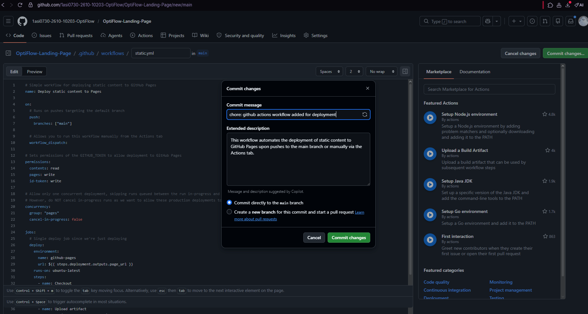{width=100%}
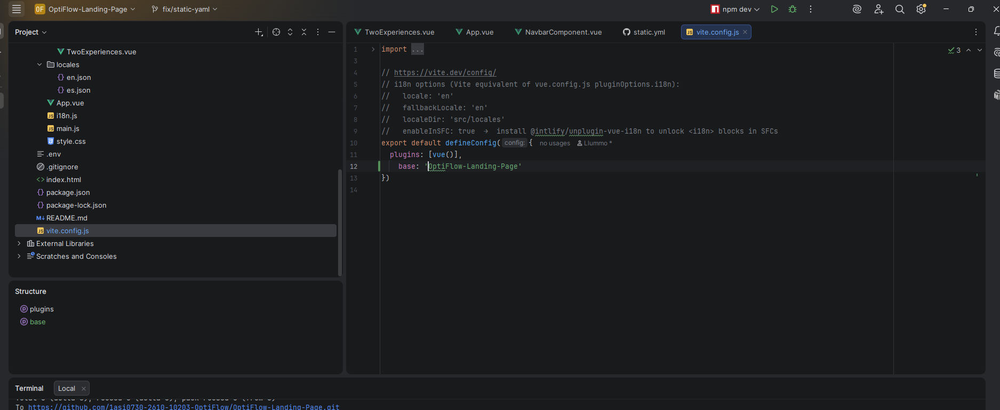{width=100%}
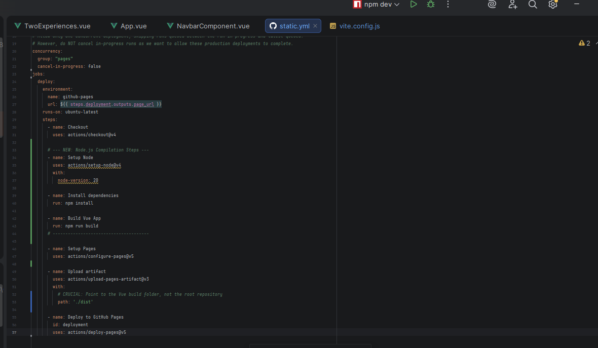{width=100%}

**URL de producción:** https://1asi0730-2610-10203-optiflow.github.io/OptiFlow-Landing-Page/

#### Frontend Web Application (SPA) — Azure Static Web Apps

El frontend Vue.js se despliega en **Azure Static Web Apps** con integración nativa a GitHub Actions. Ante cada push a `develop`, el workflow compila la aplicación y la publica automáticamente en Azure. Las variables de entorno (URL del API) se configuran directamente en el App Service de Azure.

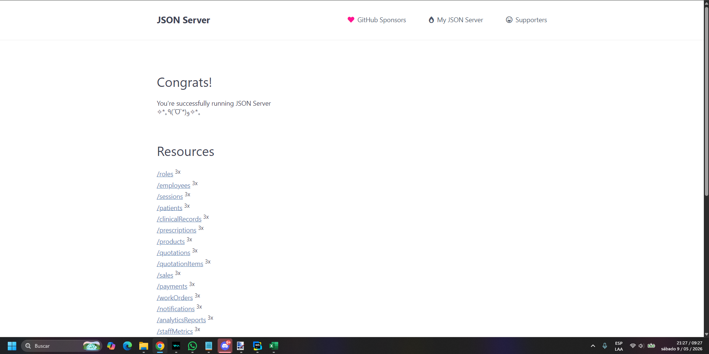
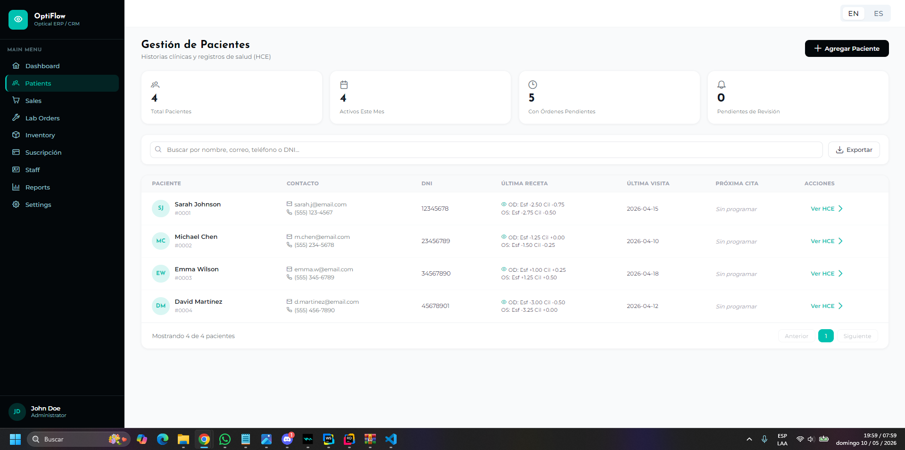

**URL de producción:** https://proud-sea-096db2110.7.azurestaticapps.net

#### Fake RESTful API (Mock API) — Repositorio local / json-server

El Fake API se basa en **json-server** con un archivo `db.json` que expone todos los recursos del sistema (clientes, órdenes, inventario, ventas, roles, etc.) como endpoints REST. Se ejecuta localmente durante el desarrollo del frontend y se referencia desde el repositorio `OptiFlow-Mock-Api`.

**Repositorio:** https://github.com/1asi0730-2610-10203-OptiFlow/OptiFlow-Mock-Api

| Producto | Plataforma | Pipeline | URL de Producción |
|:---|:---|:---|:---|
| Landing Page | GitHub Pages | GitHub Actions | https://1asi0730-2610-10203-optiflow.github.io/OptiFlow-Landing-Page/ |
| Frontend SPA | Azure Static Web Apps | GitHub Actions | https://proud-sea-096db2110.7.azurestaticapps.net |
| Fake API | json-server (local) | — | http://localhost:3000 |

## Landing Page, Services & Applications Implementation


### Sprint 1

#### Sprint Planning 1
En esta sección se especifican los aspectos principales del Sprint Planning Meeting correspondiente a la primera iteración del proyecto. El enfoque principal de este Sprint abarca la elaboración de los artefactos fundacionales de Lean UX, especificación de requerimientos, diseño de base de datos, modelado DDD, diseño de interfaces en Figma y el despliegue inicial del Landing Page.

| Aspect | Details |
| :--- | :--- |
| **Sprint #** | Sprint 1 |
| **Date** | 2026-04-23 |
| **Time** | 10:00 AM |
| **Location** | Reunión Virtual (Discord / Microsoft Teams) |
| **Prepared By** | Azama Fukuda, Juan Pablo |
| **Attendees (to planning meeting)** | Atoche Gonzales, Nicolas Fernando / Azama Fukuda, Juan Pablo / Capillo Lema, Mía Valentina / Mechan Montenegro, Luciana Carolina / Morocho Pinedo, Mariana |
| **Sprint n – 1 Review Summary** | No aplica (Primer Sprint del proyecto). |
| **Sprint n – 1 Retrospective Summary** | No aplica (Primer Sprint del proyecto). |
| **Sprint Goal** | Our focus is on setting up the foundational UX/UI design, domain architecture, and the initial landing page deployment. We believe it delivers a clear project structure and an early digital touchpoint to our target segments. This will be confirmed when the Lean UX, Database design, DDD, and Figma artifacts are completed, and the Landing Page is publicly deployed and functional. |
| **Sprint n Velocity** | 45 Story Points |
| **Sum of Story Points** | 45 |

#### Aspect Leaders and Collaborators
En el sprint principalmente se tomó enfoque en el desarrollo de la parte de diseño de la solución tanto en la parte de backend, como frontend, además del desarrollo del landing page. Por ello, se decidió dividir el equipo en sub-equipos
los cuales puedan especializarse únicamente tanto en frontend o backend, esto con el objetivo de hacer que el avance de cada punto fluya de corrido. De tal forma, se evitaría crear una cantidad de
micro tareas extensa que ocasionarían que los participantes no tengan hilación en los apartados del proyecto, debido a todo lo que abarcarían a niveles minimalistas. 


| Team Member (Last Name, First Name) | GitHub Username | Aspect Name 1 Leader (L) / Collaborator (C) | Aspect Name 2 Leader (L) / Collaborator (C) | Aspect Name 3 Leader (L) / Collaborator (C) | Aspect Name 4 Leader (L) / Collaborator (C) |
| :--- | :--- | :--- |  :--- | :--- | :--- |
| Azama Fukuda, Juan Pablo | llummo | Landing page elaboration (L) | Bounded context development (C) | Prototyping (L) | Scrum Master Role(L) |
| Atoche Gonzales, Nicolas Fernando | Japr91 | Backend architecture (L) | Bounded context development (C) | Frontend development (C) | Documentation (C) |
| Capillo Lema, Mia Valentina | Miavcl | UX Research (L) | Style Guide & IA (L) | Lean UX Process (C) | Frontend development (C) |
| Mechan Montenegro, Luciana Carolina | MehanLuciana | Backend architecture (C) | Bounded context development (L) | Database design (L) | Documentation (C) |
| Morocho Pinedo, Mariana | MarianaMP | UX Research (C) | Sprint planning & Backlog (L) | Needfinding (C) | Documentation (L) |

#### Sprint Backlog 1


| Sprint # | Sprint 1 |||||||
|:---:|:---|:---:|:---|:---|:---:|:---|:---:|
| **User Story** || **Work-Item / Task** ||||||
| **US Id** | **US Title** | **Task Id** | **Task Title** | **Description** | **Estimation (hours)** | **Assigned To** | **Status (To-Do / In-Process/ To-Review / Done)** |
| | | T01 | UX Research & Entrevistas | Realizar entrevistas a admins y clientes; crear User Personas y Empathy Maps. | 6 hrs | Mariana / Mia / Juan Pablo / Luciana | Done |
| | | T02 | Diseño UX/UI de Landing Page | Diseñar Wireframes, Mockups y User Flows de la web estática. | 5 hrs | Mia / Juan Pablo / Mariana | Done |
| | | T03 | Domain-Driven Design Artifacts | Elaborar EventStorming, Bounded Contexts y Context Mapping. | 5 hrs | Luciana / Nicolas | Done |
| | | T04 | Database & Class Diagram | Diseñar el Diagrama de Clases (UML) y el Diagrama Entidad-Relación (ERD). | 5 hrs | Luciana / Nicolas | Done |
| | | T05 | Software Development Environment | Configurar el entorno de desarrollo y dependencias locales del framework frontend. | 2 hrs | Juan Pablo | Done |
| | | T06 | Source Code Management & Styles | Definir el Style Guide del código y parte del Information Architecture. | 2 hrs | Mia | Done |
| | | T07 | Segmento objetivo & Lean UX Process | Definir segmento objetivo, Lean UX Canvas y User Task Matrix. | 2 hrs | Mia | Done |
| | | T08 | Software Deployment Configuration | Configurar el servicio de hosting cloud estático (ej. Vercel/Netlify) para la Landing. | 3 hrs | Juan Pablo | Done |
| | | T09 | Sprint 1 Planning & Backlog | Redactar el Sprint Planning, Aspect Leaders, y este Sprint Backlog en el informe. | 2 hrs | Mariana | Done |
| | | T10 | Development & Execution Evidence | Recolectar capturas de commits (Development) y video/capturas de ejecución (Execution). | 2 hrs | Mia | Done |
| | | T11 | Deployment & Services Evidence | Documentar el link de producción y métricas de colaboración (Team Collaboration Insights). | 2 hrs | Luciana | Done |
| US-46L | Propuesta de Valor (Hero Section) | T12 | Desarrollo: Hero Section | Maquetar en HTML/CSS/JS la cabecera principal, textos persuasivos y botones CTA. | 4 hrs | Juan Pablo | Done |
| US-47L | Catálogo de Características | T13 | Desarrollo: Módulos del Sistema | Programar la sección de módulos (Ventas, Laboratorio) de forma responsive. | 4 hrs | Mia | Done |
| US-48L | Consulta de Planes y Precios | T14 | Desarrollo: Pricing Table | Maquetar la tabla de precios comparativa interactiva para la web. | 4 hrs | | Done |
| US-49L | Formulario de Contacto General | T15 | Desarrollo: Formulario & Validaciones | Codificar el formulario de contacto y agregar validaciones de campos en JavaScript. | 4 hrs | Nicolas | Done |
| US-50L | Redirección a Login | T16 | Desarrollo: Navbar & Footer | Implementar la barra de navegación superior anclada y el botón de acceso al sistema. | 3 hrs | Mariana | Done |

#### Sprint Backlog y seguimiento de tareas mediante tablero en Trello
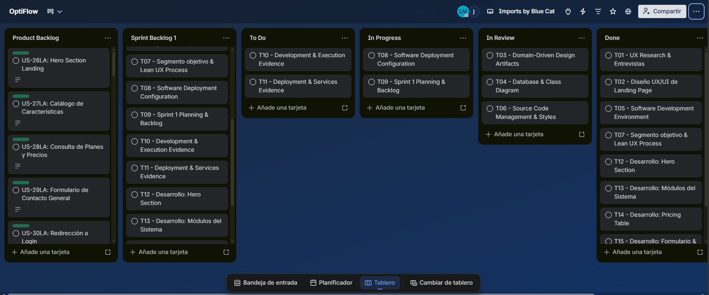

**Enlace del tablero Trello:**  
https://trello.com/invite/b/69eba124179d41cdbf1d256e/ATTI3167beb4688f2da975bd23cdf51f144c3C1DA6E6/optiflow

#### Development Evidence for Sprint Review
| Repository | Branch | Commit Id | Commit Message | Commit Message Body | Committed on (Date) |
|------------|--------|-----------|----------------|---------------------|---------------------|
| 1asi0730-2610-10203-OptiFlow/landing-page | feature/hero-section | ead6b53 | fix(hero): fix hero-title padding-top | - | 2026-04-20 |
| 1asi0730-2610-10203-OptiFlow/landing-page | feature/hero-section | 78ec519 | feat(hero): added login button and upgraded animations | - | 2026-04-20 |
| 1asi0730-2610-10203-OptiFlow/landing-page | feature/hero-section | 168670e | feat(hero): add 3d shapes | - | 2026-04-20 |
| 1asi0730-2610-10203-OptiFlow/landing-page | feature/hero-section | e4f6bf8 | fix(hero): fix hero background | - | 2026-04-20 |
| 1asi0730-2610-10203-OptiFlow/landing-page | feature/hero-section | e1884df | feat(hero): add hero section | - | 2026-04-20 |
| 1asi0730-2610-10203-OptiFlow/landing-page | feature/hero-navbar | 0e314f8 | feat(nav): add hero header navbar | - | 2026-04-20 |
| 1asi0730-2610-10203-OptiFlow/landing-page | feature/i18n | f1b8d02 | feat(i18n): add i18n | - | 2026-04-23 |
| 1asi0730-2610-10203-OptiFlow/landing-page | feature/i18n | 69b05b5 | Merge pull request #10 from 1asi0730-2610-10203-OptiFlow/feature/contact | - | 2026-04-23 |
| 1asi0730-2610-10203-OptiFlow/landing-page | feature/i18n | e1a8a19 | Update Footer | - | 2026-04-23 |
| 1asi0730-2610-10203-OptiFlow/landing-page | feature/i18n | 666a412 | Update ContactSection | - | 2026-04-23 |
| 1asi0730-2610-10203-OptiFlow/landing-page | feature/i18n | 92f9625 | Merge pull request #9 from 1asi0730-2610-10203-OptiFlow/feature/two-experiences | - | 2026-04-23 |
| 1asi0730-2610-10203-OptiFlow/landing-page | feature/i18n | bcb238a | refactor(two-exp): improve spacing and typography | - | 2026-04-23 |
| 1asi0730-2610-10203-OptiFlow/landing-page | feature/i18n | 5f520da | feat(two-exp): style two experiences section | - | 2026-04-23 |
| 1asi0730-2610-10203-OptiFlow/landing-page | feature/i18n | afbc58d | feat(two-exp): add two experiences section structure and content | - | 2026-04-23 |
| 1asi0730-2610-10203-OptiFlow/landing-page | feature/i18n | a1d2bbf | Merge pull request #8 from 1asi0730-2610-10203-OptiFlow/feature/hero-navbar | - | 2026-04-22 |
| 1asi0730-2610-10203-OptiFlow/landing-page | feature/i18n | a772e70 | feat(nav): add logo and improve navbar design | - | 2026-04-22 |
| 1asi0730-2610-10203-OptiFlow/landing-page | feature/contact | f1b8d02 | feat(i18n): add i18n | - | 2026-04-23 |
| 1asi0730-2610-10203-OptiFlow/landing-page | feature/contact | 69b05b5 | Merge pull request #10 from 1asi0730-2610-10203-OptiFlow/feature/contact | - | 2026-04-23 |
| 1asi0730-2610-10203-OptiFlow/landing-page | feature/contact | e1a8a19 | Update Footer | - | 2026-04-23 |
| 1asi0730-2610-10203-OptiFlow/landing-page | feature/contact | 666a412 | Update ContactSection | - | 2026-04-23 |
| 1asi0730-2610-10203-OptiFlow/landing-page | feature/contact | 92f9625 | Merge pull request #9 from 1asi0730-2610-10203-OptiFlow/feature/two-experiences | - | 2026-04-23 |
| 1asi0730-2610-10203-OptiFlow/landing-page | feature/contact | bcb238a | refactor(two-exp): improve spacing and typography | - | 2026-04-23 |
| 1asi0730-2610-10203-OptiFlow/landing-page | feature/contact | 5f520da | feat(two-exp): style two experiences section | - | 2026-04-23 |
| 1asi0730-2610-10203-OptiFlow/landing-page | feature/contact | afbc58d | feat(two-exp): add two experiences section structure and content | - | 2026-04-23 |
| 1asi0730-2610-10203-OptiFlow/landing-page | feature/contact | a1d2bbf | Merge pull request #8 from 1asi0730-2610-10203-OptiFlow/feature/hero-navbar | - | 2026-04-22 |
| 1asi0730-2610-10203-OptiFlow/landing-page | feature/contact | a772e70 | feat(nav): add logo and improve navbar design | - | 2026-04-22 |
| 1asi0730-2610-10203-OptiFlow/landing-page | feature/two-experiences | f1b8d02 | feat(i18n): add i18n | - | 2026-04-23 |
| 1asi0730-2610-10203-OptiFlow/landing-page | feature/two-experiences | 69b05b5 | Merge pull request #10 from 1asi0730-2610-10203-OptiFlow/feature/contact | - | 2026-04-23 |
| 1asi0730-2610-10203-OptiFlow/landing-page | feature/two-experiences | e1a8a19 | Update Footer | - | 2026-04-23 |
| 1asi0730-2610-10203-OptiFlow/landing-page | feature/two-experiences | 666a412 | Update ContactSection | - | 2026-04-23 |
| 1asi0730-2610-10203-OptiFlow/landing-page | feature/two-experiences | 92f9625 | Merge pull request #9 from 1asi0730-2610-10203-OptiFlow/feature/two-experiences | - | 2026-04-23 |
| 1asi0730-2610-10203-OptiFlow/landing-page | feature/two-experiences | bcb238a | refactor(two-exp): improve spacing and typography | - | 2026-04-23 |
| 1asi0730-2610-10203-OptiFlow/landing-page | feature/two-experiences | 5f520da | feat(two-exp): style two experiences section | - | 2026-04-23 |
| 1asi0730-2610-10203-OptiFlow/landing-page | feature/two-experiences | afbc58d | feat(two-exp): add two experiences section structure and content | - | 2026-04-23 |
| 1asi0730-2610-10203-OptiFlow/landing-page | feature/two-experiences | a1d2bbf | Merge pull request #8 from 1asi0730-2610-10203-OptiFlow/feature/hero-navbar | - | 2026-04-22 |
| 1asi0730-2610-10203-OptiFlow/landing-page | feature/two-experiences | a772e70 | feat(nav): add logo and improve navbar design | - | 2026-04-22 
| 1asi0730-2610-10203-OptiFlow/landing-page | feature/features | f1b8d02 | feat(i18n): add i18n | - | 2026-04-23 |
| 1asi0730-2610-10203-OptiFlow/landing-page | feature/features | 69b05b5 | Merge pull request #10 from 1asi0730-2610-10203-OptiFlow/feature/contact | - | 2026-04-23 |
| 1asi0730-2610-10203-OptiFlow/landing-page | feature/features | e1a8a19 | Update Footer | - | 2026-04-23 |
| 1asi0730-2610-10203-OptiFlow/landing-page | feature/features | 666a412 | Update ContactSection | - | 2026-04-23 |
| 1asi0730-2610-10203-OptiFlow/landing-page | feature/features | 92f9625 | Merge pull request #9 from 1asi0730-2610-10203-OptiFlow/feature/two-experiences | - | 2026-04-23 |
| 1asi0730-2610-10203-OptiFlow/landing-page | feature/features | bcb238a | refactor(two-exp): improve spacing and typography | - | 2026-04-23 |
| 1asi0730-2610-10203-OptiFlow/landing-page | feature/features | 5f520da | feat(two-exp): style two experiences section | - | 2026-04-23 |
| 1asi0730-2610-10203-OptiFlow/landing-page | feature/features | afbc58d | feat(two-exp): add two experiences section structure and content | - | 2026-04-23 |
| 1asi0730-2610-10203-OptiFlow/landing-page | feature/features | a1d2bbf | Merge pull request #8 from 1asi0730-2610-10203-OptiFlow/feature/hero-navbar | - | 2026-04-22 |
| 1asi0730-2610-10203-OptiFlow/landing-page | feature/features | a772e70 | feat(nav): add logo and improve navbar design | - | 2026-04-22 |

  https://github.com/1asi0730-2610-10203-OptiFlow/OptiFlow-Landing-Page.git

#### Execution Evidence for Sprint Review
Durante la iteración inicial del proyecto OptiFlow, se consolidó el diseño estratégico del sistema mediante la elaboración de artefactos de Domain-Driven Design y el modelado estructural de la base de datos, estableciendo una arquitectura técnica escalable que fue complementada por una exhaustiva investigación de Experiencia de Usuario (UX/UI) y prototipado de alta fidelidad basado en la elicitación de requerimientos de los segmentos objetivo; sobre esta integración teórico-práctica, se ejecutó exitosamente la codificación frontend y el despliegue en entorno cloud de la Landing Page comercial para la captación de prospectos (historias US-46L a US-50L), operando de manera transversal dentro de un entorno de desarrollo colaborativo estrictamente gestionado bajo la estrategia GitFlow para garantizar la integridad, control de versiones y trazabilidad de los aportes del equipo.

Execution Evidence Video: https://upcedupe-my.sharepoint.com/:v:/g/personal/u202411310_upc_edu_pe/IQDRb9C8iIC4QZsZvLTlRB7pAZ6ojywom_jWhlEpYqPo-A4?e=lHQO2L


#### Services Documentation Evidence for Sprint Review

Los servicios todavía no han sido implementados en este sprint, todos fueron implementados y documentados a partir del sprint 2


#### Software Deployment Evidence for Sprint Review
En este primer sprint se desplegó la primera versión del landing page utilizando github pages.
{width=100%}
{width=100%}
{width=100%}

Landing page deployed: https://1asi0730-2610-10203-optiflow.github.io/OptiFlow-Landing-Page/
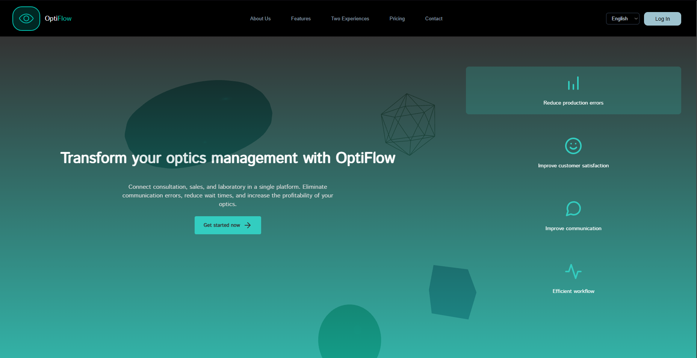{width=100%}

#### Team Collaboration Insights during Sprint
Team Collaboration Insights durante el Sprint 1
Durante el Sprint 1, el equipo coordinó las actividades de desarrollo principalmente a través de Discord y Google Meet para reuniones síncronas, y GitHub como plataforma central de control de versiones, revisión de código e integración mediante Pull Requests. Todas las contribuciones fueron gestionadas bajo la estrategia GitFlow, utilizando ramas feature/* que se integraron a develop a través de Pull Requests con revisión de pares previa a su incorporación.

### Resumen de colaboración:
El equipo realizó sesiones virtuales de planificación y revisión alineadas al cronograma del Sprint 1. La comunicación se mantuvo de forma asíncrona a través de canales de Discord dedicados a cada bounded context, permitiendo a los integrantes reportar avances y bloqueos sin interrumpir los flujos de trabajo paralelos.

Las siguientes métricas fueron extraídas del panel GitHub Insights del repositorio OptiFlow-Report-Stable durante el período del Sprint 1:

| Integrante                           | Usuario GitHub | Commits |
|--------------------------------------|----------------|----------|
| Azama Fukuda, Juan Pablo             | Llummo         | 37       |
| Capillo Lema, Mía Valentina          | Miavcl         | 15       |
| Mechan Montenegro, Luciana Carolina  | luuu62         | 15        |
| Atoche Gonzales, Nicolas Fernando    | THECOMAX       | 14       |
| Morocho Pinedo, Mariana              | Patto04        | 3        |

Se realizaron los Pull Requests mergeados por 5 integrantes contribuyentes durante este período. No se registraron issues en el repositorio durante este ciclo.

**Vista general de GitHub Insights — Pulse:**

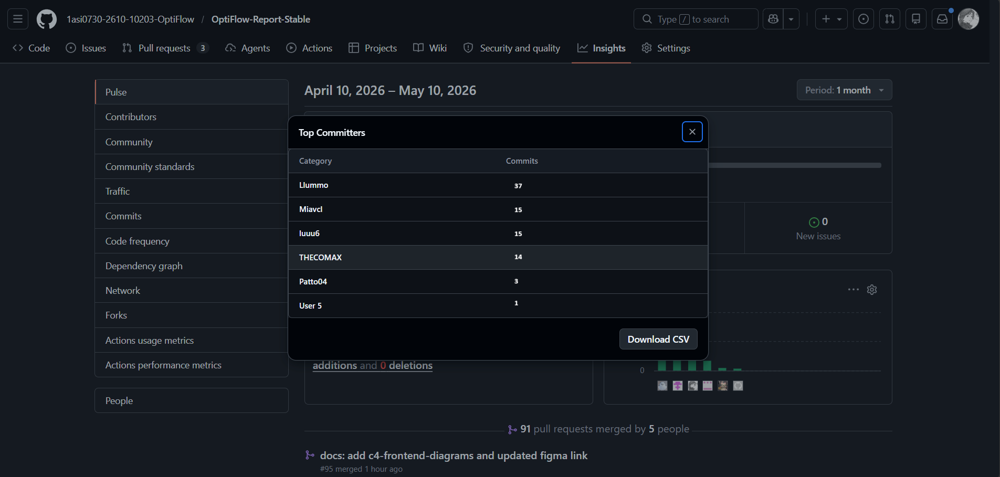

**Gráfica de Top Committers:**

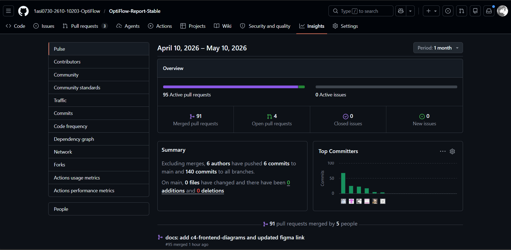

**Pull Requests mergeados recientes:**

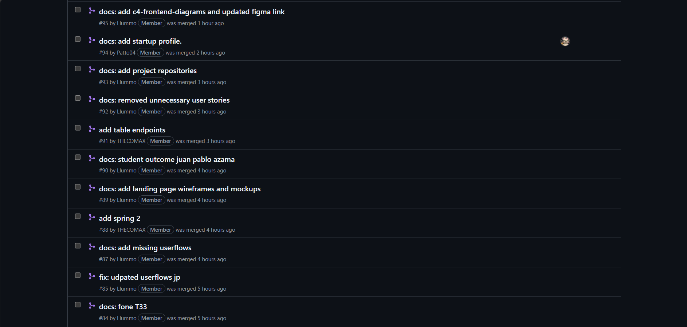

**Actividad del repositorio — OptiFlow Landing Page**

El repositorio de la Landing Page registró la participación de **5 autores** con un total de **22 commits** distribuidos en todas las ramas y **22 Pull Requests mergeados** sin issues abiertos durante el período del sprint.

**Vista general de GitHub Insights — Landing Page:**

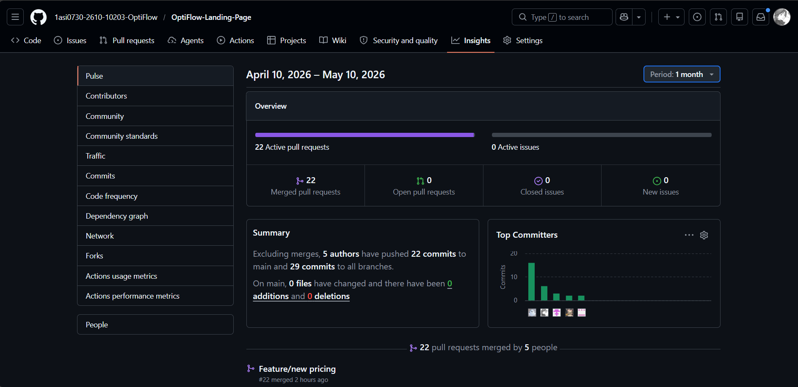

### Sprint 2

#### Sprint Planning 2
En esta sección se especifican los aspectos principales del Sprint Planning Meeting correspondiente a la segunda iteración del proyecto. El enfoque principal de este Sprint abarca la corrección de los errores identificados en el Sprint anterior y el desarrollo del frontend de la aplicación web. En base a la retrospectiva del Sprint 1, el equipo definió mejoras en la coordinación interna, la documentación y la calidad de los artefactos de diseño.

| Aspect | Details |
| :--- | :--- |
| **Sprint #** | Sprint 2 |
| **Date** | 2026-05-06 |
| **Time** | 10:00 AM |
| **Location** | Reunión Virtual (Discord / Microsoft Teams) |
| **Prepared By** | Azama Fukuda, Juan Pablo |
| **Attendees (to planning meeting)** | Atoche Gonzales, Nicolas Fernando / Azama Fukuda, Juan Pablo / Capillo Lema, Mía Valentina / Mechan Montenegro, Luciana Carolina / Morocho Pinedo, Mariana |
| **Sprint n – 1 Review Summary** | Se avanzaron artefactos Lean UX y Needfinding, se recolectaron requisitos y se finalizó el Figma. No obstante, faltó diseñar los diagramas DDD en su complitud, desplegar el landing page y documentar correctamente el sprint. |
| **Sprint n – 1 Retrospective Summary** | Errores identificados: el prototipo fue mal delegado y se ejecutó de forma descoordinada; se perdió tiempo por configuraciones de open source; los aportes tardaron en subirse al repositorio y se presentaron problemas con la conversión Pandoc. Mejoras acordadas: (1) Perfeccionar el Figma, (2) refinar diagramas C4 y Class Diagram del frontend, (3) revisión general del informe, (4) documentar Student Outcomes con commits, (5) leer el enunciado por inciso antes de trabajar, (6) reportar cada avance al grupo, (7) eliminar ramas no utilizadas del repositorio. |
| **Sprint Goal** | Our focus is on fixing the mistakes and the frontend of the project. We believe it delivers satisfaction to the optics clients and administrators. This will be confirmed when the team tests the application and determines that its use is comfortable. |
| **Sprint n Velocity** | 45 Story Points |
| **Sum of Story Points** | 45 |

#### Aspect Leaders and Collaborators
En el sprint el enfoque principal fue el desarrollo del frontend de la aplicación web y la corrección de los errores identificados en el sprint anterior. El equipo mantuvo la especialización por módulos establecida en la retrospectiva: cada integrante lideró un conjunto de vistas específico, evitando el solapamiento de responsabilidades y garantizando un avance continuo por área. Adicionalmente, se distribuyeron tareas de documentación y evidencia entre todos los miembros para mantener el informe actualizado en paralelo al desarrollo.

| Team Member (Last Name, First Name) | GitHub Username | Aspect Name 1 Leader (L) / Collaborator (C) | Aspect Name 2 Leader (L) / Collaborator (C) | Aspect Name 3 Leader (L) / Collaborator (C) | Aspect Name 4 Leader (L) / Collaborator (C) |
| :--- | :--- | :--- |  :--- | :--- | :--- |
| Azama Fukuda, Juan Pablo | Llummo | Sales module frontend development (L) | Report corrections & documentation (L) | Software deployment configuration (L) | Scrum Master Role (L) |
| Atoche Gonzales, Nicolas Fernando | THECOMAX | Clinical & authentication module frontend (L) | Fake API configuration (L) | Services documentation evidence (L) | Validation interviews (L) |
| Capillo Lema, Mia Valentina | Miavcl | Customer portal frontend development (L) | Frontend development (C) | Report documentation (C) | UX implementation (C) |
| Mechan Montenegro, Luciana Carolina |luuu6 | Inventory & lab module frontend (L) | Development evidence documentation (L) | Team collaboration insights (L) | Agile tool management (L) |
| Morocho Pinedo, Mariana | Patto04 | Analytics & admin module frontend (L) | Sprint planning & Backlog (C) | Frontend development (C) | Report documentation (C) |

#### Sprint Backlog 2
<table>
<thead>
    <tr>
      <th style="text-align: left;">Sprint #</th>
      <th colspan="7" style="text-align: left;">Sprint 2</th>
    </tr>
    <tr>
      <th colspan="2" style="text-align: left;">User Story</th>
      <th colspan="6" style="text-align: left;">Work-Item / Task</th>
    </tr>
    <tr>
      <th style="text-align: left;">Id</th>
      <th style="text-align: left;">Title</th>
      <th style="text-align: left;">Id</th>
      <th style="text-align: left;">Title</th>
      <th style="text-align: left;">Description</th>
      <th style="text-align: left;">Estimation (Hours)</th>
      <th style="text-align: left;">Assigned To</th>
      <th style="text-align: left;">Status (To-do / In-Process / To-Review / Done)</th>
    </tr>
  </thead>
  <tbody>
    <tr>
      <td>US-28P</td>
      <td>Inicio de Sesión de Cliente con DNI</td>
      <td>T01</td>
      <td>Vista de Login del Cliente (DNI)</td>
      <td>Desarrollar la vista de autenticación del portal del paciente con campo DNI y validación conectada al fake API.</td>
      <td>3 hrs</td>
      <td>Mia</td>
      <td>Done</td>
    </tr>
    <tr>
      <td>US-05P</td>
      <td>Seguimiento de Orden Web</td>
      <td>T02</td>
      <td>Componente de Seguimiento de Orden</td>
      <td>Implementar la vista del portal que muestra el estado actual de la orden del cliente, consumiendo el fake API.</td>
      <td>4 hrs</td>
      <td>Mia</td>
      <td>Done</td>
    </tr>
    <tr>
      <td>US-06P</td>
      <td>Gestión de Perfil de Usuario</td>
      <td>T03</td>
      <td>Vista de Perfil del Cliente</td>
      <td>Crear el formulario editable de datos de contacto del cliente (nombre, correo, teléfono) con actualización en fake API.</td>
      <td>3 hrs</td>
      <td>Mia</td>
      <td>Done</td>
    </tr>
    <tr>
      <td>US-07P</td>
      <td>Consulta de Saldo</td>
      <td>T04</td>
      <td>Vista de Consulta de Saldo Pendiente</td> 
      <td>Diseñar e implementar la vista que muestra el monto pendiente de la orden activa del cliente autenticado.</td>
      <td>2 hrs</td>
      <td>Mia</td>
      <td>Done</td>
    </tr>
    <tr>
      <td>US-10G</td>
      <td>Registro de Clientes</td>
      <td>T05</td>
      <td>Formulario de Registro de Cliente</td>
      <td>Desarrollar el formulario con campos básicos (nombre, DNI, teléfono, correo) y guardado mediante POST al fake API.</td>
      <td>4 hrs</td>
      <td>Nicolas</td>  
      <td>Done</td>
    </tr>
    <tr>
      <td>US-08G</td>
      <td>Registro de Historia Clínica</td>
      <td>T06</td>
      <td>Formulario de Historia Clínica (Examen Visual)</td>
      <td>Implementar el formulario de examen visual con campos de esfera, cilindro y eje para ambos ojos, guardado en fake API.</td>
      <td>5 hrs</td>
      <td>Nicolas</td>
      <td>Done</td>
    </tr>
    <tr>
      <td>US-09G</td>
      <td>Carga de Exámenes Externos</td>
      <td>T07</td>
      <td>Componente de Carga de PDF Médico</td>
      <td>Crear el componente de upload de archivos PDF con vista previa del nombre de archivo vinculado al perfil del cliente.</td>
      <td>3 hrs</td>
      <td>Nicolas</td>
      <td>Done</td>
    </tr>
    <tr>
      <td>US-36G</td>
      <td>Vista de HCE del Cliente</td>
      <td>T08</td>
      <td>Vista del Expediente Clínico (HCE)</td>
      <td>Implementar la vista que consolida los exámenes visuales anteriores y órdenes vinculadas al perfil del cliente.</td>
      <td>3 hrs</td>
      <td>Nicolas</td>
      <td>Done</td>
    </tr>
    <tr>
      <td></td>
      <td>Fake API Development</td>
      <td>T09</td>
      <td>Configuración de json-server (db.json)</td>
      <td>Configurar json-server con todos los recursos del sistema (clientes, órdenes, inventario, ventas, usuarios, roles) para ser consumidos por el frontend.</td>
      <td>4 hrs</td>
      <td>Nicolas</td>
      <td>Done</td>
    </tr>
    <tr>
      <td>US-01S</td>
      <td>Autenticación de Usuarios</td>
      <td>T10</td>
      <td>Vista de Login de Empleado</td>
      <td>Implementar la vista de inicio de sesión del sistema con campos de usuario/contraseña y redirección según rol asignado.</td>
      <td>3 hrs</td>
      <td>Nicolas</td>
      <td>Done</td>
    </tr>
    <tr>
      <td>US-02S</td>
      <td>Recuperación de Contraseña</td>
      <td>T11</td>
      <td>Vista de Recuperación de Contraseña</td>
      <td>Crear la vista con campo de correo y flujo de confirmación de restablecimiento de contraseña conectado al fake API.</td>
      <td>2 hrs</td>
      <td>Nicolas</td>
      <td>Done</td>
    </tr>
    <tr>
      <td>US-11F</td>
      <td>Gestión de Ventas</td>
      <td>T12</td>
      <td>Vista de Registro de Nueva Venta</td>
      <td>Desarrollar la vista principal de ventas con selección de cliente, productos y resumen del pedido, conectada al fake API.</td>
      <td>5 hrs</td>
      <td>Juan Pablo</td>
      <td>Done</td>
    </tr>
    <tr>
      <td>US-14F</td>
      <td>Pagos con Múltiples Métodos</td>
      <td>T13</td>
      <td>Componente de Método de Pago Mixto</td>
      <td>Implementar el componente que permite dividir el monto entre efectivo y tarjeta, calculando automáticamente el vuelto.</td>
      <td>4 hrs</td>
      <td>Juan Pablo</td>
      <td>Done</td>
    </tr>
    <tr>
      <td>US-13F</td>
      <td>Aplicación de Descuentos</td>
      <td>T14</td>
      <td>Componente de Código de Descuento</td>
      <td>Crear el input de código de descuento con validación y recálculo automático del monto en la boleta de venta.</td>
      <td>2 hrs</td>
      <td>Juan Pablo</td>
      <td>Done</td>
    </tr>
    <tr>
      <td>US-12F</td>
      <td>Registro de Pago de Saldo</td>
      <td>T15</td>
      <td>Modal de Registro de Pago Pendiente</td>
      <td>Implementar el modal de cobro de saldo al momento de la entrega del producto con actualización de estado en fake API.</td>
      <td>3 hrs</td>
      <td>Juan Pablo</td>
      <td>Done</td>
    </tr>
    <tr>
      <td>US-15F</td>
      <td>Devolución de Orden</td>
      <td>T16</td>
      <td>Flujo de Devolución de Venta</td>
      <td>Desarrollar el flujo de reversión de venta desde la pantalla de ventas con motivo de devolución y actualización de estado.</td>
      <td>3 hrs</td>
      <td>Juan Pablo</td>
      <td>Done</td>
    </tr>
    <tr>
      <td>US-16F</td>
      <td>Notificaciones de Recojo</td>
      <td>T17</td>
      <td>Componente de Notificación de Orden Lista</td>
      <td>Implementar el componente que muestra la alerta al cliente cuando su orden está lista para recoger en tienda.</td>
      <td>2 hrs</td>
      <td>Juan Pablo</td>
      <td>Done</td>
    </tr>
    <tr>
      <td>US-17F</td>
      <td>Encuestas de Satisfacción</td>
      <td>T18</td>
      <td>Vista de Encuesta de Satisfacción Post-Venta</td>
      <td>Crear el formulario de calificación post-venta con escala de valoración y campo de comentario libre, guardado en fake API.</td>
      <td>2 hrs</td>
      <td>Juan Pablo</td>
      <td>Done</td>
    </tr>
    <tr>
      <td>US-18L</td>
      <td>Consulta de Inventario en Tiempo Real</td>
      <td>T19</td>
      <td>Dashboard de Inventario</td>
      <td>Implementar la vista de consulta de stock con listado paginado de monturas y estado de disponibilidad desde fake API.</td>
      <td>4 hrs</td>
      <td>Luciana</td>
      <td>Done</td>
    </tr>
    <tr>
      <td>US-20L</td>
      <td>Registro de Nuevo Producto</td>
      <td>T20</td>
      <td>Formulario de Alta de Producto</td>
      <td>Desarrollar el formulario de registro de nuevas monturas con campos de marca, modelo, precio y stock inicial.</td>
      <td>3 hrs</td>
      <td>Luciana</td>
      <td>Done</td>
    </tr>
    <tr>
      <td>US-22L</td>
      <td>Búsqueda Avanzada</td>
      <td>T21</td>
      <td>Componente de Filtros Cruzados de Inventario</td>
      <td>Implementar el panel de filtros múltiples (marca, tipo, precio, disponibilidad) sobre el listado de productos del catálogo.</td>
      <td>3 hrs</td>
      <td>Luciana</td>
      <td>Done</td>
    </tr>
    <tr>
      <td>US-19L</td>
      <td>Alertas de Bajo Stock</td>
      <td>T22</td>
      <td>Componente de Alertas de Stock</td>
      <td>Crear el componente de alerta visual que resalta productos por debajo del umbral mínimo configurado en el inventario.</td>
      <td>3 hrs</td>
      <td>Luciana</td>
      <td>Done</td>
    </tr>
    <tr>
      <td>US-21L</td>
      <td>Gestión de Variantes</td>
      <td>T23</td>
      <td>Vista de Gestión de Variantes de Lunas</td>
      <td>Implementar la vista de registro y edición de tipos de materiales de lunas (orgánico, fotocromático, antirreflejo, etc.).</td>
      <td>3 hrs</td>
      <td>Luciana</td>
      <td>Done</td>
    </tr>
    <tr>
      <td>US-23L</td>
      <td>Control de Órdenes y Tablero Kanban</td>
      <td>T24</td>
      <td>Tablero Kanban de Laboratorio</td>
      <td>Desarrollar el tablero Kanban interactivo con columnas (Pendiente, En Proceso, Listo, Entregado) y drag-and-drop de tarjetas de orden.</td>
      <td>8 hrs</td>
      <td>Luciana</td>
      <td>Done</td>
    </tr>
    <tr>
      <td>US-24L</td>
      <td>Motivos de Retrabajo</td>
      <td>T25</td>
      <td>Modal de Registro de Motivo de Retrabajo</td>
      <td>Crear el modal de tipificación de errores de fabricación con selector de causa raíz y actualización del estado de la orden.</td>
      <td>2 hrs</td>
      <td>Luciana</td>
      <td>Done</td>
    </tr>
    <tr>
      <td>US-25L</td>
      <td>Gestión de Urgencias</td>
      <td>T26</td>
      <td>Componente de Marcado de Urgencia</td>
      <td>Implementar el botón y lógica de priorización máxima de órdenes en el tablero Kanban con resaltado visual diferenciado.</td>
      <td>2 hrs</td>
      <td>Luciana</td>
      <td>Done</td>
    </tr>
    <tr>
      <td>US-26L</td>
      <td>Control de Insumos</td>
      <td>T27</td>
      <td>Vista de Control de Insumos (Bloques)</td>
      <td>Desarrollar la vista de seguimiento de materia prima con descuento automático de stock al registrar nuevas órdenes de laboratorio.</td>
      <td>4 hrs</td>
      <td>Luciana</td>
      <td>Done</td>
    </tr>
    <tr>
      <td>US-27A</td>
      <td>Dashboard de Ventas</td>
      <td>T28</td>
      <td>Dashboard de Métricas de Ventas</td>
      <td>Implementar el panel centralizado con gráficos de ingresos, conversión y rendimiento del negocio consumiendo el fake API.</td>
      <td>5 hrs</td>
      <td>Mariana</td>
      <td>Done</td>
    </tr>
    <tr>
      <td>US-03A</td>
      <td>Gestión de Roles</td>
      <td>T29</td>
      <td>Vista de Gestión de Roles y Permisos</td>
      <td>Desarrollar la vista de asignación y edición de roles (admin, vendedor, técnico de laboratorio) con tabla de permisos por módulo.</td>
      <td>5 hrs</td>
      <td>Mariana</td>
      <td>Done</td>
    </tr>
    <tr>
      <td>US-04A</td>
      <td>Auditoría de Inventario</td>
      <td>T30</td>
      <td>Vista de Registro de Auditoría</td>
      <td>Crear la vista de historial de alteraciones de stock con filtros por fecha, producto y usuario responsable de cada cambio.</td>
      <td>4 hrs</td>
      <td>Mariana</td>
      <td>Done</td>
    </tr>
    <tr>
      <td>US-34S</td>
      <td>Registro de Empleado</td>
      <td>T31</td>
      <td>Formulario de Alta de Empleado</td>
      <td>Implementar el formulario de registro de nuevos empleados con campos de nombre, correo, rol asignado y contraseña inicial.</td>
      <td>3 hrs</td>
      <td>Mariana</td>
      <td>Done</td>
    </tr>
    <tr>
      <td>US-35A</td>
      <td>Configuración General del Sistema</td>
      <td>T32</td>
      <td>Vista de Configuración del Sistema</td>
      <td>Desarrollar la vista de configuración con campos de información del negocio, política de contraseñas y opciones de copia de seguridad.</td>
      <td>3 hrs</td>
      <td>Mariana</td>
      <td>Done</td>
    </tr>
    <tr>
      <td></td>
      <td></td>
      <td>T33</td>
      <td>Corrección de bugs del informe (Cap. V)</td>
      <td>Eliminar el texto `git` suelto dentro de celdas del Sprint Backlog 1, corregir la tabla Aspect Leaders Sprint 1 (nombres duplicados de Rodríguez Peña) y limpiar el texto corrupto con hash incrustado en el Student Outcome.</td>
      <td>4 hrs</td>
      <td>Juan Pablo</td>
      <td>Done</td>
    </tr>
    <tr>
      <td></td>
      <td></td>
      <td>T34</td>
      <td>Completar secciones preliminares del informe</td>
      <td>Agregar entrada TB2 en el Registro de Versiones, rellenar el URL del repositorio del informe en Project Report Collaboration Insights e insertar la captura de commits del equipo.</td>
      <td>4 hrs</td>
      <td>Juan Pablo</td>
      <td>Done</td>
    </tr>
    <tr>
      <td></td>
      <td></td>
      <td>T35</td>
      <td>Redactar Software Deployment Configuration</td>
      <td>Documentar la configuración de despliegue de la Landing Page: describir el pipeline de GitHub Actions, el archivo de workflow YAML, el entorno de GitHub Pages y cualquier variable de entorno utilizada.</td>
      <td>4 hrs</td>
      <td>Juan Pablo</td>
      <td>Done</td>
    </tr>
    <tr>
      <td></td>
      <td></td>
      <td>T36</td>
      <td>Grabar Execution Evidence Sprint 1 (Landing Page)</td>
      <td>Grabar un video corto que evidencie el Landing Page desplegado y funcional, mostrando todas las secciones (Hero, Features, Pricing, Contact) en desktop y mobile. Embeber el enlace en la sección Execution Evidence Sprint 1.</td>
      <td>4 hrs</td>
      <td>Juan Pablo</td>
      <td>Done</td>
    </tr>
    <tr>
      <td></td>
      <td></td>
      <td>T37</td>
      <td>Landing Page Wireframe y Mock-up (Cap. IV)</td>
      <td>Insertar las imágenes de los Wireframes y Mock-ups de la Landing Page en las secciones correspondientes del Capítulo IV (actualmente son placeholders vacíos).</td>
      <td>5 hrs</td>
      <td>Juan Pablo</td>
      <td>Done</td>
    </tr>
    <tr>
      <td></td>
      <td></td>
      <td>T38</td>
      <td>Web Applications Prototyping — enlace Figma</td>
      <td>Agregar el enlace al prototipo interactivo en Figma en la sección Web Applications Prototyping del Capítulo IV, junto con una descripción de los escenarios de prueba cubiertos.</td>
      <td>4 hrs</td>
      <td>Juan Pablo</td>
      <td>Done</td>
    </tr>
    <tr>
      <td></td>
      <td></td>
      <td>T39</td>
      <td>Development Evidence Sprint 2 (módulo ventas)</td>
      <td>Completar la tabla Development Evidence del Sprint 2 con los commits del repositorio de la Web App correspondientes a las tasks del módulo de ventas (T12–T18): registro de venta, pagos, descuentos, devoluciones y notificaciones.</td>
      <td>4 hrs</td>
      <td>Juan Pablo</td>
      <td>Done</td>
    </tr>
    <tr>
      <td></td>
      <td></td>
      <td>T40</td>
      <td>Execution Evidence Sprint 2 + Aspect Leaders S2 + Video About-the-Product</td>
      <td>Agregar capturas o video de las vistas del módulo de ventas implementadas. Completar la tabla Aspect Leaders and Collaborators del Sprint 2. Redactar la sección Video About-the-Product con enlace al video del producto final.</td>
      <td>5 hrs</td>
      <td>Juan Pablo</td>
      <td>Done</td>
    </tr>
    <tr>
      <td></td>
      <td></td>
      <td>T41</td>
      <td>Repositorios Web App y Backend en Source Code Management</td>
      <td>Agregar en la sección Source Code Management los URLs formales de los repositorios de Frontend Web App y Backend/Server Side Software, incluyendo descripción de la estrategia de ramas GitFlow aplicada en cada uno.</td>
      <td>4 hrs</td>
      <td>Nicolas</td>
      <td>Done</td>
    </tr>
    <tr>
      <td></td>
      <td></td>
      <td>T42</td>
      <td>Services Documentation Evidence Sprint 1 y Sprint 2</td>
      <td>Documentar el Fake API configurado con json-server: mostrar el db.json con todos los recursos, listar los endpoints disponibles (GET, POST, PUT, DELETE) con sus rutas y un ejemplo de respuesta JSON por cada uno. Si en Sprint 1 no hubo servicios, justificarlo explícitamente.</td>
      <td>5 hrs</td>
      <td>Nicolas</td>
      <td>Done</td>
    </tr>
    <tr>
      <td></td>
      <td></td>
      <td>T43</td>
      <td>Development Evidence Sprint 2 (módulo clínico y autenticación)</td>
      <td>Completar la tabla Development Evidence del Sprint 2 con los commits del repositorio de la Web App para las tasks T05–T11: registro de clientes, historia clínica, carga de PDF, HCE, configuración del json-server, login de empleado y recuperación de contraseña.</td>
      <td>4 hrs</td>
      <td>Nicolas</td>
      <td>Done</td>
    </tr>
    <tr>
      <td></td>
      <td></td>
      <td>T44</td>
      <td>Execution Evidence Sprint 2 (módulo clínico y login)</td>
      <td>Agregar capturas o video de las vistas implementadas: login con DNI, login de empleado, recuperación de contraseña, registro de clientes, formulario de historia clínica, carga de PDF y vista de HCE, evidenciando la integración con el json-server.</td>
      <td>4 hrs</td>
      <td>Nicolas</td>
      <td>Done</td>
    </tr>
    <tr>
      <td></td>
      <td></td>
      <td>T45</td>
      <td>Validation Interviews (Diseño, Registro y Heurísticas)</td>
      <td>Redactar las tres subsecciones de Validation Interviews: (1) Diseño de Entrevistas con objetivos y guía de preguntas, (2) Registro de Entrevistas con resumen de sesiones realizadas con usuarios reales, y (3) Evaluaciones según Heurísticas de Nielsen aplicadas a las vistas implementadas.</td>
      <td>6 hrs</td>
      <td>Nicolas</td>
      <td>Done</td>
    </tr>
    <tr>
      <td></td>
      <td></td>
      <td>T46</td>
      <td>Student Outcome — entrada de Nicolas</td>
      <td>Completar la fila de Nicolas en la tabla Student Outcome con las acciones realizadas durante TB1 y TB2, especificando los commits asociados y la conclusión de su contribución al trabajo colaborativo del equipo.</td>
      <td>4 hrs</td>
      <td>Nicolas</td>
      <td>Done</td>
    </tr>
    <tr>
      <td></td>
      <td></td>
      <td>T47</td>
      <td>Evidencia de herramienta ágil (Product Backlog + evolución de estados)</td>
      <td>Agregar capturas de pantalla de la herramienta de gestión ágil usada (Jira / Trello / GitHub Projects) mostrando: el Product Backlog con User Stories, el Sprint 1 Backlog con la evolución de tareas por estados (To Do → In Process → To Review → Done) y el Sprint 2 Backlog con el mismo seguimiento.</td>
      <td>5 hrs</td>
      <td>Luciana</td>
      <td>Done</td>
    </tr>
    <tr>
      <td></td>
      <td></td>
      <td>T48</td>
      <td>Team Collaboration Insights Sprint 1</td>
      <td>Completar la sección Team Collaboration Insights del Sprint 1: incluir métricas de contribución por integrante (commits, PRs aprobados), gráfica de actividad del repositorio, herramientas de comunicación usadas y resumen de reuniones realizadas.</td>
      <td>4 hrs</td>
      <td>Luciana</td>
      <td>Done</td>
    </tr>
    <tr>
      <td></td>
      <td></td>
      <td>T49</td>
      <td>Development Evidence Sprint 2 (módulo inventario y laboratorio)</td>
      <td>Completar la tabla Development Evidence del Sprint 2 con los commits del repositorio de la Web App para las tasks T19–T27: dashboard de inventario, alertas de stock, registro de producto, variantes, búsqueda avanzada, tablero Kanban, motivos de retrabajo, urgencias y control de insumos.</td>
      <td>4 hrs</td>
      <td>Luciana</td>
      <td>Done</td>
    </tr>
    <tr>
      <td></td>
      <td></td>
      <td>T50</td>
      <td>Execution Evidence Sprint 2 (módulo inventario y laboratorio)</td>
      <td>Agregar capturas o video de las vistas implementadas: dashboard de inventario con alertas de bajo stock, formulario de nuevo producto, panel de filtros cruzados, tablero Kanban interactivo con drag-and-drop y vista de control de insumos, evidenciando integración con el json-server.</td>
      <td>4 hrs</td>
      <td>Luciana</td>
      <td>Done</td>
    </tr>
    <tr>
      <td></td>
      <td></td>
      <td>T51</td>
      <td>Team Collaboration Insights Sprint 2 + Student Outcome de Luciana</td>
      <td>Completar la sección Team Collaboration Insights del Sprint 2 (métricas de commits, PRs, reuniones de retrospectiva). Completar la entrada de Luciana en la tabla Student Outcome del informe con sus acciones en TB1 y TB2 y la conclusión correspondiente.</td>
      <td>4 hrs</td>
      <td>Luciana</td>
      <td>Done</td>
    </tr>
    </tbody>
</table>

#### Sprint Backlog y seguimiento de tareas mediante tablero en Trello
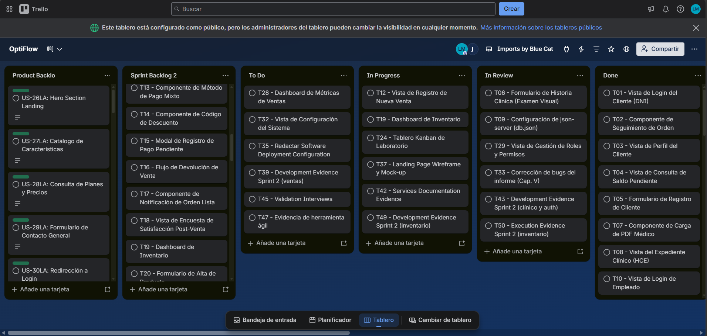

**Enlace del tablero Trello:**  
https://trello.com/invite/b/69eba124179d41cdbf1d256e/ATTI3167beb4688f2da975bd23cdf51f144c3C1DA6E6/optiflow

#### Gestión colaborativa y seguimiento de incidencias mediante Jira
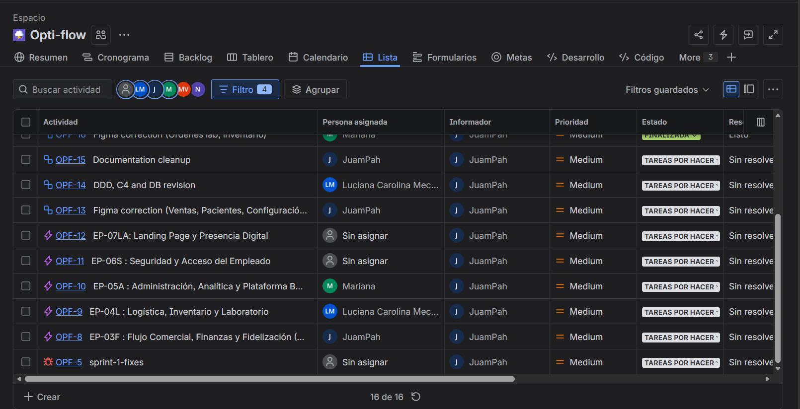

#### Development Evidence for Sprint Review
| Repository | Branch | Commit Id | Commit Message | Commit Message Body | Committed on (Date) |
| :--- | :--- | :--- | :--- | :--- | :--- |
| OptiFlow-Frontend | main | 0103d1e | release: v1.0.0 | | 13/05/2026 |
| OptiFlow-Frontend | | fd80e14 | Delete | | 13/05/2026 |
| OptiFlow-Frontend | | f05ce8f | release: v1.0.0 | | 13/05/2026 |
| OptiFlow-Frontend | develop | 62fc899 | Merge pull request #46 | feature/setting | 13/05/2026 |
| OptiFlow-Frontend | | 7a3d75c | fix: new rol in setting. | | 13/05/2026 |
| OptiFlow-Frontend | | d2bab69 | fix: role in setting. | | 13/05/2026 |
| OptiFlow-Frontend | | c74d491 | fix: style in setting. | | 13/05/2026 |
| OptiFlow-Frontend | | b2b2087 | Merge pull request #45 | feature/inventory-edit | 13/05/2026 |
| OptiFlow-Frontend | | 69c8e81 | fix(inventory-edit-button) | fix inventory edit button | 13/05/2026 |
| OptiFlow-Frontend | | d438531 | Merge pull request #44 | fix/clients | 13/05/2026 |
| OptiFlow-Frontend | | 8e19383 | fix: client profile | add fill in fields scenarios | 13/05/2026 |
| OptiFlow-Frontend | | f143b65 | feat: add setting | add setting in the app | 13/05/2026 |
| OptiFlow-Frontend | | bf7bce6 | Merge pull request #43 | fix/scenarios | 13/05/2026 |
| OptiFlow-Frontend | | c841286 | fix: scenarios | fix scenarios in sales and inventory | 13/05/2026 |
| OptiFlow-Frontend | | 4b462ef | Merge pull request #42 | feature/inventory-correction | 13/05/2026 |
| OptiFlow-Frontend | | 569560f | fix(audit) | fix audit endpoint | 13/05/2026 |
| OptiFlow-Frontend | | 8ed0a76 | Merge pull request #41 | fix/patients-admin | 13/05/2026 |
| OptiFlow-Frontend | | 841bb64 | fix: status code 500 | error when collecting remaining bills | 13/05/2026 |
| OptiFlow-Frontend | | 7ebb94c | fix: add exam | fix hard-coded employee | 13/05/2026 |
| OptiFlow-Frontend | | 97dc5c6 | Merge pull request #40 | fix/patients-admin | 13/05/2026 |
| OptiFlow-Frontend | | 169a59e | fix: patients and exams | not getting added correctly | 13/05/2026 |
| OptiFlow-Frontend | | 419d8f3 | Merge pull request #39 | fix/patients-admin | 13/05/2026 |
| OptiFlow-Frontend | | eb91c25 | fix: patient record | add patient and clinical record fix | 13/05/2026 |
| OptiFlow-Frontend | | 5de606c | Merge pull request #38 | fix/i18n | 13/05/2026 |
| OptiFlow-Frontend | | 57899b3 | fix: i18n | fix patient center i18n | 13/05/2026 |
| OptiFlow-Frontend | | bae3af0 | Merge pull request #37 | fix/i18n | 13/05/2026 |
| OptiFlow-Frontend | | 517bd4a | fix: dictionaries | fix curly braces in dictionaries | 13/05/2026 |
| OptiFlow-Frontend | | 1459711 | Merge pull request #36 | feature/report | 13/05/2026 |
| OptiFlow-Frontend | | b8ecc33 | Merge branch develop | into feature/report | 13/05/2026 |
| OptiFlow-Frontend | | 9bd8380 | feat(report) | implement dashboard with svg charts | 13/05/2026 |
| OptiFlow-Frontend | | 568253d | feat(report) | register routes and translations | 13/05/2026 |
| OptiFlow-Frontend | | 447d917 | feat(report) | implement domain, store and api | 13/05/2026 |
| OptiFlow-Frontend | | 3e18672 | Merge pull request #35 | feature/patients | 13/05/2026 |
| OptiFlow-Frontend | | 714b93e | feat: patients | complete patient section | 13/05/2026 |
| OptiFlow-Frontend | | 6a7303d | Merge pull request #34 | fix/patient-section | 13/05/2026 |
| OptiFlow-Frontend | | 125ae9b | fix: view patient | | 13/05/2026 |
| OptiFlow-Frontend | | 1eba8de | Merge pull request #33 | fix/patients | 13/05/2026 |
| OptiFlow-Frontend | | 437060a | feat: mobile topbar | add topbar for mobile app version | 13/05/2026 |
| OptiFlow-Frontend | | ec34791 | feat: mobile topbar | add topbar for mobile app version | 13/05/2026 |
| OptiFlow-Frontend | | f3b9b4b | fix: add patient button | | 13/05/2026 |
| OptiFlow-Frontend | | aeb9306 | Merge pull request #31 | feature/inventory-update | 13/05/2026 |
| OptiFlow-Frontend | | 8d127d1 | Merge branch develop | into feature/inventory-update | 13/05/2026 |
| OptiFlow-Frontend | | e3dd3d5 | fix(inventory) | update endpoint paths | 13/05/2026 |
| OptiFlow-Frontend | | 6f0c8d3 | Merge pull request #30 | feature/analytical | 13/05/2026 |
| OptiFlow-Frontend | | fb5c289 | Merge branch develop | into feature/analytical | 12/05/2026 |
| OptiFlow-Frontend | | f12a2cc | feat: staff | add staff in the app | 12/05/2026 |
| OptiFlow-Frontend | | 35d8e89 | Merge pull request #29 | fix/sales | 12/05/2026 |
| OptiFlow-Frontend | | e043c60 | fix: sales display | patient names not displaying | 12/05/2026 |
| OptiFlow-Frontend | | 7029209 | Merge pull request #28 | fix/sales | 12/05/2026 |
| OptiFlow-Frontend | | 8811528 | fix: sales form | fix patients in sales form modal | 12/05/2026 |
| OptiFlow-Frontend | | 151bbb4 | Merge pull request #27 | fix/sales | 12/05/2026 |
| OptiFlow-Frontend | | 60a269d | fix: api endpoint | work orders api endpoint fix | 12/05/2026 |
| OptiFlow-Frontend | | af693c0 | Merge pull request #26 | fix/api | 12/05/2026 |
| OptiFlow-Frontend | | 78f5df9 | fix: environment | use production api | 12/05/2026 |
| OptiFlow-Frontend | | 04b1c32 | Merge pull request #25 | fix/local-host | 12/05/2026 |
| OptiFlow-Frontend | | e829f33 | fix: dictionaries | updated dictionaries | 12/05/2026 |
| OptiFlow-Frontend | | 7faa798 | fix: sales modal | modified sales-form-modal | 12/05/2026 |
| OptiFlow-Frontend | | a98ec8b | Merge pull request #24 | fix/client-app | 12/05/2026 |
| OptiFlow-Frontend | | cb7e2b7 | feat: auth | add login screen and divided client app | 12/05/2026 |
| OptiFlow-Frontend | | be78075 | Merge pull request #23 | fix/dashboard | 12/05/2026 |
| OptiFlow-Frontend | | 751b909 | fix: corrections | additional corrections | 12/05/2026 |
| OptiFlow-Frontend | | 3cbf7cc | feat: dashboard | set dashboard | 12/05/2026 |
| OptiFlow-Frontend | | ac073b3 | Merge pull request #22 | fix/sales-responsiveness | 12/05/2026 |
| OptiFlow-Frontend | | 1fc85ce | feat: UI | add responsiveness to the sidebar | 12/05/2026 |
| OptiFlow-Frontend | | 39bf2ae | Merge pull request #21 | fix/add-i18n-in-patients | 12/05/2026 |
| OptiFlow-Frontend | | ada5ee9 | feat: i18n | add i18n in patients section | 12/05/2026 |
| OptiFlow-Frontend | | 6d9387d | fix: components | separate sidebar to individual component | 12/05/2026 |
| OptiFlow-Frontend | | c671976 | Merge pull request #20 | feature/patient-panel | 11/05/2026 |
| OptiFlow-Frontend | | d13ab80 | feat: patient panel | Panel de paciente añadido | 11/05/2026 |
| OptiFlow-Frontend | | 0f061cd | Merge pull request #19 | feature/dashboard | 11/05/2026 |
| OptiFlow-Frontend | | 91eb97d | feat: dashboard | add dashboard | 11/05/2026 |
| OptiFlow-Frontend | | f35f0e1 | Merge pull request #18 | feature/subscription | 10/05/2026 |
| OptiFlow-Frontend | | dc94f3b | refactor: billing | remove subscription bounded context | 10/05/2026 |
| OptiFlow-Frontend | | 4dc6da6 | Merge pull request #17 | fix/url-endpoint | 10/05/2026 |
| OptiFlow-Frontend | | 1b3decf | fix: urls | fix urls | 10/05/2026 |
| OptiFlow-Frontend | | 031ca06 | Merge pull request #16 | fix/env | 10/05/2026 |
| OptiFlow-Frontend | | 923ca59 | Merge branch develop | into fix/env | 10/05/2026 |
| OptiFlow-Frontend | | 985ec2b | fix: production env | production environment variable added | 10/05/2026 |
| OptiFlow-Frontend | | 80cc77f | Merge pull request #15 | feature/correction-URL-api | 10/05/2026 |
| OptiFlow-Frontend | | fa693ba | fix: api url | correction url api | 10/05/2026 |
| OptiFlow-Frontend | | 887aa47 | Merge pull request #14 | feature/correction | 10/05/2026 |
| OptiFlow-Frontend | | 6f9d070 | fix: corrections | add corrections | 10/05/2026 |
| OptiFlow-Frontend | | c253911 | Merge pull request #13 | feature/patients | 10/05/2026 |
| OptiFlow-Frontend | | 2929583 | Merge branch develop | into feature/patients | 10/05/2026 |
| OptiFlow-Frontend | | fdcc254 | fix: patients | set corrections patients | 10/05/2026 |
| OptiFlow-Frontend | | 728a9b9 | feat: patients | add patients section | 10/05/2026 |
| OptiFlow-Frontend | | 2dbda99 | Merge pull request #12 | feature/subscription | 10/05/2026 |
| OptiFlow-Frontend | | 12b8c5e | feat: subscription | Stripe sandbox integration | 10/05/2026 |
| OptiFlow-Frontend | | 77403f2 | Merge pull request #11 | feature/change-api-URL | 09/05/2026 |
| OptiFlow-Frontend | | 7a3f27f | fix: api url | set api URL | 09/05/2026 |
| OptiFlow-Frontend | | d33ab85 | ci: devops | add Azure Static Web Apps workflow | 09/05/2026 |
| OptiFlow-Frontend | | defe034 | Merge pull request #10 | feature/inventory | 06/05/2026 |
| OptiFlow-Frontend | | b93f645 | Merge branch develop | into feature/inventory | 06/05/2026 |
| OptiFlow-Frontend | | e7923d7 | fix(lab-order) | correct fulfillment store behavior | 06/05/2026 |
| OptiFlow-Frontend | | 1ef8b00 | Merge pull request #9 | feature/lab-order-management | 06/05/2026 |
| OptiFlow-Frontend | | 13dbedd | fix(lab-order) | correct work order management behavior | 06/05/2026 |
| OptiFlow-Frontend | | aed85ac | Merge pull request #8 | docs/class-diagrams | 06/05/2026 |
| OptiFlow-Frontend | | 03facb0 | docs: diagrams | updated sales and app class diagrams | 06/05/2026 |
| OptiFlow-Frontend | | 89dc15a | Merge pull request #7 | feature/inventory | 06/05/2026 |
| OptiFlow-Frontend | | f2188e7 | feat(inventory) | add inventory context | 06/05/2026 |
| OptiFlow-Frontend | | 25c181a | Merge pull request #6 | feature/lab-order-management | 06/05/2026 |
| OptiFlow-Frontend | | 835a30b | feat(lab-order) | initial implementation | 06/05/2026 |
| OptiFlow-Frontend | | f76e950 | Merge pull request #5 | feature/sales-management | 05/05/2026 |
| OptiFlow-Frontend | | cec3af8 | fix: sales | create sale + lab order button working | 05/05/2026 |
| OptiFlow-Frontend | | 45899a0 | Merge pull request #4 | feature/sales-management | 05/05/2026 |
| OptiFlow-Frontend | | fa4d205 | fix: sales | fix InputNumber not registering prices | 05/05/2026 |
| OptiFlow-Frontend | | c87d94c | Merge pull request #3 | feature/sales-management | 05/05/2026 |
| OptiFlow-Frontend | | 3f29e82 | fix: git | update gitignore | 05/05/2026 |
| OptiFlow-Frontend | | 6a7ec36 | Merge pull request #2 | feature/sales-management | 05/05/2026 |
| OptiFlow-Frontend | | 24ffe09 | feat(sales) | fixed color palette | 05/05/2026 |
| OptiFlow-Frontend | | db85c9a | feat(sales) | add sales context | 05/05/2026 |
| OptiFlow-Frontend | | b0bc49f | docs: diagrams | add frontend class diagrams | 05/05/2026 |
| OptiFlow-Frontend | | 7904bae | Merge pull request #1 | chore/project-setup | 05/05/2026 |
| OptiFlow-Frontend | | 6dcd9b0 | chore: setup | project setup | 05/05/2026 |
| OptiFlow-Frontend | | 746959f | Initial commit | | 07/04/2026 |
| OptiFlow-Landing-Page | main | 6a47f3d | Merge pull request #24 | fix/general-fixes | 13/05/2026 |
| OptiFlow-Landing-Page | | 418ffb9 | fix: final landing page tweaks added | | 13/05/2026 |
| OptiFlow-Landing-Page | | a9b09a1 | Merge pull request #23 | feature/footer-update | 11/05/2026 |
| OptiFlow-Landing-Page | | cd300a2 | feat(footer): add footer links | | 11/05/2026 |
| OptiFlow-Landing-Page | | d27d3dd | Merge pull request #22 | feature/new-pricing | 10/05/2026 |
| OptiFlow-Landing-Page | | 8d87a81 | merge develop into feature/new-pricing | | 10/05/2026 |
| OptiFlow-Landing-Page | | a51b954 | merge develop into feature/new-pricing | | 10/05/2026 |
| OptiFlow-Landing-Page | | 5d2ebd4 | feat: update landing pricing section | | 10/05/2026 |
| OptiFlow-Landing-Page | | 1232c7f | Merge pull request #21 | feature/about-us | 10/05/2026 |
| OptiFlow-Landing-Page | | 80022f2 | fix: fix responsiveness in header and hero section | | 10/05/2026 |
| OptiFlow-Landing-Page | | 902c161 | feat: add about us section | | 10/05/2026 |
| OptiFlow-Landing-Page | | 6837eda | Merge pull request #20 | fix/header | 10/05/2026 |
| OptiFlow-Landing-Page | | 676aeda | fix: header labels now redirect to each landing page section | | 10/05/2026 |
| OptiFlow-Landing-Page | | 49978b9 | Merge pull request #19 | fix/footer | 10/05/2026 |
| OptiFlow-Landing-Page | | 76cd71e | fix: removed unreachble links for the footer | | 10/05/2026 |


Frontend repository:
https://github.com/1asi0730-2610-10203-OptiFlow/OptiFlow-Frontend.git

Mock API repository:
https://github.com/1asi0730-2610-10203-OptiFlow/OptiFlow-Mock-Api.git

Landing Page repository: 
https://github.com/1asi0730-2610-10203-OptiFlow/OptiFlow-Landing-Page.git

#### Execution Evidence for Sprint Review
Durante este segundo sprint, el proyecto evolucionó de una presencia estática a una arquitectura funcional distribuida. Se implementaron los módulos críticos de **Sales Management**, **Inventory Control** y **Lab Order Management**, permitiendo la trazabilidad de órdenes de trabajo desde la generación de la receta hasta la coordinación con el laboratorio. Esta integración técnica resuelve los silos de información identificados en el análisis competitivo, facilitando la gestión de *Work Orders* mediante estados dinámicos. En términos de infraestructura, se migró el ecosistema a Microsoft Azure, estableciendo un pipeline de despliegue continuo (CI/CD) que garantiza la disponibilidad de la Web App y la sincronización con el backend mediante la configuración de variables de entorno y endpoints de producción.

Execution Evidence Sprint Video: https://upcedupe-my.sharepoint.com/:v:/g/personal/u202411310_upc_edu_pe/IQB1YeYyMUdORq1xsth-MkzuAUhgs6PjqkCqjhdgJQbWhyU?e=yV07Jj&nav=eyJyZWZlcnJhbEluZm8iOnsicmVmZXJyYWxBcHAiOiJTdHJlYW1XZWJBcHAiLCJyZWZlcnJhbFZpZXciOiJTaGFyZURpYWxvZy1MaW5rIiwicmVmZXJyYWxBcHBQbGF0Zm9ybSI6IldlYiIsInJlZmVycmFsTW9kZSI6InZpZXcifX0%3D

#### Services Documentation Evidence for Sprint Review
La API de OptiFlow ha sido desplegada y configurada para dar soporte a las operaciones de persistencia de datos. Se han expuesto los servicios necesarios para la gestión de productos (*Frames/Lenses*) y el seguimiento de pedidos.

| Endpoint | Acción | Verbo HTTP | Sintaxis de Llamada | Ejemplo de Response | Explicación |
|---|---|---|---|---|---|
| `/roles` | Listar / Crear | `GET`, `POST` | `/api/v1/roles` | `{ "role_id": 1, "name": "ADMIN" }` | Gestión de roles y permisos del sistema (Administrador, Ventas, Optómetra, etc.). |
| `/employees` | Listar / Crear | `GET`, `POST` | `/api/v1/employees` | `{ "employee_id": 1, "name": "Carlos Mendoza", "role_id": 1, "status": "ACTIVE" }` | Gestión del personal de la óptica (Administradores, Optómetras, Ventas). |
| `/sessions` | Listar / Crear | `GET`, `POST` | `/api/v1/sessions` | `{ "session_id": 1, "employee_id": 1, "token": "token_admin_123", "expires_at": "2026-06-01T12:00:00" }` | Administración de sesiones activas y autenticación de usuarios del sistema. |
| `/patients` | Listar / Crear | `GET`, `POST` | `/api/v1/patients` | `{ "patient_id": 1, "first_name": "Sarah", "last_name": "Johnson", "dni": "12345678" }` | Registro y administración de datos personales de pacientes. |
| `/clinical-records` | Listar / Crear | `GET`, `POST` | `/api/v1/clinical-records` | `{ "record_id": 1, "clinical_record_uuid": "record-001-uuid", "patient_id": 1 }` | Vinculación entre el paciente y su historial clínico acumulado. |
| `/prescriptions` | Listar / Crear | `GET`, `POST` | `/api/v1/prescriptions` | `{ "prescription_id": 1, "od_sphere": -2.5, "od_cylinder": -0.75, "notes": "Paciente reporta mayor tiempo frente a pantallas." }` | Registro de recetas ópticas (medidas de esfera, cilindro, eje y observaciones médicas). |
| `/products` | Listar / Crear | `GET`, `POST` | `/api/v1/products` | `{ "product_id": 1, "sku": "FRM-1001", "name": "Classic Black Frame", "quantity": 20 }` | Control de inventario de monturas, lunas y accesorios ópticos. |
| `/quotations` | Listar / Crear | `GET`, `POST` | `/api/v1/quotations` | `{ "quotation_id": 1, "prescription_id": 1, "total": 370.00 }` | Gestión de presupuestos comerciales basados en recetas específicas. |
| `/quotation-items` | Listar / Crear | `GET`, `POST` | `/api/v1/quotation-items` | `{ "item_id": 1, "quotation_id": 1, "product_id": 1, "quantity": 1, "unit_price": 150.00 }` | Detalle de productos incluidos dentro de una cotización. |
| `/sales` | Listar / Crear | `GET`, `POST` | `/api/v1/sales` | `{ "sale_id": 1, "status": "PAID", "total_amount": 370.00, "outstanding_balance": 170.0 }` | Registro de transacciones, estados de pago y saldos pendientes. |
| `/payments` | Listar / Crear | `GET`, `POST` | `/api/v1/payments` | `{ "payment_id": 1, "sale_id": 1, "amount_paid": 200.00, "method": "CARD" }` | Historial de abonos y métodos de pago utilizados por el cliente. |
| `/work-orders` | Listar / Crear | `GET`, `POST` | `/api/v1/work-orders` | `{ "order_id": 1, "status": "IN_PRODUCTION", "laboratory_name": "LabVision", "priority": "NORMAL" }` | Seguimiento de la fabricación de lentes en laboratorio mediante flujo Kanban. |
| `/notifications` | Listar / Crear | `GET`, `POST` | `/api/v1/notifications` | `{ "notification_id": 1, "work_order_id": 1, "message": "Your order is currently in production.", "status": "SENT" }` | Avisos automáticos enviados al paciente sobre el estado de su pedido. |
| `/analytics-reports` | Listar | `GET` | `/api/v1/analytics-reports` | `{ "report_id": 1, "total_revenue": 12000.50, "conversion_rate": 72.5 }` | Métricas de negocio: ingresos, tasa de conversión y tiempos de entrega. |
| `/staff-metrics` | Listar | `GET` | `/api/v1/staff-metrics` | `{ "staff_metric_id": 1, "employee_name": "Lucia Ramirez", "sales_closed": 10 }` | Evaluación del rendimiento del personal en ventas y cotizaciones. |

* **API Base URL (Azure):** https://opti-flow-apiv1.azurewebsites.net/
* **Documentation:** La API cuenta con documentación autogenerada bajo el estándar OpenAPI (Swagger), facilitando la integración de nuevos módulos operativos en futuros sprints.

#### Software Deployment Evidence for Sprint Review
El despliegue de este sprint marca el paso a un entorno de producción cloud utilizando una arquitectura de servicios desacoplados en Azure.

1.  **Frontend:** Desplegado mediante **Azure Static Web Apps**, aprovechando la integración nativa con GitHub Actions para despliegues automáticos desde la rama `develop`.
2.  **Fake Api:** Implementado en **Azure App Service**, configurado con un workflow de compilación y despliegue para Node.js/Java (según corresponda).


> Captura del Resource Group en Azure mostrando el App Service y la Static Web App operativos.


> Evidencia de la ejecución exitosa de los workflows de GitHub Actions para el despliegue en Azure.


**Vistas implementadas e integración con Fake API**

Las siguientes capturas evidencian la ejecución de los módulos implementados durante el Sprint 2, consumiendo datos desde el Fake API configurado . Los datos mostrados se expone los endpoints `/products`, `/categories`, `/suppliers`, `/work_orders`, `/laboratories`, entre otros, replicando el comportamiento de una API REST real mientras el backend de producción se encuentra en desarrollo.

**Módulo de Inventario — Dashboard con alertas de bajo stock:**
Los artículos con stock por debajo del nivel mínimo configurado son marcados visualmente con el ícono y barra de progreso en rojo, permitiendo al administrador identificar productos críticos de forma inmediata. Los datos de todos los artículos con un valor total de S/ 14,499 son consumidos en tiempo real desde el endpoint `/products`.

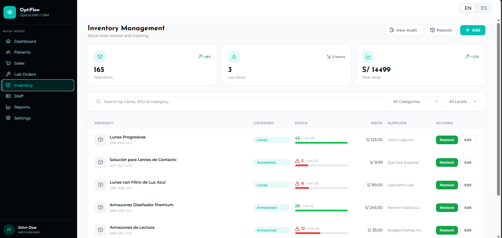

**Módulo de Inventario — Formulario de registro de nuevo producto:**

El modal de alta de productos permite registrar nombre, categoría, SKU autogenerado, stock inicial, nivel de reorden, precio unitario, proveedor y fecha de recepción. Al confirmar, se realiza un `POST` al endpoint `/products` del Fake API persistiendo el nuevo registro.

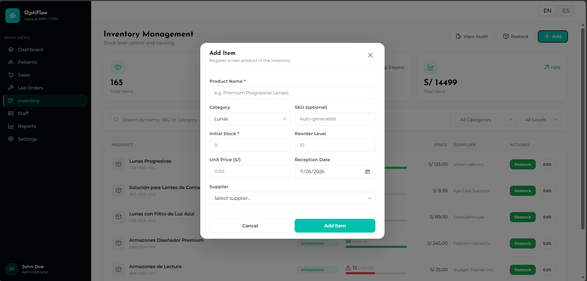

**Módulo de Lab Orders — Tablero Kanban:**

El tablero Kanban muestra las órdenes de laboratorio distribuidas en cinco columnas por etapa del proceso: Received, In Production, Quality Control, Ready for Delivery y Delivered. Cada tarjeta incluye prioridad (URGENT / HIGH), laboratorio asignado, montura, fecha de entrega estimada y saldo pendiente, consumidos desde el endpoint `/work_orders`.

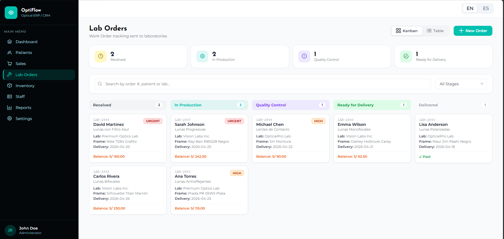

**URLs de Producción:**
**Web App:** https://proud-sea-096db2110.7.azurestaticapps.net
**API Service:** https://opti-flow-apiv1.azurewebsites.net/

#### Team Collaboration Insights durante el Sprint 2

Durante el Sprint 2, el equipo mantuvo la misma dinámica de coordinación establecida en el sprint anterior, utilizando **Discord** y **Google Meet** para las reuniones síncronas de planificación, revisión y retrospectiva. **GitHub** continuó siendo la plataforma central de control de versiones e integración, gestionando el trabajo bajo la estrategia GitFlow con ramas `feature/*` mergeadas a `develop` mediante Pull Requests revisados por pares.

**Resumen de colaboración:**

El foco de este sprint fue el desarrollo e implementación de los primeros bounded contexts del frontend de la Web Application. El equipo se organizó en subequipos especializados por módulo, lo que permitió avanzar en paralelo sin generar conflictos de integración. Las reuniones de sincronización se realizaron de forma regular para coordinar la integración de los módulos con el Fake API configurado en json-server y el posterior despliegue en Azure Static Web Apps.

**Actividad del repositorio:**

Las siguientes métricas fueron extraídas del panel GitHub Insights del repositorio `OptiFlow-Report-Stable` durante el período del Sprint 2:

| Integrante | Usuario GitHub | Commits |
|---|---|---|
| Azama Fukuda, Juan Pablo | Llummo | 67 |
| Capillo Lema, Mía Valentina | Miavcl | 25 |
| Mechan Montenegro, Luciana Carolina | luuu6 | 23 |
| Atoche Gonzales, Nicolas Fernando | THECOMAX | 17 |
| Morocho Pinedo, Mariana | Patto04 | 11 |

Se realizaron un total de **91 Pull Requests mergeados** por **5 integrantes contribuyentes** durante este período. No se registraron issues en el repositorio durante este ciclo.

**Vista general de GitHub Insights — Pulse:**

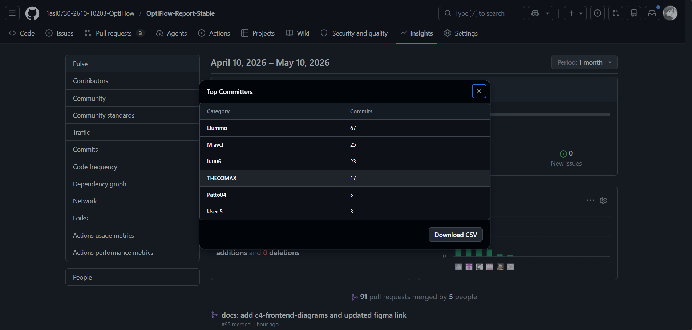

**Gráfica de Top Committers:**


**Pull Requests mergeados recientes:**


**Actividad del repositorio:**

El repositorio de la Landing Page registró la participación de **5 autores** con un total de **22 commits** distribuidos en todas las ramas y **22 Pull Requests mergeados** sin issues abiertos durante el período del sprint.

**Vista general de GitHub Insights — Landing Page:**


### Sprint 3

#### Sprint Planning 3
En esta sección se especifican los aspectos principales del Sprint Planning Meeting correspondiente a la segunda iteración del proyecto. El enfoque principal de este Sprint abarca la corrección de los errores identificados en el Sprint anterior y el desarrollo del frontend de la aplicación web. En base a la retrospectiva del Sprint 1, el equipo definió mejoras en la coordinación interna, la documentación y la calidad de los artefactos de diseño.

| Aspect | Details |
| :--- | :--- |
| **Sprint #** | Sprint 3 |
| **Date** | 2026-05-06 |
| **Time** | 10:00 AM |
| **Location** | Reunión Virtual (Discord / Microsoft Teams) |
| **Prepared By** | Azama Fukuda, Juan Pablo |
| **Attendees (to planning meeting)** | Atoche Gonzales, Nicolas Fernando / Azama Fukuda, Juan Pablo / Capillo Lema, Mía Valentina / Mechan Montenegro, Luciana Carolina / Morocho Pinedo, Mariana |
| **Sprint 2 Review Summary** | Se realizaron correcciones del sprint 1 y se hizo el primer despliegue del frontend de la aplicación |
| **Sprint 2 Retrospective Summary** | Pudo haber mejor comunicación en el equipo con respecto a algunos miembros, algunas delegaciones se percibieron como demasiado pesadas,  lo que derivó al incumplimiento de ciertas tareas. Finalmente, un integrante no llegó a contribuir mucho en el avance del frontend for factores externos. |
| **Sprint Goal** | Our focus is on enabling optic administrators to manage their optic operations and optic clients to track their orders through a fully connected webplatform. We believe it delivers a seamless end-to-end experience — from account management to order tracking — to both optic administrators and optic clients. This will be confirmed when validation interview participants from both segments can successfully complete their core tasks in the deployed application without critical blockers. |
| **Sprint n Velocity** | 45 Story Points |
| **Sum of Story Points** | 45 |


#### Aspect Leaders and Collaborators
En el sprint principalmente se tomó enfoque en el desarrollo de la parte del backend, además de actualizar las versiones del landing page y del frontend webb app.

| Team Member | GitHub | Sales module frontend (L)/(C) | Clinical & auth frontend (L)/(C) | Customer portal frontend (L)/(C) | Inventory & lab frontend (L)/(C) | Analytics & admin frontend (L)/(C) | Report corrections & doc (L)/(C) | Fake API config (L)/(C) | Frontend development (L)/(C) | Dev evidence doc (L)/(C) | Sprint planning & Backlog (L)/(C) | Software deployment config (L)/(C) | Services doc evidence (L)/(C) | Team collab insights (L)/(C) | Report documentation (L)/(C) | Scrum Master Role (L)/(C) | Validation interviews (L)/(C) | UX implementation (L)/(C) | Agile tool management (L)/(C) |
|---|---|---|---|---|---|---|---|---|---|---|---|---|---|---|---|---|---|---|---|
| Azama Fukuda, Juan Pablo | Llummo | L | | | | | L | | | | | L | | | | L | | | |
| Atoche Gonzales, Nicolas | THECOMAX | | L | | | | | L | | | | | L | | | | L | | |
| Capillo Lema, Mia | Miavcl | | | L | | | | | C | | | | | | C | | | C | |
| Mechan Montenegro, Luciana | luuu6 | | | | L | | | | | L | | | | L | | | | | L |
| Morocho Pinedo, Mariana | Patto04 | | | | | L | | | C | | C | | | | C | | | | |


#### Sprint Backlog 3

<table>
<thead>
    <tr>
      <th style="text-align: left;">Sprint #</th>
      <th colspan="7" style="text-align: left;">Sprint 3</th>
    </tr>
    <tr>
      <th colspan="2" style="text-align: left;">User Story</th>
      <th colspan="6" style="text-align: left;">Work-Item / Task</th>
    </tr>
    <tr>
      <th style="text-align: left;">Id</th>
      <th style="text-align: left;">Title</th>
      <th style="text-align: left;">Id</th>
      <th style="text-align: left;">Title</th>
      <th style="text-align: left;">Description</th>
      <th style="text-align: left;">Estimation (Hours)</th>
      <th style="text-align: left;">Assigned To</th>
      <th style="text-align: left;">Status (To-do / In-Process / To-Review / Done)</th>
    </tr>
  </thead>
  <tbody>
    <tr>
      <td></td>
      <td>Database Design & Setup</td>
      <td>T33</td>
      <td>Solidify Data Base Design (Meeting)</td>
      <td>Sesión de equipo para finalizar el diseño de la base de datos relacional a partir de los bounded contexts identificados en el Design-Level EventStorming.</td>
      <td>4 hrs</td>
      <td>Luciana</td>
      <td>Done</td>
    </tr>
    <tr>
      <td></td>
      <td>Database Design & Setup</td>
      <td>T34</td>
      <td>Implementación del Esquema de Base de Datos</td>
      <td>Crear las tablas, relaciones y constraints de la base de datos relacional que soportará la persistencia de los bounded contexts de Web Services.</td>
      <td>5 hrs</td>
      <td>Luciana</td>
      <td>Done</td>
    </tr>
    <tr>
      <td>TS-INV-001</td>
      <td>Register a Product</td>
      <td>T35</td>
      <td>Endpoint de Registro de Producto</td>
      <td>Implementar el endpoint POST /api/v1/products con validación de atributos, detección de SKU duplicado y respuesta mediante ProductResource.</td>
      <td>5 hrs</td>
      <td>Luciana</td>
      <td>Done</td>
    </tr>
    <tr>
      <td>TS-INV-002</td>
      <td>Restock a Product</td>
      <td>T36</td>
      <td>Endpoint de Reabastecimiento de Producto</td>
      <td>Implementar el endpoint POST /api/v1/products/{id}/restock con validación de cantidad, manejo de producto no encontrado y actualización del stock.</td>
      <td>4 hrs</td>
      <td>Luciana</td>
      <td>Done</td>
    </tr>
    <tr>
      <td>TS-INV-003</td>
      <td>Get Low-Stock Products</td>
      <td>T37</td>
      <td>Endpoint de Consulta de Productos con Bajo Stock</td>
      <td>Implementar el endpoint GET /api/v1/products/low-stock que retorna los productos cuyo stock está en o por debajo del umbral mínimo.</td>
      <td>4 hrs</td>
      <td>Luciana</td>
      <td>Done</td>
    </tr>
    <tr>
      <td>TS-SAL-001</td>
      <td>Create a Sale</td>
      <td>T38</td>
      <td>Endpoint de Registro de Venta</td>
      <td>Implementar el endpoint POST /sales con validación de atributos y persistencia de la venta, retornando el SaleResource creado.</td>
      <td>5 hrs</td>
      <td>Juan Pablo</td>
      <td>Done</td>
    </tr>
    <tr>
      <td>TS-SAL-002</td>
      <td>Apply a Promotional Discount</td>
      <td>T39</td>
      <td>Endpoint de Aplicación de Descuento</td>
      <td>Implementar el endpoint POST /sales/{id}/discount con validación de estado de la venta y recálculo del monto pendiente.</td>
      <td>4 hrs</td>
      <td>Juan Pablo</td>
      <td>Done</td>
    </tr>
    <tr>
      <td>TS-SAL-003</td>
      <td>Pay Outstanding Balance</td>
      <td>T40</td>
      <td>Endpoint de Pago de Saldo Pendiente</td>
      <td>Implementar el endpoint POST /sales/{id}/pay-outstanding con lógica de pago total/parcial y transición de estado de la venta.</td>
      <td>5 hrs</td>
      <td>Juan Pablo</td>
      <td>Done</td>
    </tr>
    <tr>
      <td>TS-SAL-004</td>
      <td>Cancel a Sale</td>
      <td>T41</td>
      <td>Endpoint de Cancelación de Venta</td>
      <td>Implementar el endpoint POST /sales/{id}/cancel con validación del estado cancelable y actualización a estado CANCELLED.</td>
      <td>4 hrs</td>
      <td>Juan Pablo</td>
      <td>Done</td>
    </tr>
    <tr>
      <td>TS-LAB-001</td>
      <td>Register a Laboratory</td>
      <td>T42</td>
      <td>Endpoint de Registro de Laboratorio</td>
      <td>Implementar el endpoint POST /api/v1/laboratories con validación de nombre duplicado y formato de email.</td>
      <td>4 hrs</td>
      <td>Luciana</td>
      <td>Done</td>
    </tr>
    <tr>
      <td>TS-LAB-002</td>
      <td>Create a Work Order</td>
      <td>T43</td>
      <td>Endpoint de Creación de Orden de Trabajo</td>
      <td>Implementar el endpoint POST /api/v1/work-orders con validación de campos requeridos y persistencia del WorkOrderResource.</td>
      <td>5 hrs</td>
      <td>Luciana</td>
      <td>Done</td>
    </tr>
    <tr>
      <td>TS-LAB-003</td>
      <td>Update Work Order Status</td>
      <td>T44</td>
      <td>Endpoint de Actualización de Estado de Orden</td>
      <td>Implementar el endpoint PATCH /api/v1/work-orders/{id}/status con validación de transición de estado del flujo Kanban de laboratorio.</td>
      <td>5 hrs</td>
      <td>Luciana</td>
      <td>Done</td>
    </tr>
    <tr>
      <td>TS-CLI-001</td>
      <td>Register a Patient</td>
      <td>T45</td>
      <td>Endpoint de Registro de Paciente</td>
      <td>Implementar el endpoint POST /api/v1/patients con validación de DNI duplicado y creación automática del registro clínico asociado.</td>
      <td>5 hrs</td>
      <td>Nicolas</td>
      <td>Done</td>
    </tr>
    <tr>
      <td>TS-CLI-002</td>
      <td>Create a Prescription</td>
      <td>T46</td>
      <td>Endpoint de Creación de Prescripción</td>
      <td>Implementar el endpoint POST /api/v1/prescriptions con validación de campos ópticos y vinculación al registro clínico del paciente.</td>
      <td>4 hrs</td>
      <td>Nicolas</td>
      <td>Done</td>
    </tr>
    <tr>
      <td>TS-SUB-001</td>
      <td>Select a Subscription Plan</td>
      <td>T47</td>
      <td>Endpoint de Creación de Suscripción</td>
      <td>Implementar el endpoint POST /api/v1/subscriptions con validación de plan y persistencia del SubscriptionResource.</td>
      <td>4 hrs</td>
      <td>Juan Pablo</td>
      <td>Done</td>
    </tr>
    <tr>
      <td>TS-SUB-002</td>
      <td>Activate a Subscription</td>
      <td>T48</td>
      <td>Endpoint de Activación de Suscripción</td>
      <td>Implementar el endpoint POST /api/v1/subscriptions/{id}/activate con validación de estado PENDING_PAYMENT y cálculo de fechas de vigencia.</td>
      <td>4 hrs</td>
      <td>Juan Pablo</td>
      <td>Done</td>
    </tr>
    <tr>
      <td>TS-SUB-003</td>
      <td>Process a Subscription Payment</td>
      <td>T49</td>
      <td>Endpoint de Procesamiento de Pago de Suscripción</td>
      <td>Implementar el endpoint POST /api/v1/payments con validación de monto y vinculación al ciclo de facturación de la suscripción.</td>
      <td>4 hrs</td>
      <td>Juan Pablo</td>
      <td>Done</td>
    </tr>
    <tr>
      <td>TS-ANA-001</td>
      <td>Retrieve Analytics Reports</td>
      <td>T50</td>
      <td>Endpoint de Consulta de Reportes Analíticos</td>
      <td>Implementar los endpoints GET /api/v1/analytics-reports y GET /api/v1/analytics-reports/{id} retornando AnalyticsReportResource.</td>
      <td>5 hrs</td>
      <td>Mariana</td>
      <td>Done</td>
    </tr>
    <tr>
      <td>TS-ANA-002</td>
      <td>Retrieve Staff Metrics</td>
      <td>T51</td>
      <td>Endpoint de Consulta de Métricas de Personal</td>
      <td>Implementar el endpoint GET /api/v1/staff-metrics retornando una lista de StaffMetricResource con KPIs por empleado.</td>
      <td>4 hrs</td>
      <td>Mariana</td>
      <td>Done</td>
    </tr>
    <tr>
      <td></td>
      <td>IAM Module</td>
      <td>T52</td>
      <td>Endpoints de Identity and Access Management</td>
      <td>Implementar los endpoints de autenticación y autorización del bounded context IAM para Web Services.</td>
      <td>5 hrs</td>
      <td>Mariana</td>
      <td>Done</td>
    </tr>
    <tr>
      <td></td>
      <td>Patient-center Module</td>
      <td>T53</td>
      <td>Endpoints de Portal del Paciente</td>
      <td>Implementar los endpoints del bounded context Patient-center que exponen los datos consumidos por el portal del paciente.</td>
      <td>5 hrs</td>
      <td>Mia</td>
      <td>Done</td>
    </tr>
    <tr>
      <td></td>
      <td>HTML Course</td>
      <td>T54</td>
      <td>Crear el Repositorio Público del Curso</td>
      <td>Crear el repositorio público con la nomenclatura exigida (webdev-course-[nombre del equipo]) para alojar el contenido del curso de HTML.</td>
      <td>4 hrs</td>
      <td>Juan Pablo</td>
      <td>Done</td>
    </tr>
    <tr>
      <td></td>
      <td>HTML Course</td>
      <td>T55</td>
      <td>Redacción del README.md</td>
      <td>Redactar el README.md con las instrucciones de configuración del repositorio del curso.</td>
      <td>4 hrs</td>
      <td>Juan Pablo</td>
      <td>Done</td>
    </tr>
    <tr>
      <td></td>
      <td>HTML Course</td>
      <td>T56</td>
      <td>Estructura de Carpetas Base</td>
      <td>Crear y estructurar las carpetas base del repositorio (/starter-files, /completed-examples, /scripts).</td>
      <td>4 hrs</td>
      <td>Juan Pablo</td>
      <td>Done</td>
    </tr>
    <tr>
      <td></td>
      <td>HTML Course</td>
      <td>T57</td>
      <td>Código de Ejemplo para las Clases</td>
      <td>Desarrollar el código de los ejemplos para las clases del curso (Estructura HTML, CSS simple, página de perfil).</td>
      <td>5 hrs</td>
      <td>Nicolas</td>
      <td>Done</td>
    </tr>
    <tr>
      <td></td>
      <td>HTML Course</td>
      <td>T58</td>
      <td>Enlaces Precargados para Descripciones</td>
      <td>Generar los enlaces directos precargados que se incluirán en la descripción de los videos del curso.</td>
      <td>4 hrs</td>
      <td>Nicolas</td>
      <td>Done</td>
    </tr>
    <tr>
      <td></td>
      <td>HTML Course</td>
      <td>T59</td>
      <td>Redacción de Guiones por Lección</td>
      <td>Cada miembro redacta el guion de la lección del curso que le fue asignada.</td>
      <td>4 hrs</td>
      <td>Juan Pablo</td>
      <td>Done</td>
    </tr>
    <tr>
      <td></td>
      <td>HTML Course</td>
      <td>T59-2</td>
      <td>Redacción de Guion — Introducción al desarrollo web</td>
      <td>Redactar el guion de la lección "Introducción al desarrollo web (qué es un sitio web?)".</td>
      <td>4 hrs</td>
      <td>Luciana</td>
      <td>Done</td>
    </tr>
    <tr>
      <td></td>
      <td>HTML Course</td>
      <td>T59-3</td>
      <td>Redacción de Guion — Estructura HTML básica</td>
      <td>Redactar el guion de la lección "Estructura HTML básica (etiquetas, elementos, atributos)".</td>
      <td>4 hrs</td>
      <td>Juan Pablo</td>
      <td>Done</td>
    </tr>
    <tr>
      <td></td>
      <td>HTML Course</td>
      <td>T59-4</td>
      <td>Redacción de Guion — Elementos HTML comunes</td>
      <td>Redactar el guion de la lección "Elementos HTML comunes (encabezados, párrafos, listas, imágenes, enlaces)".</td>
      <td>4 hrs</td>
      <td>Nicolas</td>
      <td>Done</td>
    </tr>
    <tr>
      <td></td>
      <td>HTML Course</td>
      <td>T59-5</td>
      <td>Redacción de Guion — Introducción a CSS</td>
      <td>Redactar el guion de la lección "Introducción a CSS (selectores, propiedades como color, fuente, diseño)".</td>
      <td>4 hrs</td>
      <td>Mia</td>
      <td>Done</td>
    </tr>
    <tr>
      <td></td>
      <td>HTML Course</td>
      <td>T59-6</td>
      <td>Redacción de Guion — Estilo simple</td>
      <td>Redactar el guion de la lección "Estilo simple (p.ej., centrar contenido, añadir colores y borders)".</td>
      <td>4 hrs</td>
      <td>Mariana</td>
      <td>Done</td>
    </tr>
    <tr>
      <td></td>
      <td>HTML Course</td>
      <td>T59-7</td>
      <td>Redacción de Guion — Creación de página web básica</td>
      <td>Redactar el guion de la lección final "Creación de una página web básica (ej. Una página de perfil o una entrada de un blog)".</td>
      <td>4 hrs</td>
      <td></td>
      <td>Done</td>
    </tr>
    <tr>
      <td></td>
      <td>HTML Course</td>
      <td>T59-8</td>
      <td>Redacción de Guion — Recomendaciones y errores comunes</td>
      <td>Redactar el guion de la lección "Recomendaciones y errores comunes para principiantes".</td>
      <td>4 hrs</td>
      <td>Juan Pablo</td>
      <td>Done</td>
    </tr>
    <tr>
      <td></td>
      <td>HTML Course</td>
      <td>T60</td>
      <td>Grabación de Voz por Lección</td>
      <td>Cada miembro grava la voz en off de la lección del curso que le fue asignada.</td>
      <td>4 hrs</td>
      <td></td>
      <td>Done</td>
    </tr>
    <tr>
      <td></td>
      <td>HTML Course</td>
      <td>T61</td>
      <td>Validación de Ausencia de Branding</td>
      <td>Garantizar que no haya branding ni referencias personales de los integrantes durante la grabación de los videos del curso.</td>
      <td>4 hrs</td>
      <td>Nicolas</td>
      <td>Done</td>
    </tr>
    <tr>
      <td></td>
      <td>HTML Course</td>
      <td>T62</td>
      <td>Edición de Video por Lección</td>
      <td>Cada miembro edita el video de la lección del curso que le fue asignada.</td>
      <td>4 hrs</td>
      <td></td>
      <td>Done</td>
    </tr>
    <tr>
      <td></td>
      <td>HTML Course</td>
      <td>T63</td>
      <td>Subida de Videos a YouTube</td>
      <td>Subir todos los videos del curso a YouTube con la configuración de privacidad en "No listado".</td>
      <td>4 hrs</td>
      <td>Juan Pablo</td>
      <td>Done</td>
    </tr>
    <tr>
      <td></td>
      <td>HTML Course</td>
      <td>T64</td>
      <td>Descripciones Finales de Videos en YouTube</td>
      <td>Armar las descripciones finales de los videos en YouTube, incluyendo los enlaces directos precargados a los editores de código.</td>
      <td>4 hrs</td>
      <td>Luciana</td>
      <td>Done</td>
    </tr>
  </tbody>
</table>

Si bien es cierto el enunciado solicita la utilización de la herramienta de Trello, nosotros optamos por utilizar Jira como nuestra herramienta de desarrollo ágil. Aún así, mostramos una captura con delegaciones en el trello solo para poder cumplir con el requisito del enucniado, además de mostrar las capturas del Jira.

#### Gestión colaborativa y seguimiento de incidencias mediante Jira
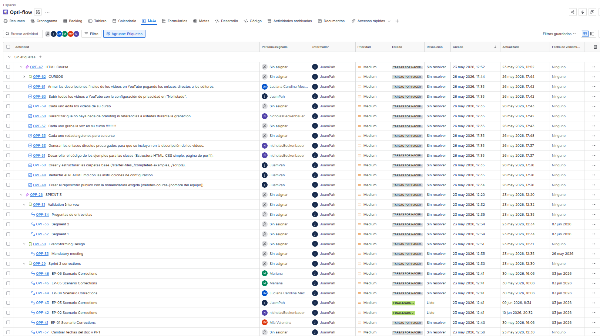
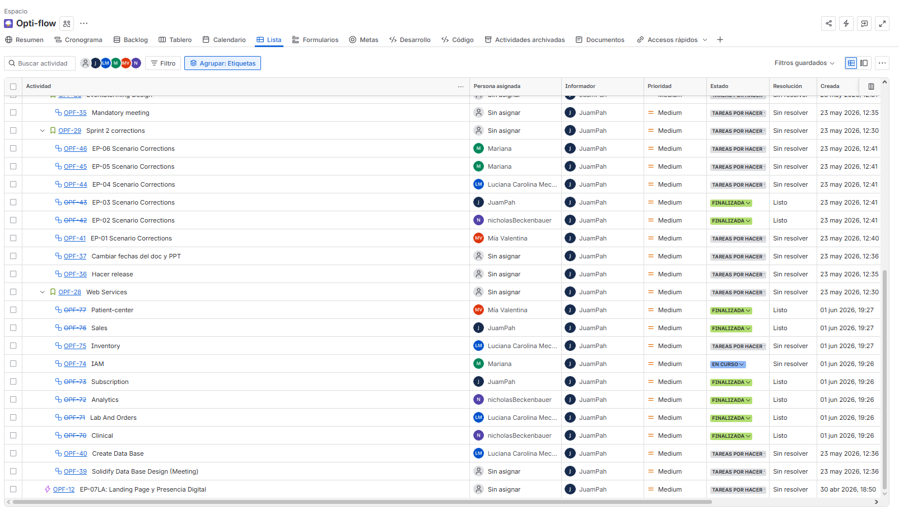


#### Gestión colaborativa y seguimiento de incidencias mediante Trello
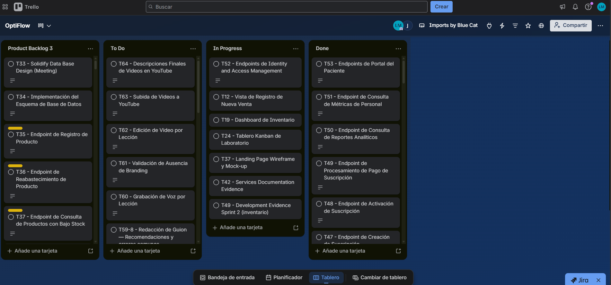


#### Development Evidence for Sprint Review  

| Repository | Branch | Commit Id | Commit Message | Commit Message Body | Committed on (Date) |
| :--- | :--- | :--- | :--- | :--- | :--- |
| optiflow-platform | main | 09132d6 | Initial commit | - | 25/05/2026 |
| optiflow-platform | feature/lab-and-orders | 0ec3bf3 | chore: project setup | - | 04/06/2026 |
| optiflow-platform | feature/lab-and-orders | 2387b14 | feat: add shared context | - | 04/06/2026 |
| optiflow-platform | feature/lab-and-orders | 8e56035 | feat(lab-and-orders): add domain layer | WorkOrder aggregate and value objects | 04/06/2026 |
| optiflow-platform | feature/lab-and-orders | 9aaa7b7 | feat(lab-and-orders): add application layer | command and query services | 04/06/2026 |
| optiflow-platform | feature/lab-and-orders | fd564fc | feat(lab-and-orders): add infrastructure layer | EFC repositories and migration | 04/06/2026 |
| optiflow-platform | feature/lab-and-orders | 9b26141 | feat(lab-and-orders): add interfaces layer | REST controllers and assemblers | 04/06/2026 |
| optiflow-platform | feat/sales | 650408f | feat: added sales bounded context | - | 07/06/2026 |
| optiflow-platform | feature/inventory | f8bd9db | feat(inventory): add domain layer | - | 07/06/2026 |
| optiflow-platform | feature/inventory | 86f12fd | feat(inventory): add application layer | - | 07/06/2026 |
| optiflow-platform | feature/inventory | 2aa9e1f | feat(inventory): add infrastructure layer | - | 07/06/2026 |
| optiflow-platform | feature/inventory | 41127c6 | feat(inventory): add interfaces layer | - | 07/06/2026 |
| optiflow-platform | develop | 7d7ed33 | feat(subscription): add subscription domain events | - | 14/06/2026 |
| optiflow-platform | develop | b8faefd | feat(subscription): add event handlers | - | 14/06/2026 |
| optiflow-platform | develop | 29e6562 | feat(subscription): add plans related query and query services | - | 14/06/2026 |
| optiflow-platform | develop | ddeade7 | feat(subscription): add plan command service and errors | - | 14/06/2026 |
| optiflow-platform | develop | 3ef75ee | feat(subscription): add plan resources | - | 14/06/2026 |
| optiflow-platform | develop | e8fa4b9 | feat(subscription): add plan Controller, finished subscription bounded context | - | 14/06/2026 |
| optiflow-platform | develop | dca66e2 | feat(subscription): add EF Core migration for subscription tables | - | 14/06/2026 |
| optiflow-platform | develop | e955c3e | feat(sales): add sales anticorruption layer | - | 14/06/2026 |
| optiflow-platform | develop | be67058 | feat(shared): extended IEvent and INotificationHandler | - | 14/06/2026 |
| optiflow-platform | feature/register-laboratory | 3be1e59 | feat(LabAndOrders): add ContactInfo value object | phone and email validation | 15/06/2026 |
| optiflow-platform | feature/register-laboratory | cfd1d84 | feat(LabAndOrders): implement LaboratoryCommandService | with duplicate-check | 15/06/2026 |
| optiflow-platform | feature/register-laboratory | 551aaed | feat(LabAndOrders): add POST endpoint to LaboratoriesController | - | 15/06/2026 |
| optiflow-platform | develop | ba0e452 | feat(sales): refactor sales to match sales info in the frontend | - | 15/06/2026 |
| optiflow-platform | develop | 5ecf695 | feat(sales): connected partially with frontend | - | 15/06/2026 |
| optiflow-platform | develop | d2c17c7 | feat(Inventory): add SupplierContact value object | - | 16/06/2026 |
| optiflow-platform | develop | 9cb73f4 | feat(Inventory): promote Supplier to aggregate root | - | 16/06/2026 |
| optiflow-platform | develop | a82f40e | feat(Inventory): implement SupplierCommandService | - | 16/06/2026 |
| optiflow-platform | develop | 3649d37 | feat(Inventory): add POST endpoint to SuppliersController | - | 16/06/2026 |
| optiflow-platform | fix/clinical | a206e94 | update clinical assemblers | - | 17/06/2026 |
| optiflow-platform | fix/clinical | d186a77 | add validations in clinical resources | - | 17/06/2026 |
| optiflow-platform | develop | e85104e | feat: created model builder extensions for each bounded context | - | 18/06/2026 |
| optiflow-platform | develop | 9ff57b0 | refactor(shared): split AppDbContext into BC extensions | fix SaleId dictionary mismatch and remove duplicate migration | 18/06/2026 |
| optiflow-platform | develop | cfc77df | feat(sales): add duplicate validation for sale creation | - | 18/06/2026 |
| optiflow-platform | develop | 8205e96 | feat: add new deploy.yml | - | 18/06/2026 |
| optiflow-platform | feature/patient-center | 53abffd | feat(patient-center): add notification commands | patient orders endpoint and fix notification fields | 18/06/2026 |
| optiflow-platform | feature/IAM | 0cd3205 | feat(iam): implement user aggregates and core identity value objects | - | 19/06/2026 |
| optiflow-platform | feature/IAM | ee7933a | feat(iam): add domain entities and value objects | - | 19/06/2026 |
| optiflow-platform | feature/IAM | 9cf5037 | feat(iam): setup database context, settings, and infrastructure | - | 19/06/2026 |
| optiflow-platform | feature/IAM | f1676c8 | feat(iam): implement repositories and core application service | - | 19/06/2026 |
| optiflow-platform | feature/IAM | 71ac33a | feat(iam): add application commands, queries, and services | - | 19/06/2026 |
| optiflow-platform | feature/IAM | da00900 | feat(iam): implement password recovery and reset flow | - | 19/06/2026 |
| optiflow-platform | feature/IAM | 6ab948d | feat(iam): implement user authentication use case | - | 19/06/2026 |
| optiflow-platform | feature/IAM | f9e78f7 | feat(iam): implement user registration use case | - | 19/06/2026 |
| optiflow-platform | feature/IAM | 1e090d3 | feat(iam): expose authentication endpoints, middlewares, and resources | - | 19/06/2026 |
| OptiFlow-Frontend | fix/datebirth | 5fd3b10 | fix: add range to birth date | - | 31/05/2026 |
| OptiFlow-Frontend | fix/fulfillment | f81cde3 | feat: add QA validation form in fulfillment | - | 01/06/2026 |
| OptiFlow-Frontend | fix/fulfillment | 03e35e6 | fix: improve kanban board status list responsiveness | - | 01/06/2026 |
| OptiFlow-Frontend | feature/settings | 87672d5 | feat: add business information, security and data | - | 01/06/2026 |
| OptiFlow-Frontend | fix/report | bc301e7 | feat: add sales and finance section | - | 01/06/2026 |
| OptiFlow-Frontend | fix/report | 23f9f71 | feat: add personal performance section | - | 02/06/2026 |
| OptiFlow-Frontend | fix/report | f73f27b | feat: add productivity section | - | 02/06/2026 |
| OptiFlow-Frontend | feat/inventory-events | 70c5518 | feat(inventory): add right click functionality and inventory kardex-service.js | - | 11/06/2026 |
| OptiFlow-Frontend | feat/inventory-events | 8cbce7d | fix(inventory): stock bar resetting to initial state after restock | purchase events do not register in audit | 11/06/2026 |
| OptiFlow-Frontend | fix/sales-rework | 8b8562a | fix(sales): rework sales context to work with lab orders | - | 11/06/2026 |
| OptiFlow-Frontend | fix/inventory-hardcoded-summary-trends | 4987b20 | fix(inventory): replace hardcoded summary trends with calculated values | - | 11/06/2026 |
| OptiFlow-Frontend | fix/report-static-data | d5ef006 | fix(reports): replace static data with real store calculations and fix i18n period keys | - | 11/06/2026 |
| OptiFlow-Frontend | feature/laboratory-register-form | 926ebb5 | feat(fulfillment): add register laboratory form | - | 15/06/2026 |
| OptiFlow-Frontend | fix/payments | 88f3695 | feat(payment-api): add payOutstandingBalance function | - | 15/06/2026 |
| OptiFlow-Frontend | fix/payments | df2fdad | feat(payments): refactored payment api and sales store to work with actual backend | - | 15/06/2026 |
| OptiFlow-Frontend | feature/supplier-registration-form | 930b8f4 | feat(Inventory): add supplier registration modal component | - | 16/06/2026 |
| OptiFlow-Frontend | feature/supplier-registration-form | e5798bf | feat(Inventory): integrate supplier registration modal in inventory view | - | 16/06/2026 |
| OptiFlow-Frontend | feature/connect-laborders-backend | 2b1a2fb | feat(fulfillment): add backend connection | - | 16/06/2026 |
| OptiFlow-Frontend | fix/clinical | 4daf88c | set assemblers in clinical | - | 16/06/2026 |
| OptiFlow-Frontend | fix/clinical | 3007ac1 | fix record-api and store in clinical | - | 16/06/2026 |
| OptiFlow-Frontend | fix/ui-general-fixes | e51f7e3 | feat: add general right click functionalities | - | 17/06/2026 |
| OptiFlow-Frontend | fix/laboratory-assembler-remove-id-from-post | 8d47955 | fix(Inventory): update add product modal to send camelCase fields to backend | - | 17/06/2026 |
| OptiFlow-Frontend | fix/laboratory-assembler-remove-id-from-post | 5baebc6 | fix(Inventory): update inventory list view | - | 17/06/2026 |
| OptiFlow-Frontend | fix/connect-clinical | f91ee4c | set prescription-api | - | 18/06/2026 |
| OptiFlow-Frontend | fix/ui-general-fixes | 2efd1e8 | fix(frontend): align API endpoints and field names with backend contract | - | 18/06/2026 |
| OptiFlow-Frontend | fix/fulfillment-create-lab-order | dd76bc4 | fix: update work order resource | - | 18/06/2026 |
| OptiFlow-Frontend | fix/connections-clinical | 227a6b5 | set store in clinical | - | 18/06/2026 |
| OptiFlow-Frontend | feature/endpoint-patient-center | c3c48be | feat(patient-center): connect frontend with backend endpoints | - | 19/06/2026 |
| OptiFlow-Landing-Page | feature/improve-landing | 45387e2 | feat(improve-landing): update landing page | - | 19/06/2026 |

#### Execution Evidence for Sprint Review
En este sprint se logró principalmente el despliegue del backend utilizando Azure, se implementó una mejora en la UI del landing page y cambios sutiles en las funcionalidades del frontend.

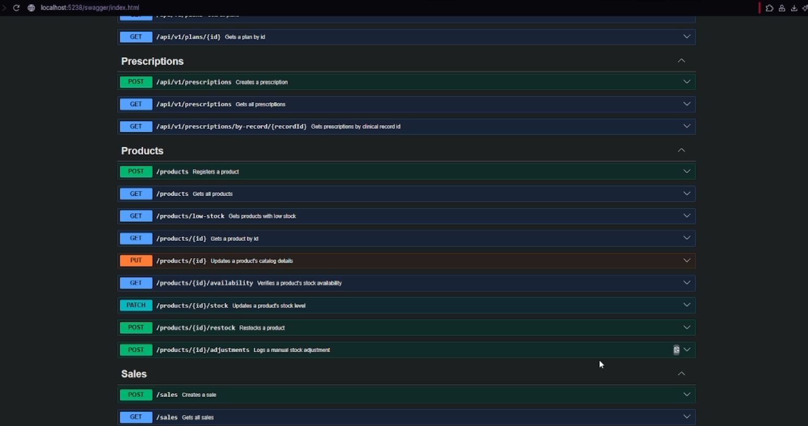
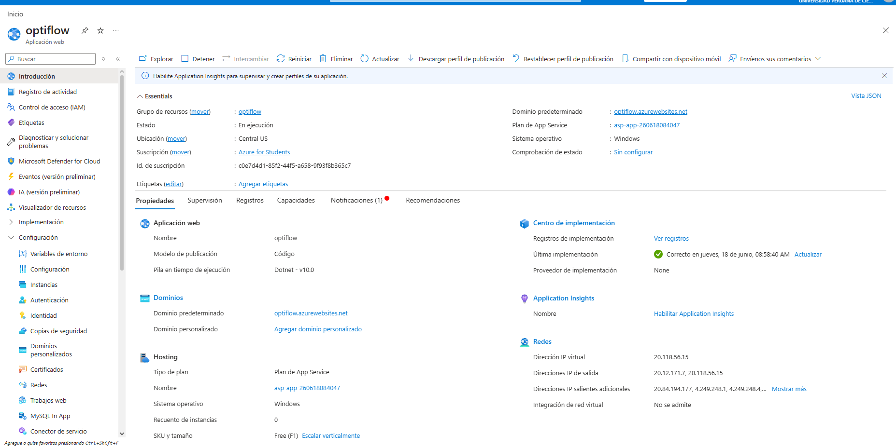
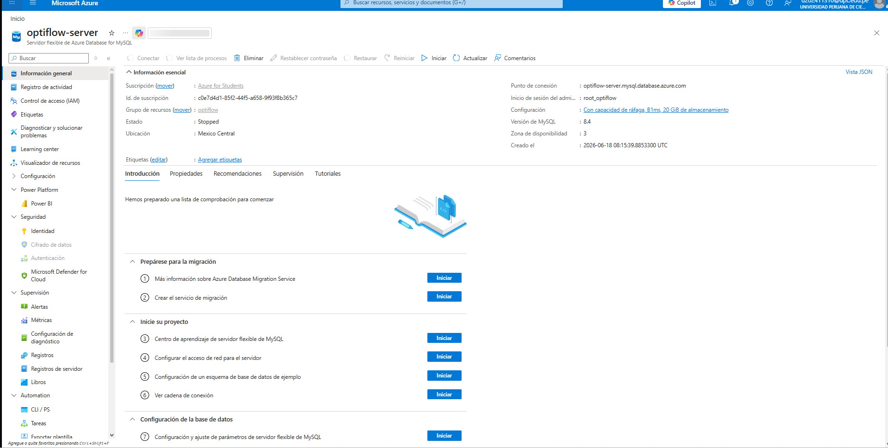
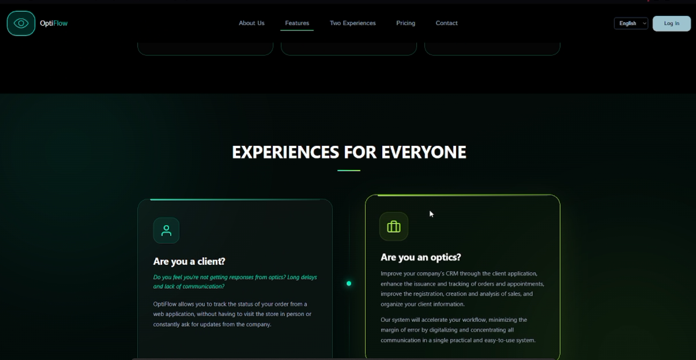
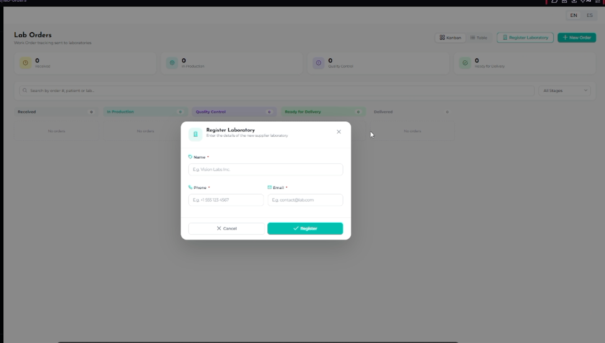
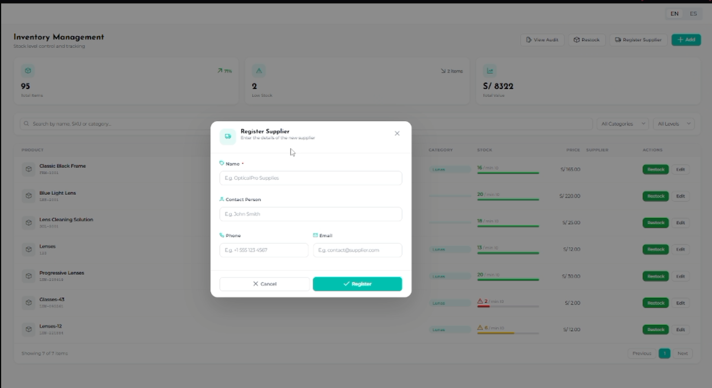

Link del video: https://upcedupe-my.sharepoint.com/:v:/g/personal/u202411310_upc_edu_pe/IQCYdJ6buvRlRqYAf8LnbvznAUvRkR-WcuUp-oQkUtj4pXY?nav=eyJyZWZlcnJhbEluZm8iOnsicmVmZXJyYWxBcHAiOiJTdHJlYW1XZWJBcHAiLCJyZWZlcnJhbFZpZXciOiJTaGFyZURpYWxvZy1MaW5rIiwicmVmZXJyYWxBcHBQbGF0Zm9ybSI6IldlYiIsInJlZmVycmFsTW9kZSI6InZpZXcifX0%3D&e=t9U6Gj


#### Services Documentation Evidence for Sprint Review

Durante el Sprint 3 se documentaron mediante OpenAPI (vía Swagger/Swashbuckle) los endpoints de los seis bounded contexts implementados en el backend de Web Services: Inventory, Sales, Lab and Orders, Clinical, Subscription y Analytics. Cada controlador incluye anotaciones `SwaggerOperation` y `SwaggerResponse` que documentan el propósito de cada acción, los códigos de respuesta posibles y el esquema de los recursos de entrada y salida, generando así una especificación interactiva accesible desde `/swagger`. El backend fue desplegado en Azure App Service y la documentación está disponible públicamente en `https://optiflow.azurewebsites.net/swagger/index.html`. A continuación se detalla, para cada endpoint relevante al alcance del Sprint, el verbo HTTP, la sintaxis de la llamada, los parámetros esperados y un ejemplo de respuesta.

**Repositorio de Web Services:** [https://github.com/1asi0730-2610-10203-OptiFlow/optiflow-platform](https://github.com/1asi0730-2610-10203-OptiFlow/optiflow-platform)

| Endpoint | Verbo HTTP | Sintaxis de llamada | Parámetros | URL de documentación |
|---|---|---|---|---|
| registrar producto | POST | `/products` | Body: `categoryId`, `category`, `supplierId`, `supplierName`, `sku`, `name`, `brand`, `model`, `price`, `stock`, `minimumStockThreshold` | https://optiflow.azurewebsites.net/swagger/index.html#/products/RegisterProduct |
| reabastecer producto | POST | `/products/{id}/restock` | Path: `id` (int). Body: `quantity`, `author` | https://optiflow.azurewebsites.net/swagger/index.html#/products/RestockProduct |
| consultar productos con bajo stock | GET | `/products/low-stock` | Ninguno | https://optiflow.azurewebsites.net/swagger/index.html#/products/GetLowStockProducts |
| crear venta | POST | `/sales` | Body: `invoiceNumber`, `labOrderNumber`, `patientId`, `patientName`, `userId`, `userName`, `totalAmount`, `advance`, `discountCode`, `discountAmount`, `paymentMethod`, `createdAt`, `deliveredAt`, `notes` | https://optiflow.azurewebsites.net/swagger/index.html#/sales/CreateSale |
| aplicar descuento promocional | POST | `/sales/{id}/apply-discount` | Path: `id` (int). Body: detalle del descuento a aplicar | https://optiflow.azurewebsites.net/swagger/index.html#/sales/ApplyPromotionalDiscount |
| pagar saldo pendiente | POST | `/payments/{saleId}/pay` | Path: `saleId` (int). Body: monto del pago | https://optiflow.azurewebsites.net/swagger/index.html#/payments/PayOutstandingBalance |
| cancelar venta | POST | `/sales/{id}/cancel` | Path: `id` (int). Body: motivo de cancelación | https://optiflow.azurewebsites.net/swagger/index.html#/sales/CancelSale |
| registrar laboratorio | POST | `/laboratories` | Body: `name`, `phone`, `email` | https://optiflow.azurewebsites.net/swagger/index.html#/laboratories/RegisterLaboratory |
| crear orden de trabajo | POST | `/work-orders` | Body: `saleId`, `recipeId`, `labId`, `priority`, `patientName`, `lensType`, `frame`, `prescriptionDetails`, `deposit`, `total` | https://optiflow.azurewebsites.net/swagger/index.html#/work-orders/CreateWorkOrder |
| actualizar estado de orden de trabajo | PATCH | `/work-orders/{id}/status` | Path: `id` (int). Body: `newStatus` | https://optiflow.azurewebsites.net/swagger/index.html#/work-orders/UpdateWorkOrderStatus |
| registrar paciente | POST | `/api/v1/patients` | Body: `firstName`, `lastName`, `dni`, `phone`, `email`, `birthDate` | https://optiflow.azurewebsites.net/swagger/index.html#/patients/CreatePatient |
| crear prescripción | POST | `/api/v1/prescriptions` | Body: `clinicalRecordId`, `odSphere`, `odCylinder`, `odAxis`, `oiSphere`, `oiCylinder`, `oiAxis`, `addition`, `doctorName`, `notes` | https://optiflow.azurewebsites.net/swagger/index.html#/prescriptions/CreatePrescription |
| crear suscripción | POST | `/api/v1/subscriptions` | Body: `adminId`, `planId`, `tier`, `amount`, `paymentMethod` | https://optiflow.azurewebsites.net/swagger/index.html#/subscriptions/SelectSubscriptionPlan |
| activar suscripción | POST | `/api/v1/subscriptions/{id}/activate` | Path: `id` (int) | https://optiflow.azurewebsites.net/swagger/index.html#/subscriptions/ActivateSubscription |
| procesar pago de suscripción | POST | `/api/v1/subscription-payments/subscriptions/{subscriptionId}` | Path: `subscriptionId` (int). Body: detalle del pago | https://optiflow.azurewebsites.net/swagger/index.html#/subscription-payments/ProcessSubscriptionPayment |
| consultar reportes analíticos | GET | `/api/v1/analytics-reports` | Ninguno | https://optiflow.azurewebsites.net/swagger/index.html#/analytics-reports/GetAllAnalyticsReports |
| consultar métricas de personal | GET | `/api/v1/staff-metrics/by-report/{reportId}` | Path: `reportId` (int) | https://optiflow.azurewebsites.net/swagger/index.html#/staff-metrics/GetStaffMetricsByReportId |

**Ejemplo y explicación del response — Registrar producto (POST /products):**

Ante una petición válida, el API responde `201 Created` y retorna el recurso del producto registrado:

```json
{
  "id": 12,
  "categoryId": 3,
  "category": "Monturas",
  "supplierId": 2,
  "supplierName": "OptiSupply S.A.",
  "sku": "MNT-0098",
  "name": "Montura Aviador",
  "brand": "RayBan",
  "model": "RB3025",
  "price": 320.00,
  "stock": 15,
  "minimumStockThreshold": 5,
  "lastRestockDate": "2026-06-10"
}
```

Si el `sku` ya existe, el sistema responde `409 Conflict` indicando que el producto ya está registrado; si el payload tiene campos inválidos (por ejemplo, un `categoryId` ausente), responde `400 Bad Request` describiendo el error de validación.

**Ejemplo y explicación del response — Activar suscripción (POST /api/v1/subscriptions/{id}/activate):**

Ante una suscripción en estado `PENDING_PAYMENT`, el API responde `200 OK` con la suscripción actualizada:

```json
{
  "id": 4,
  "adminId": 1,
  "planId": 2,
  "tier": "STANDARD",
  "amount": 149.90,
  "paymentMethod": "CREDIT_CARD",
  "status": "ACTIVE",
  "startDate": "2026-06-10",
  "endDate": "2026-07-10"
}
```

Si la suscripción ya se encuentra activa, el sistema responde `409 Conflict`; si el identificador no existe, responde `404 Not Found`.

**Capturas de la interacción con la documentación:**

La siguiente captura muestra la interfaz de Swagger UI generada por Swashbuckle en `https://optiflow.azurewebsites.net/swagger`, con la lista completa de controladores agrupados por tag (Products, Sales, Payments, WorkOrders, Laboratories, Patients, Prescriptions, Subscriptions, AnalyticsReports, StaffMetrics) desde la cual es posible ejecutar cada operación mediante "Try it out".

{width=100%}

**Commits relacionados con Documentación para este Sprint:**

| Commit Id | Mensaje | Fecha |
|---|---|---|
| 41127c6 | feat(inventory): add interfaces layer | 07/06/2026 |
| 9b26141 | feat(lab-and-orders): add interfaces layer - REST controllers and assemblers | 04/06/2026 |
| 303867c | add clinical bounded context | 05/06/2026 |
| 0308f3e | add analytics section | 05/06/2026 |
| 650408f | feat: added sales bounded context | 07/06/2026 |
| 35f107d | feet(subscription): add controllers | 08/06/2026 |
| 3362c8a | feat(subscription): add queries documentation | 08/06/2026 |
| 29f6db1 | fix: swagger error api not defined fix | 08/06/2026 |
 

#### Software Deployment Evidence for Sprint Review
Durante el Sprint 3 se consolidó el entorno de producción cloud de OptiFlow conectando por primera vez el frontend desplegado en **Azure Static Web Apps** directamente con el backend real en **Azure App Service**, eliminando la dependencia del Fake API utilizado en sprints anteriores. Todos los bounded contexts implementados — Inventory, Lab Orders, Sales, Patients, Prescriptions, Payments, Subscriptions, Analytics Reports y Staff Metrics — quedaron disponibles a través de la API de producción en `optiflow.azurewebsites.net`, y para poder realmente probar la API se accedería a `optiflow.azurewebsites.net/swagger/index.html`


> Captura del Resource Group en Azure Portal mostrando el App Service del backend y la Static Web App del frontend en estado operativo durante el Sprint 3.
> Captura del server con MySQL
> 


#### Team Collaboration Insights for Sprint Review 

Durante el Sprint 3, el equipo mantuvo la dinámica de coordinación establecida en los sprints anteriores, utilizando **Discord** y **Google Meet** para las reuniones síncronas de planificación, revisión y retrospectiva. **GitHub** continuó siendo la plataforma central de control de versiones e integración, gestionando el trabajo bajo la estrategia GitFlow con ramas `feature/*` mergeadas a `develop` mediante Pull Requests revisados por pares.

**Resumen de colaboración:**

El foco de este sprint fue la implementación completa del backend con arquitectura DDD en ASP.NET Core, la integración del frontend con la API real desplegada en Azure App Service, y la documentación de los endpoints bajo el estándar OpenAPI/Swagger. El equipo se organizó en subequipos especializados por bounded context, permitiendo avances en paralelo con mínimos conflictos de integración. Las métricas del período Mayo 19 – Junio 19, 2026 se detallan a continuación por repositorio.

**Actividad del repositorio — Informe (OptiFlow-Report-Stable):**

El repositorio del informe registró **22 Pull Requests mergeados** y ninguno abierto al cierre del sprint, con **0 issues** activos. La participación fue distribuida entre 5 integrantes contribuyentes, con el contribuidor principal liderando de forma notable en volumen de commits.

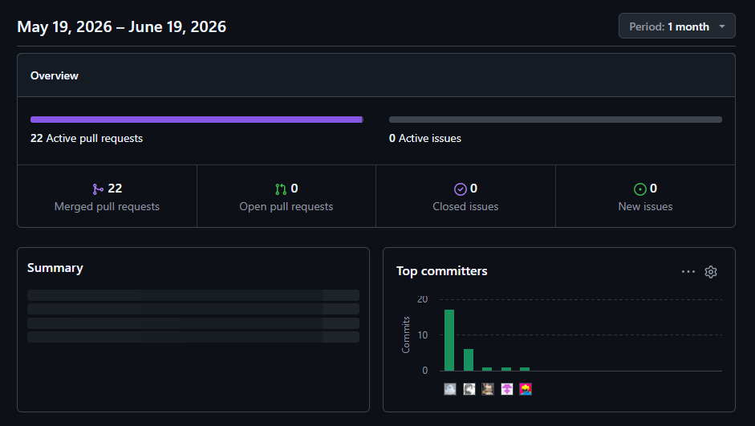

**Actividad del repositorio — Plataforma (Web Services / Backend):**

Se registraron **30 pull requests activos**, de los cuales **29 fueron mergeados** y **1 permaneció abierto** al cierre del sprint. En total, **5 autores** realizaron **159 commits** distribuidos en todas las ramas, con los 29 Pull Requests integrados por **4 integrantes contribuyentes** y sin issues abiertos durante el período.

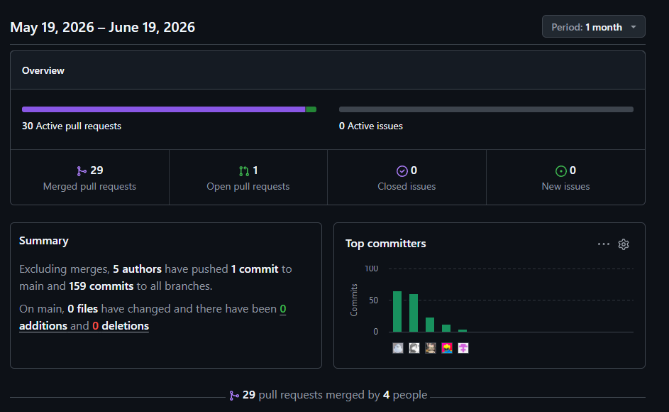

**Actividad del repositorio — Frontend (Web Application):**

Se registraron **25 pull requests activos**, todos **mergeados** al cierre del sprint, sin Pull Requests pendientes ni issues abiertos. Los **25 Pull Requests** fueron integrados por **5 integrantes contribuyentes** durante el período.

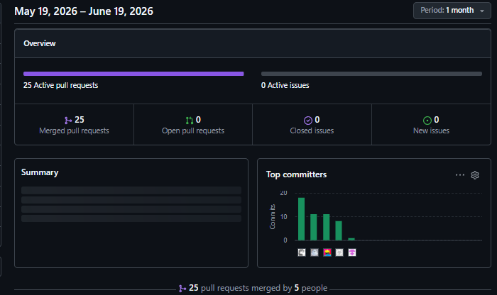

**Actividad del repositorio — Landing Page:**

La Landing Page registró la participación de **5 autores** durante el período, con el contribuidor principal (Llummo) encabezando con **17 commits** y **3 018 adiciones**. La distribución de contribuciones por integrante fue la siguiente:

| Integrante | Usuario GitHub | Commits | Adiciones | Eliminaciones |
|---|---|---|---|---|
| Azama Fukuda, Juan Pablo | Llummo | 17 | 3 018 | 704 |
| Mechan Montenegro, Luciana Carolina | luuu6 | 8 | 1 055 | 269 |
| Capillo Lema, Mía Valentina | Miavcl | 3 | 225 | 104 |
| Atoche Gonzales, Nicolas Fernando | THECOMAX | 2 | 437 | 3 |
| Morocho Pinedo, Mariana | Patto04 | 2 | 728 | 10 |

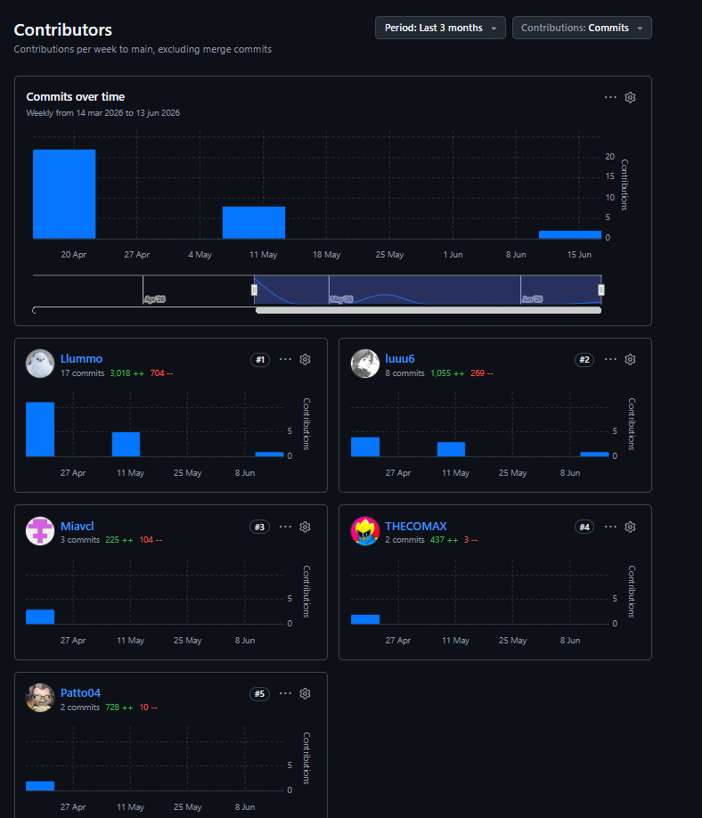

#### Sprint Review: Conclusiones y Recomendaciones del Sprint 3

**Conclusiones**

Durante el Sprint 3 se alcanzó el hito técnico más significativo del proyecto: la transición completa desde el Fake API hacia un backend real en producción. Los seis bounded contexts priorizados — Inventory, Sales, Lab and Orders, Clinical, Subscriptions y Analytics — fueron implementados bajo una arquitectura DDD con ASP.NET Core y desplegados en Azure App Service, conectándose por primera vez con el frontend desplegado en Azure Static Web Apps. Esto elimina la deuda técnica del Fake API y establece una base de persistencia real sobre SQL Server en Azure.

Todos los Technical Stories de alta prioridad (TS-INV, TS-SAL, TS-LAB, TS-CLI, TS-SUB, TS-ANA) fueron completados exitosamente, con sus endpoints documentados bajo el estándar OpenAPI/Swagger. El diseño y la implementación del esquema relacional de base de datos quedaron alineados con los bounded contexts del EventStorming, lo que garantiza integridad transaccional en los flujos críticos de negocio.

Las entrevistas de validación con ambos segmentos objetivos confirmaron que los flujos principales de la plataforma resultan usables sin bloqueos críticos: el portal de pacientes fue completado sin asistencia por los entrevistados del segundo segmento, y el segmento de administradores validó la coherencia del flujo de ventas y el Kanban de laboratorio con los procesos reales de una óptica. La evaluación heurística identificó 5 problemas de usabilidad (2 de severidad 2 y 3 de severidad 3), lo que confirma que la plataforma es funcional pero requiere refinamientos focalizados antes del lanzamiento.

**Recomendaciones**

- **Corregir los problemas de severidad 3 identificados en la evaluación heurística** con prioridad alta: (1) agregar alerta visual de fecha de entrega vencida en la vista My Lenses del portal del paciente; (2) hacer visible permanentemente el botón de avance de estado en las tarjetas del tablero Kanban; (3) complementar los gráficos del Dashboard con tablas de valores numéricos accesibles para usuarios con tecnologías de asistencia.

- **Completar el módulo IAM** (T52), que finalizó el sprint en estado In-Process. La ausencia de autenticación y autorización real representa un riesgo para el despliegue en producción y debe resolverse como primera tarea del siguiente ciclo.

- **Incorporar las mejoras sugeridas por los entrevistados del primer segmento:** módulo de seguimiento de metas e indicadores de desempeño empresarial, ranking de trabajadores con mejor rendimiento, reportes de ventas segmentados por categoría de producto y filtros temporales más granulares en el módulo analítico.

- **Mejorar la experiencia del portal del paciente** atendiendo las observaciones del segundo segmento: separar la vista de seguimiento de pedido y el resumen de pago en secciones independientes dentro de My Lenses, agregar imágenes de referencia de modelos en el Virtual Try-On y añadir texto de ayuda contextual en los campos de la Calculadora de Grosor ("Encuéntralo en tu receta óptica").

- **Desarrollar una versión responsiva para dispositivos móviles**, dado que múltiples entrevistados del primer segmento señalaron que las ópticas pequeñas operan principalmente desde teléfonos celulares. Esta capacidad ampliaría significativamente el alcance comercial de la plataforma.

- **Evaluar estrategias de pricing diferenciadas** para ópticas pequeñas, dado que el precio actual puede representar una barrera de adopción para negocios con menor flujo de clientes, según la retroalimentación recibida en las entrevistas de validación.

- **Orientar el siguiente sprint** hacia la finalización de las tareas del HTML Course (T54–T64) que quedaron pendientes, la implementación de la capa IAM y la incorporación de las correcciones heurísticas priorizadas.


### Sprint 4

#### Sprint Planning 4
En esta sección se especifican los aspectos principales del Sprint Planning Meeting correspondiente a la cuarta iteración del proyecto. El enfoque principal de este Sprint abarca la corrección de los problemas de usabilidad identificados en la evaluación heurística del Sprint 3, la integración completa del módulo IAM con el frontend, las mejoras del portal del paciente y la optimización de la responsividad móvil de la aplicación.

| Aspect | Details |
| :--- | :--- |
| **Sprint #** | Sprint 4 |
| **Date** | 2026-06-22 |
| **Time** | 10:00 AM |
| **Location** | Reunión Virtual (Discord / Microsoft Teams) |
| **Prepared By** | Azama Fukuda, Juan Pablo |
| **Attendees (to planning meeting)** | Atoche Gonzales, Nicolas Fernando / Azama Fukuda, Juan Pablo / Capillo Lema, Mía Valentina / Mechan Montenegro, Luciana Carolina / Morocho Pinedo, Mariana |
| **Sprint 3 Review Summary** | Se implementó el backend completo con arquitectura DDD en ASP.NET Core, conectando por primera vez el frontend con la API real desplegada en Azure App Service. Se documentaron los endpoints de los bounded contexts bajo el estándar OpenAPI/Swagger y se realizaron las entrevistas de validación con ambos segmentos objetivo, identificando 5 problemas de usabilidad en la evaluación heurística. |
| **Sprint 3 Retrospective Summary** | La evaluación heurística identificó 5 problemas de usabilidad (2 de severidad 2 y 3 de severidad 3) que deben corregirse antes del lanzamiento. El módulo IAM fue implementado en el backend pero no integrado completamente con el frontend, lo que representa un riesgo para el despliegue en producción. Mejoras acordadas: (1) corregir los 3 problemas de severidad 3 con prioridad alta, (2) integrar la autenticación IAM real en el frontend, (3) mejorar el portal del paciente según el feedback de los entrevistados y (4) desarrollar responsividad móvil en las vistas principales. Finalmente, la mayoría de integrantes opinó que el trabajo sí fue más organizado, pero hubieron algunos erorres de comunicación y de delegación |
| **Sprint Goal** | Our focus is on delivering a production-ready, secure and accessible OptiFlow platform. We believe it delivers a polished end-to-end experience that resolves all critical usability issues and integrates real authentication for both administrators and patients. This will be confirmed when the three severity-3 heuristic issues are resolved, IAM is fully integrated in the frontend, and the patient portal improvements are validated in the deployed application. |
| **Sprint n Velocity** | 45 Story Points |
| **Sum of Story Points** | 45 |


#### Retrospectiva del Sprint 3

A continuación se registran los aportes individuales del equipo durante la sesión de retrospectiva realizada al cierre del Sprint 3, estructurados en aciertos y oportunidades de mejora por integrante.

| Integrante | Aciertos | Oportunidades de mejora |
| :--- | :--- | :--- |
| Azama Fukuda, Juan Pablo | Se cumplieron con los plazos de entrega con margen razonable. Se mejoró el proceso de QA respecto a sprints anteriores. | Las delegaciones fueron mediocres en algunos casos; falta revisión del trabajo delegado antes de darlo por cerrado. Falta mayor comunicación entre los integrantes. |
| Atoche Gonzales, Nicolas Fernando | En general estuvo mejor el trabajo en equipo respecto a sprints anteriores. | Algunas delegaciones no tenían sentido aparente; una delegación no se realizó y causó un problema concreto. Se pudieron haber realizado pruebas unitarias para prevenir errores. |
| Mechan Montenegro, Luciana Carolina | Mejor organización del equipo durante el sprint. | Mejorar la comunicación; reportar el avance individual dentro del grupo de manera más constante. |
| Morocho Pinedo, Mariana | Mejor organización del equipo durante el sprint. | Vergüenza a la hora de comunicarse por el grupo y al momento de realizar las entrevistas. Las actividades del curso de open source consumieron demasiado tiempo, afectando la disponibilidad para el sprint. |
| Capillo Lema, Mía Valentina | Mejor organización del equipo durante el sprint. | Comentar más los avances en el chat grupal y compartir más la situación personal cuando afecta la disponibilidad para el proyecto. |

#### Aspect Leaders and Collaborators
En el sprint el enfoque principal fue la corrección de los problemas de usabilidad identificados en la evaluación heurística, la integración del módulo IAM con el frontend y las mejoras del portal del paciente. El equipo distribuyó las responsabilidades según la especialización de cada integrante en los módulos correspondientes.

| Team Member (Last Name, First Name) | GitHub Username | Heuristic fixes & UX improvements (L)/(C) | IAM Frontend Integration (L)/(C) | Patient portal improvements (L)/(C) | Mobile responsiveness (L)/(C) | Report corrections & documentation (L)/(C) | Software deployment configuration (L)/(C) | Sprint planning & Backlog (L)/(C) | Team collaboration insights (L)/(C) | Scrum Master Role (L)/(C) |
| :--- | :--- | :--- | :--- | :--- | :--- | :--- | :--- | :--- | :--- | :--- |
| Azama Fukuda, Juan Pablo | Llummo | L | | | C | L | L | | | L |
| Atoche Gonzales, Nicolas Fernando | THECOMAX | | L | | | | | | | |
| Capillo Lema, Mia Valentina | Miavcl | C | | L | | C | | | | |
| Mechan Montenegro, Luciana Carolina | luuu6 | C | | | L | | | | L | |
| Morocho Pinedo, Mariana | Patto04 | | | C | | C | | L | | |


#### Sprint Backlog 4

<table>
<thead>
    <tr>
      <th style="text-align: left;">Sprint #</th>
      <th colspan="7" style="text-align: left;">Sprint 4</th>
    </tr>
    <tr>
      <th colspan="2" style="text-align: left;">User Story</th>
      <th colspan="6" style="text-align: left;">Work-Item / Task</th>
    </tr>
    <tr>
      <th style="text-align: left;">Id</th>
      <th style="text-align: left;">Title</th>
      <th style="text-align: left;">Id</th>
      <th style="text-align: left;">Title</th>
      <th style="text-align: left;">Description</th>
      <th style="text-align: left;">Estimation (Hours)</th>
      <th style="text-align: left;">Assigned To</th>
      <th style="text-align: left;">Status (To-do / In-Process / To-Review / Done)</th>
    </tr>
  </thead>
  <tbody>
    <tr>
      <td>TS-IAM-001</td>
      <td>Integrar autenticación IAM en el frontend</td>
      <td>T65</td>
      <td>Frontend IAM Integration — Login y Guards de Ruta</td>
      <td>Conectar el frontend con los endpoints de autenticación del módulo IAM real (sign-in, sign-up, token refresh). Implementar guards de ruta que restrinjan el acceso a vistas protegidas según el rol del usuario autenticado.</td>
      <td>6 hrs</td>
      <td>Nicolas</td>
      <td>Done</td>
    </tr>
    <tr>
      <td>TS-IAM-002</td>
      <td>Persistencia de sesión y flujo de logout</td>
      <td>T66</td>
      <td>Frontend IAM Integration — Sesión y Logout</td>
      <td>Implementar la persistencia del token JWT en localStorage/sessionStorage, el manejo de expiración de sesión y el flujo de cierre de sesión con limpieza del estado de la store.</td>
      <td>4 hrs</td>
      <td>Nicolas</td>
      <td>Done</td>
    </tr>
    <tr>
      <td>TS-IAM-003</td>
      <td>Google Sign-In</td>
      <td>T81</td>
      <td>Endpoint de Google Sign-In</td>
      <td>Implementar el endpoint POST /api/v1/authentication/sign-in/google que autentica al usuario mediante su credencial de Google y retorna el token JWT junto con los datos del usuario.</td>
      <td>4 hrs</td>
      <td>Mariana</td>
      <td>Done</td>
    </tr>
    <tr>
      <td>TS-IAM-004</td>
      <td>Password Recovery & Reset</td>
      <td>T82</td>
      <td>Endpoints de Recuperación y Restablecimiento de Contraseña</td>
      <td>Implementar POST /api/v1/authentication/password-recoveries (genera y envía el token de recuperación) y POST /api/v1/authentication/password-resets (restablece la contraseña con el token de recuperación).</td>
      <td>4 hrs</td>
      <td>Mariana</td>
      <td>Done</td>
    </tr>
    <tr>
      <td>TS-IAM-005</td>
      <td>Update Email & Password</td>
      <td>T83</td>
      <td>Endpoints de Actualización de Email y Contraseña</td>
      <td>Implementar PUT /api/v1/users/{id}/email (retorna un nuevo JWT) y PUT /api/v1/users/{id}/password para el usuario autenticado.</td>
      <td>3 hrs</td>
      <td>Mariana</td>
      <td>Done</td>
    </tr>
    <tr>
      <td>TS-IAM-006</td>
      <td>Secure Endpoints (JWT Authorization)</td>
      <td>T84</td>
      <td>Protección de Controladores con Filtro de Autorización</td>
      <td>Implementar el JwtMiddleware y el filtro de autorización personalizado, aplicando el atributo [Authorize] a todos los controladores excepto autenticación, de modo que cada request a un endpoint protegido exija el token JWT.</td>
      <td>5 hrs</td>
      <td>Mariana</td>
      <td>Done</td>
    </tr>
    <tr>
      <td>TS-ACC-001</td>
      <td>Account Onboarding (Multi-tenant)</td>
      <td>T85</td>
      <td>Onboarding de Cuenta y Agregado Account</td>
      <td>Implementar el agregado Account y los endpoints POST /api/v1/accounts (completa el onboarding del administrador) y GET /api/v1/accounts/me, con el gate ACCOUNT_SETUP_REQUIRED para forzar el onboarding.</td>
      <td>5 hrs</td>
      <td>Juan Pablo</td>
      <td>Done</td>
    </tr>
    <tr>
      <td>TS-ACC-002</td>
      <td>Account Scoping</td>
      <td>T86</td>
      <td>Aislamiento de Datos por Cuenta (account_id)</td>
      <td>Acotar todos los bounded contexts (Inventory, Sales, Lab & Orders, Clinical, Patient-center y Subscription) a un account_id mediante migraciones de EF Core y la resolución del CurrentUserContext dentro del DbContext, garantizando el aislamiento de datos entre ópticas.</td>
      <td>6 hrs</td>
      <td>Juan Pablo</td>
      <td>Done</td>
    </tr>
    <tr>
      <td>TS-SUB-004</td>
      <td>Stripe Checkout Session</td>
      <td>T87</td>
      <td>Checkout de Suscripción con Stripe</td>
      <td>Implementar el endpoint POST /api/v1/checkout que genera la sesión de Stripe Checkout para un plan y retorna la URL de redirección, respaldado por IStripeCheckoutService.</td>
      <td>5 hrs</td>
      <td>Luciana</td>
      <td>Done</td>
    </tr>
    <tr>
      <td>TS-SUB-005</td>
      <td>Subscription Access Gate</td>
      <td>T88</td>
      <td>Gate de Suscripción Activa</td>
      <td>Implementar GET /api/v1/subscriptions/me y la validación de suscripción activa (SUBSCRIPTION_REQUIRED) dentro del filtro de autorización, restringiendo el acceso a los módulos según el estado de la suscripción de la cuenta.</td>
      <td>4 hrs</td>
      <td>Juan Pablo</td>
      <td>Done</td>
    </tr>
    <tr>
      <td>TS-SUB-006</td>
      <td>Plan Selection & Payment Flow (Frontend)</td>
      <td>T89</td>
      <td>Flujo de Selección y Pago de Plan</td>
      <td>Implementar la vista de selección de plan que consume GET /api/v1/plans y redirige a Stripe Checkout vía POST /api/v1/checkout, integrada al onboarding del administrador tras el registro.</td>
      <td>4 hrs</td>
      <td>Luciana</td>
      <td>Done</td>
    </tr>
    <tr>
      <td>TS-NOT-001</td>
      <td>System Notifications</td>
      <td>T90</td>
      <td>Notificaciones de Sistema vía REST</td>
      <td>Implementar los endpoints GET y PATCH /api/v1/users/{userId}/notifications para listar y marcar como leídas las notificaciones de sistema del usuario autenticado.</td>
      <td>4 hrs</td>
      <td>Juan Pablo</td>
      <td>Done</td>
    </tr>
    <tr>
      <td>TS-SAL-005</td>
      <td>Work Order ↔ Sale Link & Sale Items</td>
      <td>T91</td>
      <td>Vínculo Orden de Trabajo ↔ Venta e Ítems de Venta</td>
      <td>Implementar PATCH /work-orders/{id}/sale para vincular la orden de laboratorio con su venta, y exponer los ítems de venta (line items) embebidos en el SaleResource.</td>
      <td>4 hrs</td>
      <td>Juan Pablo</td>
      <td>Done</td>
    </tr>
    <tr>
      <td>TS-INV-004</td>
      <td>Stock Depletion on Sale Completion</td>
      <td>T92</td>
      <td>Depleción de Stock al Completar Venta</td>
      <td>Implementar POST /products/{id}/consume con registro de auditoría y la depleción automática de stock del inventario cuando una venta se completa.</td>
      <td>4 hrs</td>
      <td>Juan Pablo</td>
      <td>Done</td>
    </tr>
    <tr>
      <td></td>
      <td>Heuristic Fix — Severity 3</td>
      <td>T67</td>
      <td>Fix: Alerta visual de fecha de entrega vencida en My Lenses</td>
      <td>Implementar la comparación entre estimatedDate y la fecha actual en la vista My Lenses. Si la fecha ya pasó y el pedido no está en estado DELIVERED, mostrar el campo en rojo con un ícono de advertencia y el texto "Delayed — estimated date has passed".</td>
      <td>3 hrs</td>
      <td>Juan Pablo</td>
      <td>To-do</td>
    </tr>
    <tr>
      <td></td>
      <td>Heuristic Fix — Severity 3</td>
      <td>T68</td>
      <td>Fix: Visibilidad permanente del botón de avance de estado en Kanban</td>
      <td>Refactorizar las tarjetas del tablero Kanban para que el botón de avance de estado sea visible permanentemente (sin depender de hover), utilizando una opacidad reducida en reposo que aumente al hacer hover, o reubicándolo como elemento siempre visible en la parte inferior de la tarjeta.</td>
      <td>3 hrs</td>
      <td>Juan Pablo</td>
      <td>To-Review</td>
    </tr>
    <tr>
      <td></td>
      <td>Heuristic Fix — Severity 3</td>
      <td>T69</td>
      <td>Fix: Tablas de valores numéricos en el Dashboard</td>
      <td>Agregar debajo de cada gráfico del Dashboard (gráfico de líneas de conversión e ingresos semanales) una sección con los valores numéricos principales en formato de tabla compacta o texto, accesible para tecnologías de asistencia y usuarios con discapacidad visual.</td>
      <td>4 hrs</td>
      <td>Juan Pablo</td>
      <td>To-do</td>
    </tr>
    <tr>
      <td></td>
      <td>Heuristic Fix — Severity 2</td>
      <td>T70</td>
      <td>Fix: Texto de ayuda en campos de la Calculadora de Grosor</td>
      <td>Agregar un texto de ayuda breve debajo de cada campo de prescripción en la Calculadora de Grosor del portal del paciente (ej. "Encuéntralo en tu receta óptica. Ejemplo: -2.50"). Corregir además el label técnico del selector de material.</td>
      <td>2 hrs</td>
      <td>Mia</td>
      <td>To-Review</td>
    </tr>
    <tr>
      <td></td>
      <td>Patient Portal Improvement</td>
      <td>T71</td>
      <td>Mejora: Separar seguimiento de pedido y resumen de pago en My Lenses</td>
      <td>Refactorizar la vista My Lenses para separar el tracker de estado del pedido y el resumen de pago en secciones independientes (tabs o cards diferenciadas), e incorporar un detalle itemizado de los productos similar a una boleta con descripción y costo individual.</td>
      <td>4 hrs</td>
      <td>Mia</td>
      <td>Done</td>
    </tr>
    <tr>
      <td></td>
      <td>Patient Portal Improvement</td>
      <td>T72</td>
      <td>Mejora: Imágenes de referencia en Virtual Try-On</td>
      <td>Agregar imágenes de referencia de los modelos de montura disponibles en la vista Virtual Try-On, para que el paciente tenga una referencia visual concreta del producto antes de activar la cámara.</td>
      <td>3 hrs</td>
      <td>Mia</td>
      <td>To-Review</td>
    </tr>
    <tr>
      <td></td>
      <td>Mobile Responsiveness</td>
      <td>T73</td>
      <td>Responsividad móvil — Módulo de Ventas e Inventario</td>
      <td>Implementar estilos responsivos para las vistas del módulo de Ventas e Inventario, asegurando la usabilidad en dispositivos móviles (viewport &lt; 768px) mediante breakpoints CSS y reorganización del layout en pantallas pequeñas.</td>
      <td>5 hrs</td>
      <td>Luciana</td>
      <td>Done</td>
    </tr>
    <tr>
      <td></td>
      <td>Mobile Responsiveness</td>
      <td>T74</td>
      <td>Responsividad móvil — Tablero Kanban y Portal del Paciente</td>
      <td>Implementar estilos responsivos para el tablero Kanban del módulo de Lab Orders y las vistas del portal del paciente (My Lenses, Virtual Try-On, Calculadora de Grosor), garantizando la usabilidad en teléfonos celulares.</td>
      <td>5 hrs</td>
      <td>Luciana</td>
      <td>Done</td>
    </tr>
    <tr>
      <td></td>
      <td>Documentation</td>
      <td>T75</td>
      <td>Sprint 4 Planning & Backlog</td>
      <td>Redactar el Sprint Planning 4, Aspect Leaders and Collaborators y el Sprint Backlog 4 en el informe del proyecto.</td>
      <td>2 hrs</td>
      <td>Mariana</td>
      <td>Done</td>
    </tr>
    <tr>
      <td></td>
      <td>Documentation</td>
      <td>T76</td>
      <td>Development Evidence Sprint 4</td>
      <td>Completar la tabla Development Evidence del Sprint 4 con los commits de todos los repositorios (optiflow-platform, OptiFlow-Frontend, OptiFlow-Landing-Page) correspondientes a las tasks implementadas en este sprint.</td>
      <td>3 hrs</td>
      <td>Luciana</td>
      <td>Done</td>
    </tr>
    <tr>
      <td></td>
      <td>Documentation</td>
      <td>T77</td>
      <td>Execution Evidence Sprint 4</td>
      <td>Recolectar capturas de pantalla o video que evidencien las correcciones heurísticas implementadas, la integración IAM, las mejoras del portal del paciente y las vistas responsivas en mobile, incluyendo el enlace al video de ejecución en SharePoint.</td>
      <td>4 hrs</td>
      <td>Juan Pablo</td>
      <td>Done</td>
    </tr>
    <tr>
      <td></td>
      <td>Documentation</td>
      <td>T78</td>
      <td>Services Documentation Evidence Sprint 4</td>
      <td>Actualizar la documentación de los servicios del backend con cualquier endpoint nuevo o modificado durante el Sprint 4, verificando la disponibilidad de la documentación Swagger en producción.</td>
      <td>3 hrs</td>
      <td>Nicolas</td>
      <td>Done</td>
    </tr>
    <tr>
      <td></td>
      <td>Documentation</td>
      <td>T79</td>
      <td>Software Deployment Evidence Sprint 4</td>
      <td>Documentar el despliegue final del Sprint 4 en Azure, incluyendo capturas del pipeline de GitHub Actions, del Resource Group en Azure Portal y las URLs de producción actualizadas para el frontend y el backend.</td>
      <td>2 hrs</td>
      <td>Juan Pablo</td>
      <td>Done</td>
    </tr>
    <tr>
      <td></td>
      <td>Documentation</td>
      <td>T80</td>
      <td>Team Collaboration Insights Sprint 4</td>
      <td>Completar la sección Team Collaboration Insights del Sprint 4 con métricas de contribución por integrante (commits, PRs aprobados), capturas de GitHub Insights de todos los repositorios activos y resumen de las reuniones de retrospectiva realizadas.</td>
      <td>3 hrs</td>
      <td>Luciana</td>
      <td>Done</td>
    </tr>
  </tbody>
</table>

Si bien es cierto el enunciado solicita la utilización de la herramienta de Trello, nosotros optamos por utilizar Jira como nuestra herramienta de desarrollo ágil. Aún así, mostramos una captura con delegaciones en el Trello solo para poder cumplir con el requisito del enunciado, además de mostrar las capturas del Jira.

#### Gestión colaborativa y seguimiento de incidencias mediante Jira
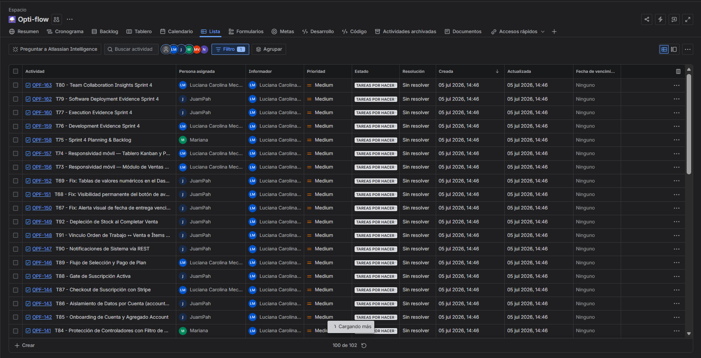


#### Gestión colaborativa y seguimiento de incidencias mediante Trello
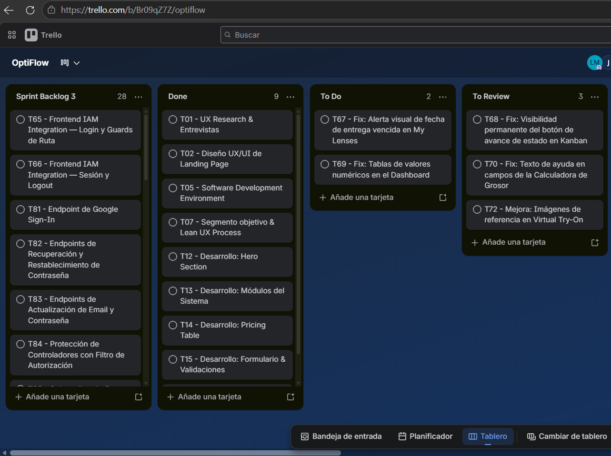

#### Development Evidence for Sprint Review

Durante el Sprint 4 el equipo concentró el esfuerzo de desarrollo en cerrar el ciclo de vida del producto de cara al release final. El trabajo más significativo fue la implementación completa del bounded context de **Identity and Access Management (IAM)** en el backend —con autenticación por JWT, hashing de contraseñas con BCrypt, Google Sign-In y flujo de recuperación de contraseña— y su **integración real en el frontend** (vistas de login, registro, perfil y recuperación de contraseña, interceptor JWT, persistencia de sesión y navegación condicionada por autenticación). Sobre esta base se incorporó **multi-tenancy (account scoping)**: cada bounded context —Inventory, Sales, Lab & Orders, Clinical, Patient-center y Subscription— fue acotado a una cuenta (`account_id`) con sus respectivas migraciones de Entity Framework Core, garantizando el aislamiento de datos entre ópticas. Adicionalmente se integró **Stripe** para el checkout de suscripciones, se implementaron las **notificaciones de sistema vía REST**, y se consolidó el cableado de datos reales entre frontend y backend (ítems de venta, vínculo orden de laboratorio ↔ venta, depleción de stock al completar una venta y cómputo de reportes analíticos en vivo). La siguiente tabla detalla los commits relacionados con la implementación en los repositorios de código durante el Sprint.

| Repository | Branch | Commit Id | Commit Message | Commit Message Body | Committed on (Date) |
| :--- | :--- | :--- | :--- | :--- | :--- |
| optiflow-platform | feature/IAM | 8c62d24 | feat(shared): update problem details factory. | - | 29/06/2026 |
| optiflow-platform | feature/IAM | 0f01895 | feat(shared): update result pattern implementation. | - | 29/06/2026 |
| optiflow-platform | feature/IAM | 15781b0 | feat(iam): add update email and update password endpoints. | - | 29/06/2026 |
| optiflow-platform | feature/IAM | d182ce8 | feat(iam): add google sign-in and password recovery endpoints. | - | 29/06/2026 |
| optiflow-platform | feature/IAM | 4f23a2a | feat(iam): update user repository implementation. | - | 29/06/2026 |
| optiflow-platform | feature/IAM | 1d4777e | feat(iam): update user repository interface. | - | 29/06/2026 |
| optiflow-platform | feature/IAM | dea7170 | feat(iam): add get all users query. | - | 29/06/2026 |
| optiflow-platform | feature/IAM | 546d9ba | feat(iam): update user aggregate with google id and email value objects. | - | 29/06/2026 |
| optiflow-platform | feature/IAM | 11b65db | feat(iam): update user query service interface. | - | 29/06/2026 |
| optiflow-platform | feature/IAM | b44cade | feat(iam): update user query service implementation. | - | 29/06/2026 |
| optiflow-platform | feature/IAM | 205942f | feat(iam): add google sign-in and password recovery handling. | - | 29/06/2026 |
| optiflow-platform | feature/IAM | c9c3acf | feat(iam): add password recovery command service interface. | - | 29/06/2026 |
| optiflow-platform | feature/IAM | 2d95cf9 | feat(analytics): update staff metrics controller. | - | 29/06/2026 |
| optiflow-platform | feature/IAM | 4d46497 | feat(analytics): update analytics reports controller. | - | 29/06/2026 |
| optiflow-platform | feature/IAM | b4da7f9 | chore: register new services in dependency injection | - | 29/06/2026 |
| optiflow-platform | feature/IAM | 85afe8e | chore: add missing nuget packages for jwt, bcrypt and google auth. | - | 29/06/2026 |
| optiflow-platform | feature/IAM | 36c4de3 | feat(subscription): implement Stripe checkout integration | - | 30/06/2026 |
| optiflow-platform | feature/IAM | 4706319 | feat(shared): add database migration | - | 30/06/2026 |
| optiflow-platform | feature/IAM | f71e0cb | refactor(subscription): update application configuration | - | 30/06/2026 |
| optiflow-platform | feature/IAM | 7946d73 | feat(subscription): add authorize attribute. | - | 30/06/2026 |
| optiflow-platform | feature/IAM | dfa5376 | feat(sales): add authorize attribute. | - | 30/06/2026 |
| optiflow-platform | feature/IAM | c1419aa | feat(patient): add authorize attribute. | - | 30/06/2026 |
| optiflow-platform | feature/IAM | 15a4211 | feat(lab): add authorize attribute. | - | 30/06/2026 |
| optiflow-platform | feature/IAM | 6e515fc | feat(inventory): add authorize attribute. | - | 30/06/2026 |
| optiflow-platform | feature/IAM | ccec2e0 | feat(clinical): add authorize attribute. | - | 30/06/2026 |
| optiflow-platform | feature/IAM | 0b67580 | feat(iam): add authorize attribute to all controllers except authentication. | - | 30/06/2026 |
| optiflow-platform | feature/IAM | 1dbaba8 | fix(inventory): implement inventory reduction | - | 02/07/2026 |
| optiflow-platform | feature/IAM | 5579917 | fix: fix app settings development. | - | 03/07/2026 |
| optiflow-platform | feature/IAM | 7203762 | fix(iam): fix login and sign-in flow. | - | 03/07/2026 |
| optiflow-platform | feature/IAM | 76c65e4 | Fix 500 on sign-up with empty email/password | - | 03/07/2026 |
| optiflow-platform | feature/IAM | 38bf356 | Restore StockOperation.Consumption dropped by a merge | - | 03/07/2026 |
| optiflow-platform | feature/IAM | a34a34f | Fix duplicate sale completion on payment | - | 03/07/2026 |
| optiflow-platform | feature/IAM | cd53330 | Deplete inventory stock when a sale completes | - | 03/07/2026 |
| optiflow-platform | feature/IAM | 3472b74 | Add sale line items | - | 03/07/2026 |
| optiflow-platform | feature/IAM | 9743117 | Add ReduceStock command and Sale audit operation to Inventory | - | 03/07/2026 |
| optiflow-platform | feature/patient-center-profile-backend | a770021 | feat(patient-center): add AllowWithoutAccount to controllers and patient profile endpoint | - | 04/07/2026 |
| optiflow-platform | feature/patient-center-profile-backend | 165b24d | feat(subscription): add migration for account_id columns | - | 04/07/2026 |
| optiflow-platform | feature/patient-center-profile-backend | 883b545 | feat(subscription): scope subscription, billing, and payment | - | 04/07/2026 |
| optiflow-platform | feature/patient-center-profile-backend | af101b3 | feat(patient-center): add migration for account_id column | - | 04/07/2026 |
| optiflow-platform | feature/patient-center-profile-backend | c0cf034 | feat(patient-center): scope notifications to an account | - | 04/07/2026 |
| optiflow-platform | feature/patient-center-profile-backend | 47c0714 | feat(lab-orders): add migration for account_id columns | - | 04/07/2026 |
| optiflow-platform | feature/patient-center-profile-backend | 0849e8a | feat(lab-orders): scope work orders to an account | - | 04/07/2026 |
| optiflow-platform | feature/patient-center-profile-backend | 8b1a1f1 | feat(clinical): add migration for account_id columns | - | 04/07/2026 |
| optiflow-platform | feature/patient-center-profile-backend | af80c87 | feat(clinical): scope patient records to an account | - | 04/07/2026 |
| optiflow-platform | feature/patient-center-profile-backend | aa629ab | feat(inventory): add migration for account_id columns | - | 04/07/2026 |
| optiflow-platform | feature/patient-center-profile-backend | 073e7db | feat(inventory): scope catalog to an account | - | 04/07/2026 |
| optiflow-platform | feature/patient-center-profile-backend | cbc5bc8 | fix(sales): fix account id in fresh-scope event handlers | - | 04/07/2026 |
| optiflow-platform | feature/patient-center-profile-backend | 0f8ed69 | feat(sales): add migration for account_id columns | - | 04/07/2026 |
| optiflow-platform | feature/patient-center-profile-backend | c364340 | feat(shared): scope system notifications to an account | - | 04/07/2026 |
| optiflow-platform | feature/patient-center-profile-backend | 689fbc7 | feat(sales): scope sale, payment, and sale item to an account | - | 04/07/2026 |
| optiflow-platform | feature/patient-center-profile-backend | f8ded91 | feat(iam): add migration for accounts and user account_id | - | 04/07/2026 |
| optiflow-platform | feature/patient-center-profile-backend | f199364 | chore: register account services and http context accessor | - | 04/07/2026 |
| optiflow-platform | feature/patient-center-profile-backend | 7db215c | feat(shared): resolve current account into db context | - | 04/07/2026 |
| optiflow-platform | feature/patient-center-profile-backend | e0b16ad | feat(iam): add account onboarding endpoint and gate | - | 04/07/2026 |
| optiflow-platform | feature/patient-center-profile-backend | 113b8cd | feat(iam): add Account aggregate and onboarding services | - | 04/07/2026 |
| optiflow-platform | feature/patient-center-profile-backend | d1b49f2 | feat(analytics): compute reports live instead of an empty table | - | 04/07/2026 |
| optiflow-platform | feature/patient-center-profile-backend | 2bc99b9 | feat(analytics): add ACL facades to Sales and LabAndOrders | - | 04/07/2026 |
| optiflow-platform | feature/patient-center-profile-backend | 601bd12 | feat(sales): block sale completion until lab order is ready | - | 04/07/2026 |
| optiflow-platform | feature/patient-center-profile-backend | dbd15ac | feat(lab-orders): add endpoint to link a work order to its sale | - | 04/07/2026 |
| optiflow-platform | feature/patient-center-profile-backend | 07ec1f7 | fix(inventory): don't misreport concurrency errors as insufficient stock | - | 04/07/2026 |
| optiflow-platform | feature/patient-center-profile-backend | da89915 | fix(sales): give concurrent SaleCompleted handlers their own DI scope | - | 04/07/2026 |
| optiflow-platform | feature/patient-center-profile-backend | a7d0434 | fix(sales): seed first payment from pending balance, not sale total | - | 04/07/2026 |
| optiflow-platform | feature/patient-center-profile-backend | 8a3ade0 | fix(sales): avoid concurrent DbContext use when listing sales | - | 04/07/2026 |
| optiflow-platform | feature/patient-center-profile-backend | feb298d | feat(sales): expose sale items in SaleResource | - | 04/07/2026 |
| optiflow-platform | feature/patient-center-profile-backend | bbbb1db | fix(lab-orders): stop consuming stock at work order creation | - | 04/07/2026 |
| optiflow-platform | feature/patient-center-profile-backend | 73a0279 | revert(sales): drop work order exclusion from stock depletion | - | 04/07/2026 |
| optiflow-platform | feature/patient-center-profile-backend | 74fd305 | fix(sales): avoid double stock depletion on sale completion | - | 04/07/2026 |
| optiflow-platform | feature/patient-center-profile-backend | 32ef75c | feat(sales): notify sale owner on sale completion | - | 04/07/2026 |
| optiflow-platform | feature/patient-center-profile-backend | b953a24 | feat(shared): expose system notifications via REST | - | 04/07/2026 |
| optiflow-platform | feature/patient-center-profile-backend | 040a7c3 | feat(shared): add system notification application services | - | 04/07/2026 |
| optiflow-platform | feature/patient-center-profile-backend | 7b5acb3 | feat(db): add system_notifications table migration | - | 04/07/2026 |
| optiflow-platform | feature/patient-center-profile-backend | 74d34c4 | feat(shared): add system notification domain model and persistence | - | 04/07/2026 |
| optiflow-platform | feature/patient-center-profile-backend | e359c9a | fix(db): drop stale categories table from old migration | - | 04/07/2026 |
| optiflow-platform | feature/patient-center-profile-backend | e5c7ae6 | feat(sales): expose work order material product ids via ACL facade | - | 04/07/2026 |
| optiflow-platform | feature/patient-center-profile-backend | 3838742 | feat(patient-center): update patient profile endpoint to return full patient data | - | 05/07/2026 |
| OptiFlow-Frontend | feat/dashboard-laborders-display | 6cf37c4 | fix: send labId to API and preload stores before work order modal opens | - | 20/06/2026 |
| OptiFlow-Frontend | feat/dashboard-laborders-display | eb40842 | fix: resolve zero IDs in work order creation modal | - | 20/06/2026 |
| OptiFlow-Frontend | feat/dashboard-laborders-display | 0c0c2d3 | fix: forms | - | 20/06/2026 |
| OptiFlow-Frontend | feat/dashboard-laborders-display | a83550b | fix: forms | - | 20/06/2026 |
| OptiFlow-Frontend | feat/dashboard-laborders-display | b1227ee | fix: work order api | - | 20/06/2026 |
| OptiFlow-Frontend | feat/dashboard-laborders-display | 7eed382 | feat(dashboard): improve lab orders display section | - | 29/06/2026 |
| OptiFlow-Frontend | feat/dashboard-laborders-display | 2e89193 | fix: quick actions now open real forms | - | 29/06/2026 |
| OptiFlow-Frontend | feat/dashboard-laborders-display | ed0baae | feat: quick actions in global search open their modals directly | - | 29/06/2026 |
| OptiFlow-Frontend | feat/dashboard-laborders-display | 4827aa0 | fix: resolve blank screen on tab switch caused by mode=out-in transition | - | 29/06/2026 |
| OptiFlow-Frontend | feat/dashboard-laborders-display | efafb90 | fix(animations): remove route key causing blank screen on tab switch | - | 29/06/2026 |
| OptiFlow-Frontend | feat/dashboard-laborders-display | 336d4ba | feat(animations): add open/close animations to all custom overlay modals | - | 29/06/2026 |
| OptiFlow-Frontend | feat/dashboard-laborders-display | 9a42e99 | feat(animations): add smooth focus glow and icon scale on search bars | - | 29/06/2026 |
| OptiFlow-Frontend | feat/dashboard-laborders-display | 3af4667 | feat(animations): add staggered card entrance animations on page load | - | 29/06/2026 |
| OptiFlow-Frontend | feat/dashboard-laborders-display | bba1ea0 | feat(animations): add page transition fade-slide on route change | - | 29/06/2026 |
| OptiFlow-Frontend | feat/dashboard-laborders-display | 13d699f | feat: add actions searchbar | - | 29/06/2026 |
| OptiFlow-Frontend | feature/iam | 52885ca | fix(laboratories): improve placeholders in add laboratory form | - | 01/07/2026 |
| OptiFlow-Frontend | feature/iam | be2fcb6 | feat(shared): update sidebar with auth-aware navigation. | - | 02/07/2026 |
| OptiFlow-Frontend | feature/iam | 4dbb2fb | feat(shared): add base api with jwt interceptor. | - | 02/07/2026 |
| OptiFlow-Frontend | feature/iam | 9de7934 | feat(iam): add reset password view. | - | 02/07/2026 |
| OptiFlow-Frontend | feature/iam | 9e757f4 | feat(iam): add register view. | - | 02/07/2026 |
| OptiFlow-Frontend | feature/iam | 9bcc7b7 | feat(iam): add profile view. | - | 02/07/2026 |
| OptiFlow-Frontend | feature/iam | ef00020 | feat(iam): add login view. | - | 02/07/2026 |
| OptiFlow-Frontend | feature/iam | 2ae2682 | feat(iam): add forgot password view. | - | 02/07/2026 |
| OptiFlow-Frontend | feature/iam | f5e41f0 | feat(iam): add iam routes configuration. | - | 02/07/2026 |
| OptiFlow-Frontend | feature/iam | aa442da | feat(iam): add user assembler to map api response to entity. | - | 02/07/2026 |
| OptiFlow-Frontend | feature/iam | 898b1ee | feat(iam): add user entity model. | - | 02/07/2026 |
| OptiFlow-Frontend | feature/iam | db7a6fd | feat(iam): persist session on successful sign-up. | - | 02/07/2026 |
| OptiFlow-Frontend | feature/iam | a1aabc6 | fix(iam): correct authentication endpoint routes. | - | 02/07/2026 |
| OptiFlow-Frontend | feature/iam | c1ddb64 | feat(router): add iam routes. | - | 02/07/2026 |
| OptiFlow-Frontend | feature/iam | 22fb598 | chore: update app entry point with iam integration. | - | 02/07/2026 |
| OptiFlow-Frontend | feature/iam | 6d7ac73 | fix(inventory): implement product inventory reduction | - | 02/07/2026 |
| OptiFlow-Frontend | feature/iam | 7fa2239 | fix(iam): fix login and sign-up flow. | - | 03/07/2026 |
| OptiFlow-Frontend | feature/patient-center-auth | fe198e4 | Surface sale creation failures instead of always showing success | - | 03/07/2026 |
| OptiFlow-Frontend | feature/patient-center-auth | bd4ec39 | Add product line items to the sale creation form | - | 03/07/2026 |
| OptiFlow-Frontend | feature/patient-center-auth | df00bea | Add items field to sale resource/entity/assembler | - | 03/07/2026 |
| OptiFlow-Frontend | feature/patient-center-profile-backend | e18123e | feat(patient-center): update patient-api to use new by-email endpoint | - | 04/07/2026 |
| OptiFlow-Frontend | feature/patient-center-profile-backend | f72fd52 | feat(patient): add export functionality in patient | - | 04/07/2026 |
| OptiFlow-Frontend | feature/patient-center-profile-backend | 6157c52 | feat(subscription): add plan section | - | 04/07/2026 |
| OptiFlow-Frontend | feature/patient-center-profile-backend | 0a3f9fc | fix(iam): sync session state across browser tabs | - | 04/07/2026 |
| OptiFlow-Frontend | feature/patient-center-profile-backend | bc99bde | fix(iam): remove hardcoded fallback JWT for logged-out requests | - | 04/07/2026 |
| OptiFlow-Frontend | feature/patient-center-profile-backend | cda5939 | fix(dashboard): relabel lab orders chart legend, drop prescriptions mislabel | - | 04/07/2026 |
| OptiFlow-Frontend | feature/patient-center-profile-backend | 2953ae1 | fix(dashboard): show real patients seen/attended today | - | 04/07/2026 |
| OptiFlow-Frontend | feature/patient-center-profile-backend | 27f6b28 | fix(lab-orders): stop assigning a stale sale id to new orders | - | 04/07/2026 |
| OptiFlow-Frontend | feature/patient-center-profile-backend | eb93a77 | fix(sales): surface real error and fail state on payment rejection | - | 04/07/2026 |
| OptiFlow-Frontend | feature/patient-center-profile-backend | d3ebdcb | feat(sales): link work order to sale and hide sold orders from picker | - | 04/07/2026 |
| OptiFlow-Frontend | feature/patient-center-profile-backend | 331fb3f | fix(sales): hide delivered orders from New Sale picker | - | 04/07/2026 |
| OptiFlow-Frontend | feature/patient-center-profile-backend | cef8203 | feat(sales): warn when a lab order lacks a linked product | - | 04/07/2026 |
| OptiFlow-Frontend | feature/patient-center-profile-backend | d1b0e3c | refactor(sales): drop disconnected articulos field | - | 04/07/2026 |
| OptiFlow-Frontend | feature/patient-center-profile-backend | 724cc37 | fix(sales): show real sale items in Products column | - | 04/07/2026 |
| OptiFlow-Frontend | feature/patient-center-auth | 1328714 | feat(patient-center): update frontend to use auth store for patient identification | - | 04/07/2026 |
| OptiFlow-Frontend | feature/iam | 49ad6ef | fix(staff): include phone and entryDate fields in staff saved payload | - | 05/07/2026 |
| OptiFlow-Frontend | feature/patient-center-profile-backend | e8db672 | feat(patient-center): connect profile view to backend and update sidebar with real patient data | - | 05/07/2026 |
| OptiFlow-Frontend | feature/iam | df94e57 | chore(i18n): add translation keys for staff and settings. | - | 05/07/2026 |
| OptiFlow-Frontend | feature/iam | 5929b5e | fix(report): fix reports endpoint. | - | 05/07/2026 |
| OptiFlow-Frontend | feature/iam | 0baa888 | feat(settings): adjust role assignment and per-role user count. | - | 05/07/2026 |
| OptiFlow-Frontend | feature/iam | bd1ef73 | feat(staff): improve employee management in modals and list view. | - | 05/07/2026 |

En este Sprint el repositorio de la Landing Page no registró nuevos commits, dado que su versión final (`release/v3.0.0`) fue publicada al cierre del Sprint 3; se mantiene como versión estable de producción sin cambios adicionales.

#### Execution Evidence for Sprint Review

Durante el Sprint 4 se completó la transformación de OptiFlow en una plataforma multi-tenant lista para producción. Los principales logros ejecutables de este Sprint fueron:

- **Autenticación real integrada (IAM):** el frontend ya no utiliza sesiones simuladas. El usuario inicia sesión contra el backend real, recibe un token JWT que se persiste (con sincronización de sesión entre pestañas del navegador) y se adjunta automáticamente a cada request mediante un interceptor, y la navegación queda protegida por guards de ruta según el estado de autenticación. Se incorporaron las vistas de login, registro, perfil, recuperación de contraseña y Google Sign-In.
- **Aislamiento de datos por cuenta (multi-tenancy):** el aislamiento se aplica en el backend. Todos los bounded contexts fueron acotados a un `account_id` y el filtro de autorización personalizado exige que el usuario haya completado el onboarding de su cuenta (`ACCOUNT_SETUP_REQUIRED`) y cuente con una suscripción activa (`SUBSCRIPTION_REQUIRED`), de modo que cada administrador únicamente accede a la información de su propia óptica.
- **Checkout de suscripciones con Stripe:** la selección y pago de planes de suscripción se conectó con la pasarela de pago de Stripe.
- **Cableado de datos reales:** el módulo de ventas expone ítems de venta itemizados, vincula la orden de laboratorio con la venta, y descuenta stock del inventario al completar una venta; el Dashboard muestra métricas reales (pacientes atendidos, órdenes de laboratorio) y los reportes analíticos se calculan en vivo sobre los datos de la cuenta.

*(Insertar capturas de pantalla que evidencien: la vista de login/registro del portal con autenticación IAM activa, el flujo de suscripción con Stripe, el detalle itemizado de una venta y el perfil del paciente conectado al backend real)*

Link del video: *(Insertar enlace al video de ejecución del Sprint 4 en Microsoft Stream/SharePoint)*

#### Services Documentation Evidence for Sprint Review

Durante el Sprint 4 se ampliaron los servicios del backend con el bounded context de **Identity and Access Management (IAM)**, el mecanismo de **account onboarding** para multi-tenancy, las **notificaciones de sistema** y el **checkout de suscripciones con Stripe**. Todos los endpoints continúan documentados mediante OpenAPI (Swagger/Swashbuckle) y disponibles públicamente en `https://optiflow.azurewebsites.net/swagger/index.html`. Con la incorporación de IAM, la mayoría de controladores quedaron protegidos con el atributo `[Authorize]`, por lo que su consumo requiere el token JWT emitido por los endpoints de autenticación.

**Repositorio de Web Services:** [https://github.com/1asi0730-2610-10203-OptiFlow/optiflow-platform](https://github.com/1asi0730-2610-10203-OptiFlow/optiflow-platform)

A continuación se detallan los endpoints nuevos o modificados en este Sprint. El resto de endpoints documentados en el Sprint 3 (Products, Sales, WorkOrders, Laboratories, Patients, Prescriptions, Subscriptions, AnalyticsReports, StaffMetrics) se mantienen disponibles, ahora bajo autenticación. El control de acceso opera en niveles progresivos: **anónimo** (endpoints de autenticación), **autenticado**, **autenticado + cuenta** (onboarding completado) y **autenticado + cuenta + suscripción activa** (nivel por defecto de los módulos operativos).

| Endpoint | Verbo HTTP | Sintaxis de llamada | Parámetros | Descripción |
|---|---|---|---|---|
| Iniciar sesión | POST | `/api/v1/authentication/sign-in` | Body: `email`, `password` | Autentica al usuario y retorna el token JWT junto con los datos del usuario. |
| Registrar usuario | POST | `/api/v1/authentication/sign-up` | Body: `email`, `password`, `fullName` | Crea un nuevo usuario y persiste la sesión inicial. |
| Google Sign-In | POST | `/api/v1/authentication/sign-in/google` | Body: `idToken` (credencial de Google) | Autentica al usuario mediante su cuenta de Google. |
| Recuperar contraseña | POST | `/api/v1/authentication/password-recoveries` | Body: `email` | Genera y envía el token de recuperación de contraseña. |
| Restablecer contraseña | POST | `/api/v1/authentication/password-resets` | Body: `token`, `newPassword` | Restablece la contraseña a partir del token de recuperación. |
| Crear cuenta (onboarding) | POST | `/api/v1/accounts` | Body: `accountName` y datos de la óptica | Crea la cuenta (tenant) y completa el onboarding del administrador. |
| Consultar mi cuenta | GET | `/api/v1/accounts/me` | Ninguno | Retorna la cuenta del usuario autenticado (204 si aún no completó el onboarding). |
| Consultar usuarios | GET | `/api/v1/users` | Ninguno | Retorna la lista de usuarios de la cuenta. |
| Actualizar email | PUT | `/api/v1/users/{id}/email` | Path: `id` (int). Body: `email` | Actualiza el correo del usuario autenticado (retorna un nuevo JWT). |
| Actualizar contraseña | PUT | `/api/v1/users/{id}/password` | Path: `id` (int). Body: `currentPassword`, `newPassword` | Actualiza la contraseña del usuario autenticado. |
| Notificaciones de sistema (usuario) | GET | `/api/v1/users/{userId}/notifications` | Path: `userId` (int) | Retorna las notificaciones de sistema del usuario autenticado. |
| Marcar notificación de sistema como leída | PATCH | `/api/v1/users/{userId}/notifications/{notificationId}/read` | Path: `userId`, `notificationId` (int) | Marca una notificación de sistema como leída. |
| Vincular orden de trabajo a venta | PATCH | `/work-orders/{id}/sale` | Path: `id` (int). Body: `saleId` | Asocia una orden de laboratorio con su venta correspondiente. |
| Listar planes de suscripción | GET | `/api/v1/plans` | Ninguno | Retorna los planes disponibles (visible durante el onboarding). |
| Checkout de suscripción (Stripe) | POST | `/api/v1/checkout` | Body: `adminId`, `planId`, `planName`, `amount` | Genera la sesión de Stripe Checkout para el pago del plan y retorna la URL de redirección. |
| Consultar mi suscripción | GET | `/api/v1/subscriptions/me` | Ninguno | Retorna el estado de la suscripción de la cuenta (`hasActiveSubscription`, `status`). |

**Ejemplo y explicación del response — Iniciar sesión (POST /api/v1/authentication/sign-in):**

Ante credenciales válidas, el API responde `200 OK` y retorna el token JWT junto con los datos del usuario autenticado:

```json
{
  "id": 1,
  "email": "admin@optiflow.pe",
  "fullName": "Administrador Óptica",
  "accountId": 3,
  "role": "ADMIN",
  "token": "eyJhbGciOiJIUzI1NiIsInR5cCI6IkpXVCJ9..."
}
```

Si las credenciales son incorrectas, el sistema responde `401 Unauthorized`; si el payload es inválido (por ejemplo, email vacío), responde `400 Bad Request` describiendo el error de validación. El token retornado debe enviarse en la cabecera `Authorization: Bearer <token>` para consumir los endpoints protegidos con `[Authorize]`.

**Capturas de la interacción con la documentación:**

*(Insertar capturas de la interfaz de Swagger UI mostrando el nuevo grupo de controladores Authentication, Users, Accounts y SystemNotifications, así como la ejecución de "Try it out" sobre POST /api/v1/authentication/sign-in con su respuesta 200 OK y el uso del botón Authorize con el token JWT.)*

**Commits relacionados con Documentación de servicios para este Sprint:**

| Commit Id | Mensaje | Fecha |
|---|---|---|
| 15781b0 | feat(iam): add update email and update password endpoints. | 29/06/2026 |
| d182ce8 | feat(iam): add google sign-in and password recovery endpoints. | 29/06/2026 |
| e0b16ad | feat(iam): add account onboarding endpoint and gate | 04/07/2026 |
| b953a24 | feat(shared): expose system notifications via REST | 04/07/2026 |
| dbd15ac | feat(lab-orders): add endpoint to link a work order to its sale | 04/07/2026 |
| 36c4de3 | feat(subscription): implement Stripe checkout integration | 30/06/2026 |

#### Software Deployment Evidence for Sprint Review

Durante el Sprint 4 se consolidó el despliegue de la **versión final** de los productos digitales sobre Azure, cerrando el ciclo de vida del proyecto. El backend en **Azure App Service** (`optiflow.azurewebsites.net`) fue actualizado con las migraciones de Entity Framework Core correspondientes al multi-tenancy (columnas `account_id` en cada bounded context, tabla de cuentas y tabla de notificaciones de sistema), la integración de Stripe (configurada mediante las variables de entorno del App Service) y la seguridad JWT para todos los controladores protegidos. El frontend Vue.js se mantiene desplegado en **Azure Static Web Apps** con integración continua vía GitHub Actions, consumiendo ahora la API asegurada. La Landing Page permanece en su versión estable `v3.0.0` publicada en GitHub Pages al cierre del Sprint 3.


> Captura del Resource Group en Azure Portal mostrando el App Service del backend y la Static Web App del frontend en estado operativo durante el Sprint 4.

*(Insertar capturas del pipeline de GitHub Actions ejecutado para el despliegue final del Sprint 4 y de las variables de entorno de Stripe/JWT configuradas en el App Service de Azure)*

**URLs de Producción:**
- **Landing Page:** https://1asi0730-2610-10203-optiflow.github.io/OptiFlow-Landing-Page/
- **Web App (Frontend SPA):** https://proud-sea-096db2110.7.azurestaticapps.net
- **API Service (Web Services):** https://optiflow.azurewebsites.net/
- **API Documentation (Swagger):** https://optiflow.azurewebsites.net/swagger/index.html

#### Team Collaboration Insights for Sprint Review

Durante el Sprint 4, el equipo mantuvo la dinámica de coordinación de los sprints anteriores, utilizando **Discord** y **Google Meet** para las reuniones síncronas de planificación, revisión y retrospectiva, y **GitHub** como plataforma central de control de versiones e integración bajo la estrategia GitFlow, con ramas `feature/*` mergeadas a `develop` mediante Pull Requests revisados por pares.

**Resumen de colaboración:**

El foco de este Sprint fue la integración de autenticación real (IAM) en frontend y backend, la implementación del multi-tenancy (account scoping) sobre todos los bounded contexts, la integración de Stripe para el checkout de suscripciones y el cableado de datos reales de cara al release final. La mayor parte de la actividad de desarrollo se concentró en los repositorios **optiflow-platform** (backend) y **OptiFlow-Frontend**. Las métricas del período Junio 20 – Julio 05, 2026 se detallan a continuación.

**Contribuciones por integrante en los repositorios de código (commits, incluye merges):**

| Integrante | Usuario GitHub | optiflow-platform | OptiFlow-Frontend | Total |
|---|---|---:|---:|---:|
| Azama Fukuda, Juan Pablo | Llummo | 66 | 36 | 102 |
| Morocho Pinedo, Mariana | Patto04 | 30 | 24 | 54 |
| Mechan Montenegro, Luciana Carolina | luuu6 | 6 | 12 | 18 |
| Capillo Lema, Mía Valentina | Miavcl | 4 | 6 | 10 |
| Atoche Gonzales, Nicolas Fernando | THECOMAX | 0 | 4 | 4 |

**Pull Requests integrados durante el Sprint:**

| Repositorio | Pull Requests mergeados |
|---|---:|
| optiflow-platform (Web Services / Backend) | 31 |
| OptiFlow-Frontend (Web Application) | 25 |
| OptiFlow-Landing-Page | 0 (versión final estable, sin cambios) |
| OptiFlow-Report-Stable (Informe) | 5 |

En total se integraron **56 Pull Requests** en los repositorios de código durante el Sprint, sin issues abiertos al cierre. La distribución evidencia una participación distribuida del equipo, con el contribuidor principal liderando en volumen de commits y las tareas de IAM, multi-tenancy y cableado de datos repartidas entre los integrantes según su especialización por módulo.

#### Platform collaboration insights

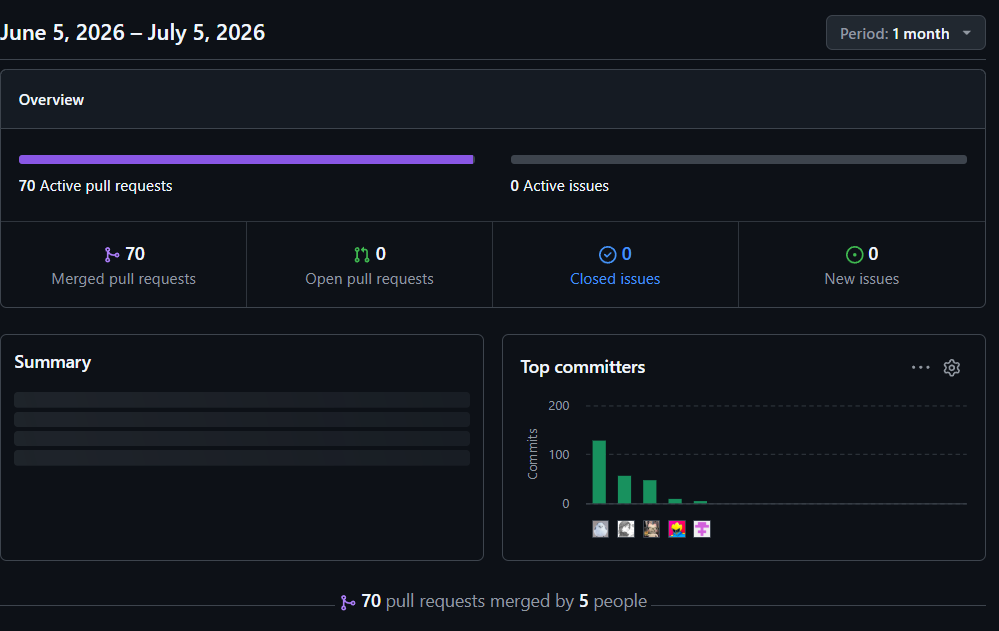

#### Frontend collaboration insights

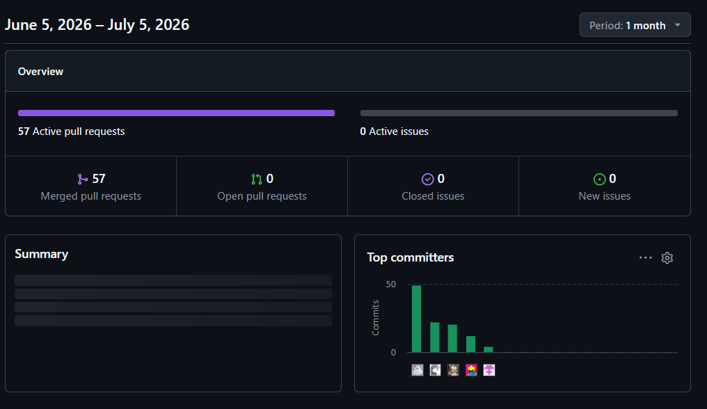


#### Sprint Review: Conclusiones y Recomendaciones del Sprint 4

**Conclusiones**

El Sprint 4 marcó el cierre del ciclo de vida del proyecto con la entrega de la versión final de OptiFlow como una plataforma multi-tenant, segura y desplegada en producción. La integración completa del módulo IAM —tanto en el backend (JWT, BCrypt, Google Sign-In, recuperación de contraseña) como en el frontend (login, registro, perfil, guards de sesión e interceptor de token)— eliminó la principal deuda técnica identificada en la retrospectiva del Sprint 3: la ausencia de autenticación real. Sobre esa base, la implementación del account scoping garantizó el aislamiento de datos entre ópticas, un requisito indispensable para operar como un verdadero producto SaaS.

Adicionalmente, se integró Stripe para el pago de suscripciones y se completó el cableado de datos reales entre el frontend y el backend, reemplazando los últimos valores simulados por información persistida y calculada en vivo (ítems de venta itemizados, depleción de stock al completar ventas, reportes analíticos en tiempo real). Con ello, los tres productos digitales —Landing Page, Web Application y Web Services— quedaron desplegados en su versión final sobre GitHub Pages y Azure.

**Recomendaciones**

Es importante precisar que el alcance real del Sprint se reorientó respecto a la planificación inicial: el equipo priorizó el cierre técnico del producto (integración IAM, multi-tenancy con account scoping, checkout de Stripe y cableado de datos reales) por encima de algunas correcciones de usabilidad planificadas. Se completaron la responsividad móvil (T73, T74) y la separación del tracker de pedido y el resumen de pago en My Lenses (T71), mientras que varias correcciones heurísticas quedaron pendientes o parcialmente resueltas.

- **Completar las correcciones heurísticas de mayor severidad que quedaron pendientes:** la alerta visual de fecha de entrega vencida en My Lenses (T67) y las tablas de valores numéricos accesibles bajo los gráficos del Dashboard (T69), ambas de severidad 3 y sin implementar al cierre del Sprint.
- **Consolidar los avances parciales de usabilidad:** hacer permanentemente visible el botón de avance del Kanban también en escritorio (T68, hoy visible solo en dispositivos táctiles), agregar texto de ayuda por campo en la Calculadora de Grosor (T70, hoy con guía general al pie) e incorporar imágenes de referencia reales de las monturas en el Virtual Try-On (T72, hoy con un catálogo de nombre/precio sin fotografías).
- **Endurecer la seguridad y consistencia de la integración:** enforcer los guards de ruta por rol en el frontend (actualmente el rol solo condiciona la redirección post-login), proteger el endpoint de checkout de Stripe (hoy sin autorización) y persistir en el backend la información de perfil del paciente que aún se guarda solo en `localStorage`.
- **Consolidar la suite de pruebas automatizadas** (unitarias y de integración) sobre los bounded contexts críticos, dado que la retrospectiva identificó la ausencia de pruebas como una oportunidad de mejora recurrente que habría prevenido varios de los errores corregidos durante el Sprint.
- **Reforzar la comunicación y la revisión del trabajo delegado** dentro del equipo, ya que la retrospectiva señaló que persistieron algunas fricciones de comunicación y delegaciones que no fueron revisadas antes de darse por cerradas.


## Validation Interviews

### Diseño de Entrevistas

Para las entrevistas se considerarán los siguientes factores. En primer lugar, el landing page será mostrado brevemente a ambos segmentos objetivos. En segundo lugar, se separarán los userflows que se usarán por segmento. En este caso, a los clientes/pacientes de ópticas se le mostrarán los userflows principales relacionados a el centro de pacientes al que pueden acceder. Por otro lado, al segmento de administradores de las ópticas, se les mostrará las funcionalidades más importantes que tiene la aplicación (Lab Orders, Sales and inventory). 

Para los clientes: US16, US34, US33

## Registro de Entrevistas

### Primer segmento: 
## Entrevista 1: 
Entrevistador: Mariana Morocho

Datos del entrevistado
- Nombre: Nicole
- Apellidos: Ortiz Salcedo
- Edad:29 años
- Distrito: Lima 
- Duración: 15:25
- Link de grabación: [Ver grabación aquí](https://upcedupe-my.sharepoint.com/:v:/g/personal/u202411521_upc_edu_pe/IQA2qWPjEv2fQ7jILC7LFXr_AWjcIse-NVqcwtASKwxt4-o?nav=eyJyZWZlcnJhbEluZm8iOnsicmVmZXJyYWxBcHAiOiJTdHJlYW1XZWJBcHAiLCJyZWZlcnJhbFZpZXciOiJTaGFyZURpYWxvZy1MaW5rIiwicmVmZXJyYWxBcHBQbGF0Zm9ybSI6IldlYiIsInJlZmVycmFsTW9kZSI6InZpZXcifX0%3D&e=1vV1zt)
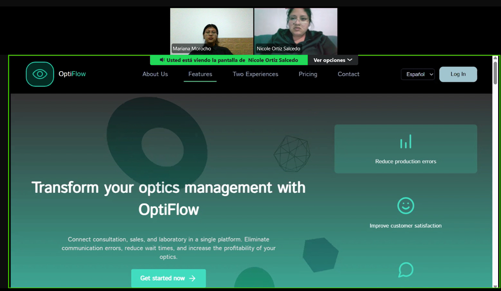
#### Resumen descriptivo: 

Durante la entrevista realizada a una profesional con experiencia en gestión de ventas dentro del sector óptico, se obtuvo una valoración positiva de la plataforma OptiFlow. La participante destacó que la solución presenta una estructura organizada y funcionalidades que facilitan la administración de pacientes, ventas, inventario y productividad del personal. Asimismo, resaltó como aspectos especialmente útiles la visualización del historial de pacientes, el registro de exámenes, la gestión de promociones y descuentos, el control de inventario y los indicadores de desempeño del personal, ya que permiten optimizar los procesos operativos y mejorar la toma de decisiones.

Por otro lado, la entrevistada sugirió algunas mejoras orientadas al análisis y gestión estratégica de la óptica. Entre ellas, recomendó incorporar un módulo de seguimiento de metas e indicadores de desempeño empresarial, un ranking de trabajadores con mejor rendimiento, reportes de ventas por categorías de productos para identificar tendencias de consumo y herramientas de filtrado más avanzadas para consultar información por meses específicos. Además, propuso una mejor organización de los comprobantes de pago, separando de forma más clara las boletas y facturas.


## Entrevista 2: 
Entrevistador: Mariana Morocho
Datos del entrevistado
- Nombre: Marcos
- Apellidos: Ruiz
- Edad: 52 años
- Distrito: Pimentel 
- Duración: 13:03
- Link de la entrevista: [Ver grabación aquí](https://upcedupe-my.sharepoint.com/:v:/g/personal/u202411521_upc_edu_pe/IQAMKl_uYoheTJuU7tB8N9SUAScnQWQXCDOMC87CQkeAV5A?nav=eyJyZWZlcnJhbEluZm8iOnsicmVmZXJyYWxBcHAiOiJTdHJlYW1XZWJBcHAiLCJyZWZlcnJhbFZpZXciOiJTaGFyZURpYWxvZy1MaW5rIiwicmVmZXJyYWxBcHBQbGF0Zm9ybSI6IldlYiIsInJlZmVycmFsTW9kZSI6InZpZXcifX0%3D&e=UeW3aJ)

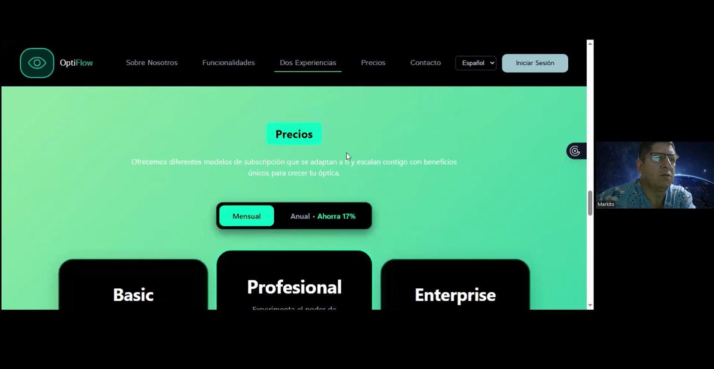

###

#### Resumen descriptivo: 

Durante la entrevista realizada a un optometrista, se obtuvo una evaluación favorable de la plataforma OptiFlow.Destacó que la presentación de la página es atractiva, los precios son accesibles en relación con las funcionalidades ofrecidas y la estructura general del sistema resulta adecuada para la gestión de una óptica. Asimismo, señaló que los módulos más relevantes para su labor diaria son pacientes, órdenes de laboratorio, inventario y ventas, considerando que la plataforma cubre de manera satisfactoria estos procesos.

En relación con el módulo de pacientes, el entrevistado indicó que la información mostrada es completa; sin embargo, recomendó incorporar una visualización más rápida de las refracciones o exámenes anteriores junto con los nuevos registros, ya que estos datos sirven como referencia importante durante la atención. Además, sugirió incluir un apartado específico para el historial clínico del paciente, donde se puedan registrar antecedentes relevantes y realizar un seguimiento más completo de cada caso.

Respecto al módulo de ventas, consideró que el flujo de trabajo es adecuado y fácil de utilizar, permitiendo relacionar rápidamente a los pacientes con los productos adquiridos y registrar las ventas de manera ordenada. Del mismo modo, validó la secuencia de estados del laboratorio, indicando que refleja correctamente el proceso operativo que se sigue en una óptica, desde la recepción de la orden hasta la entrega final al paciente.

## Entrevista 3: 
Entrevistador: Mariana Morocho

Datos del entrevistado
- Nombre: Liz
- Apellidos: Guevara
- Edad: 30 años
- Distrito: Tarapoto
- Duración: 14:27
- Link de la entrevista individual:  [Ver grabación aquí](https://upcedupe-my.sharepoint.com/:v:/g/personal/u202411521_upc_edu_pe/IQDlwA10IMBCSaO9r4zAfaiTAcFJfZkqFV1p1zeAQtIlJF0?nav=eyJyZWZlcnJhbEluZm8iOnsicmVmZXJyYWxBcHAiOiJTdHJlYW1XZWJBcHAiLCJyZWZlcnJhbFZpZXciOiJTaGFyZURpYWxvZy1MaW5rIiwicmVmZXJyYWxBcHBQbGF0Zm9ybSI6IldlYiIsInJlZmVycmFsTW9kZSI6InZpZXcifX0%3D&e=W79kDk) 

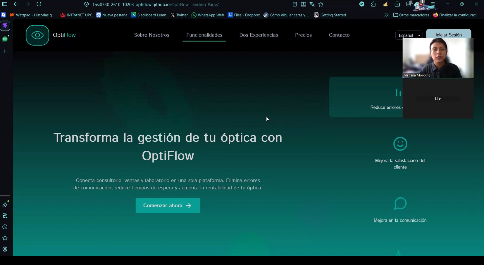

#### Resumen descriptivo: 

La entrevistada destacó que la plataforma presenta funcionalidades interesantes para la gestión de ópticas, especialmente en las áreas de control de órdenes de laboratorio, inventario y seguimiento de pacientes. Asimismo, consideró que la organización de la información y la estructura de los módulos facilitan el control de las operaciones diarias, principalmente en ópticas medianas y grandes que manejan un alto volumen de ventas y pacientes.

Respecto a la propuesta comercial, señaló que el precio puede resultar accesible para ópticas con mayor capacidad económica y flujo de clientes, pero podría representar una barrera para negocios pequeños. Por ello, recomendó evaluar estrategias comerciales o planes más atractivos que permitan ampliar el alcance de la plataforma a distintos tipos de ópticas y aumentar las posibilidades de adopción.

Durante la exploración del sistema, resaltó el valor del módulo de órdenes de laboratorio, indicando que la clasificación por estados permite llevar un control eficiente de los pedidos y mejorar la organización del trabajo. De igual forma, valoró positivamente el módulo de inventario, ya que facilita el monitoreo del stock disponible y la reposición de productos cuando es necesario.

Entre las mejoras sugeridas, recomendó desarrollar una versión adaptada para dispositivos móviles, debido a que muchas ópticas pequeñas utilizan principalmente teléfonos celulares para gestionar sus actividades diarias. Además, propuso incorporar una clasificación opcional de las monturas por material, como acetato, metal o titanio, con el fin de obtener un mejor control del inventario y facilitar la gestión de productos específicos.

### Segundo segmento

## Entrevista 1: 
Entrevistador: 
Datos del entrevistado
- Nombre: Adrián Geraldo
- Apellidos:  Huaman Villacorta
- Edad: 19
- Distrito: Santiago de Surco 
- Duración: 7:09
- Link de la entrevista individual: [Ver grabación aquí](https://upcedupe-my.sharepoint.com/:v:/g/personal/u202411310_upc_edu_pe/IQBigwiuvJsRS6m6QzLqMV9oAZb9HLy6r1C52q7KB-aSSno?nav=eyJyZWZlcnJhbEluZm8iOnsicmVmZXJyYWxBcHAiOiJTdHJlYW1XZWJBcHAiLCJyZWZlcnJhbFZpZXciOiJTaGFyZURpYWxvZy1MaW5rIiwicmVmZXJyYWxBcHBQbGF0Zm9ybSI6IldlYiIsInJlZmVycmFsTW9kZSI6InZpZXcifX0%3D&e=eYc4GK)


#### Resumen descriptivo:

Adrián es un joven cliente de óptica que participó en la sesión de validación como representante del segundo segmento objetivo de OptiFlow. Durante la entrevista exploró el portal de pacientes de la plataforma, recorriendo las funcionalidades disponibles para su perfil: consulta del estado de su pedido de lentes, revisión de su información de perfil, vista de notificaciones, probador virtual y el calculador de grosor.

A lo largo de toda la sesión, Adrián completó cada una de las tareas propuestas sin dificultad y sin necesitar asistencia del entrevistador. Navegó por los diferentes módulos del portal de forma fluida, orientándose con facilidad entre las secciones disponibles. Al consultar el estado de su orden encontró la información de manera inmediata, y al revisar su perfil de paciente no tuvo inconveniente alguno para ubicar sus datos ni para interpretar la estructura de la vista.

Al finalizar la entrevista, Adrián no presentó observaciones sobre problemas de usabilidad, navegación o comprensión visual en ninguna de las secciones recorridas. No identificó pasos innecesarios, elementos confusos ni fricciones en los flujos evaluados. En términos generales, su experiencia con la plataforma fue positiva desde el inicio: indicó que la interfaz le resultaba clara y que la información presentada era suficiente para entender qué hacer en cada pantalla sin necesidad de instrucciones adicionales. Su retroalimentación refleja que el portal de pacientes cumple con las expectativas de un usuario cliente que busca una experiencia directa y sin complicaciones para hacer seguimiento de su pedido.

## Entrevista 2: 
Entrevistador: Mía Capillo
Datos del entrevistado
- Nombre: Isabella Lourdes
- Apellidos: Martinez Parra
- Edad: 20
- Distrito: La Molina
- Duración: 7:37
- Link de la entrevista individual:  [Ver grabación aquí](https://upcedupe-my.sharepoint.com/:v:/g/personal/u20241c101_upc_edu_pe/IQApPY5nwro2RLhZqmgOMGY5ActxwZzwtF1MNl-cIUTcTeY?e=fum9gh&nav=eyJyZWZlcnJhbEluZm8iOnsicmVmZXJyYWxBcHAiOiJTdHJlYW1XZWJBcHAiLCJyZWZlcnJhbFZpZXciOiJTaGFyZURpYWxvZy1MaW5rIiwicmVmZXJyYWxBcHBQbGF0Zm9ybSI6IldlYiIsInJlZmVycmFsTW9kZSI6InZpZXcifX0%3D) 


Resumen descriptivo:
Durante la entrevista, Isabella exploró la landing page de manera autónoma. A través del análisis de la información presentada y de los elementos visuales, logró comprender el propósito general del producto sin necesidad de asistencia. Asimismo, destacó como especialmente atractivos los beneficios dirigidos a los pacientes, segmento del cual forma parte. Por otro lado, señaló que una sección de reseñas o testimonios sería un elemento relevante, ya que suele considerar las experiencias de otros usuarios al momento de evaluar y elegir un producto o servicio.

Al explorar el módulo de Probador Virtual, la participante identificó rápidamente su funcionalidad y navegó con facilidad por las distintas opciones disponibles. Consideró que se trata de una herramienta valiosa, principalmente por el ahorro de tiempo y recursos que representa al permitir una evaluación previa de manera práctica y accesible.

En relación con la Calculadora de Grosor, Isabella localizó y comprendió con rapidez el propósito de la sección. Valoró positivamente que la herramienta proporcione información referencial que sirva como guía para los usuarios. Sin embargo, mencionó que algunas de las terminologías empleadas resultan difíciles de comprender, lo que puede dificultar la interpretación de los resultados y requerir un mayor esfuerzo para entender la información presentada.

## Entrevista 3: 
Entrevistador: Luciana Mechan

Datos del entrevistado
- Nombre: Carla
- Apellidos: Gallardo Morales
- Edad: 19 años
- Distrito: La Molina
- Duración: 13:44
- Link de la entrevista individual:  [Ver grabación aquí](https://upcedupe-my.sharepoint.com/:v:/g/personal/u20241b843_upc_edu_pe/IQBLol40bDVYSr61kfRjDim4AdscP3hXfd_PKZw4FLNTK8w?e=wptacT&nav=eyJyZWZlcnJhbEluZm8iOnsicmVmZXJyYWxBcHAiOiJTdHJlYW1XZWJBcHAiLCJyZWZlcnJhbFZpZXciOiJTaGFyZURpYWxvZy1MaW5rIiwicmVmZXJyYWxBcHBQbGF0Zm9ybSI6IldlYiIsInJlZmVycmFsTW9kZSI6InZpZXcifX0%3D) 

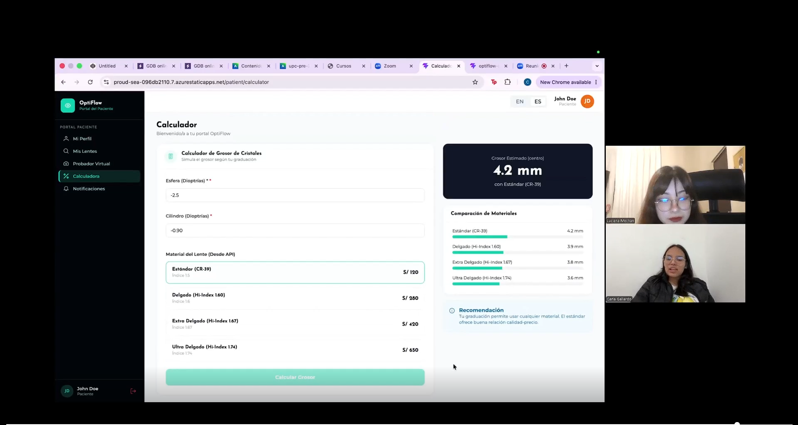

#### Resumen descriptivo: 
La participante exploró la landing page de forma autónoma, comprendiendo con claridad 
el propósito del producto a través de las secciones de características y beneficios. 
Identificó correctamente que OptiFlow es un sistema de gestión para ópticas con un 
portal orientado al cliente, y reconoció sin dificultad los beneficios que tendría 
como usuaria: evitar filas innecesarias y consultar el estado de sus lentes de forma 
remota. La sección de contacto le resultó intuitiva y fácil de localizar.

Al explorar el módulo de Mis Lentes, la participante navegó hacia la sección de forma 
inmediata y logró interpretar el tracker de estados, asociando los íconos en color 
turquesa con pedidos listos y los grises con pedidos en proceso. Sin embargo, señaló 
que la combinación del seguimiento del pedido y el estado de pago en una misma vista 
le generó confusión inicial, sugiriendo que ambas secciones deberían estar separadas. 
Adicionalmente, indicó que esperaría encontrar en el resumen de pago un detalle 
itemizado de los productos, similar a una boleta, con la descripción y el costo 
individual de cada componente del pedido. En cuanto al Virtual Try-On, comprendió 
correctamente el funcionamiento esperado de la herramienta, aunque señaló la ausencia 
de imágenes de referencia de los modelos de montura como una limitación, ya que no 
contaba con una referencia visual concreta del producto antes de activar la cámara.

En la tarea de la Calculadora de grosor, la participante localizó la sección sin 
inconvenientes, pero manifestó no comprender los términos "esfera" y "cilindro" al 
verlos sin contexto, indicando que necesitaría una explicación junto a cada campo 
para poder utilizarlos correctamente. Valoró positivamente la visualización de 
precios por material, reconociendo que es información relevante para ajustarse a un 
presupuesto. Finalmente, expresó interés en contar con una comparación visual del 
grosor entre materiales, más allá de los valores numéricos, para facilitar la 
comprensión de las diferencias entre opciones.

Enlace del video único de las entrevistas: [Ver grabación aquí](https://upcedupe-my.sharepoint.com/:v:/g/personal/u20241b843_upc_edu_pe/IQAO5qXfRglnQ4FqAduk84tTAVSZUoN9jBvadp3ScCEuuWI?e=u7b3hw&nav=eyJyZWZlcnJhbEluZm8iOnsicmVmZXJyYWxBcHAiOiJTdHJlYW1XZWJBcHAiLCJyZWZlcnJhbFZpZXciOiJTaGFyZURpYWxvZy1MaW5rIiwicmVmZXJyYWxBcHBQbGF0Zm9ybSI6IldlYiIsInJlZmVycmFsTW9kZSI6InZpZXcifX0%3D) 

## Evaluaciones según heurísticas
Carrera: Ingeniería de Software <br>
Curso:  Aplicaciones Web  
Sección: 10203  
Profesores:  
Auditor: BuildingFex <br>
CLIENTE(S): 
- Sebastian Martin Beingolea Montalvo - U202217853
- Villanueva Rodríguez Giuseppe Adrián - U20221c554
- Saul Ortega Muñoz - U20231c019
- Alejandro Manuel Jave Chang - U202312510
- Valentin Nicolas Medina Mamani - U202316829

#### Site o App a evaluar: OptiFlow

#### Nombre de App: OptiFlow

### Tareas a evaluar
El alcance de esta evaluación incluye la revisión de la usabilidad de las siguientes tareas:

1. Aprobación de una orden de laboratorio mediante el flujo de Control de 
   Calidad (QA)
2. Acceso al portal del paciente — Mis Lentes
3. Acceso al portal del paciente — Calculadora de grosor de lentes
4. Avance del estado de una orden de laboratorio en el tablero Kanban
5. Visualización del Dashboard principal con gráficos de gestión
6. Revisión de reportes de gestión (ventas, laboratorio y desempeño del personal) 

No están incluidas en esta versión de la evaluación las siguientes tareas:
1. Inicio de sesión como empleado del sistema
2. Registro de una nueva venta
3. Registro y edición de pacientes clínicos
4. Adición y edición de productos en el inventario
5. Gestión del personal (Staff)
6. Creación de nuevas órdenes de laboratorio
7. Configuración del sistema (roles y ajustes generales)
8. Acceso al portal del paciente — Mi Perfil
9. Acceso al portal del paciente — Virtual Try-On
10. Acceso al portal del paciente — Notificaciones
11. Exportación o descarga de datos del sistema

### ESCALA DE SEVERIDAD

Los errores serán puntuados tomando en cuenta la siguiente escala de severidad:

| Nivel | Descripción |
|---|---|
| 1 | Problema superficial: puede ser fácilmente superado por el usuario u ocurre con muy poca frecuencia. No necesita ser arreglado a no ser que exista disponibilidad de tiempo. |
| 2 | Problema menor: puede ocurrir un poco más frecuentemente o es un poco más difícil de superar para el usuario. Se le debería asignar una prioridad baja resolverlo de cara al siguiente release. |
| 3 | Problema mayor: ocurre frecuentemente o los usuarios no son capaces de resolverlos. Es importante que sean corregidos y se les debe asignar una prioridad alta. |
| 4 | Problema muy grave: un error de gran impacto que impide al usuario continuar con el uso de la herramienta. Es imperativo que sea corregido antes del lanzamiento. |

### TABLA RESUMEN

| # | Problema | Heurística/Principio violada(o) | Escala de Severidad |
|---|---|---|---|
| 1 | El modal de Control de Calidad no comunica al usuario por qué el botón "Aprobar" permanece deshabilitado | Usability: Visibilidad del estado del sistema | 2 |
| 2 | Los campos de la Calculadora usan terminología clínica sin contexto para el paciente, y el label del selector de material incluye texto técnico de desarrollo | Usability: Relación entre el sistema y el mundo real | 2 |
| 3 | La fecha de entrega estimada vencida no genera ninguna alerta visual para el paciente | Usability: Visibilidad del estado del sistema / Information Architecture: Is it credible? | 3 |

#### PROBLEMA #1: El modal de Control de Calidad no comunica al usuario por qué el botón "Aprobar" permanece deshabilitado

Severidad: 2
Heurística violada: Usabilidad — Visibilidad del estado del sistema

Problema: En el modal de Control de Calidad (QA), que se abre al intentar avanzar una orden de laboratorio de "Control de Calidad" a "Listo", el botón "Aprobar" permanece deshabilitado hasta que los 9 ítems del checklist hayan sido marcados como completos. No existe ningún texto de ayuda, tooltip, mensaje de progreso ni indicador que explique al usuario que debe completar todos los ítems del checklist para habilitar la acción.
Esto viola la heurística de Visibilidad del estado del sistema, que establece que la aplicación debe mantener siempre informado al usuario de lo que está ocurriendo. Si un usuario abre el modal y ve el botón gris sin instrucción clara, puede creer que hay un error del sistema o que no tiene permisos para aprobar, cuando en realidad simplemente falta completar los puntos del formulario.

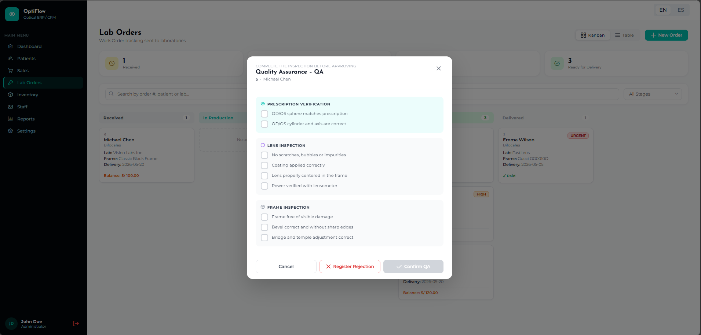

Recomendación: Agregar junto al botón "Aprobar" un indicador de progreso, por ejemplo "X de 9 ítems completados", que se actualice en tiempo real a medida que el usuario marca los checks. Adicionalmente, un tooltip sobre el botón deshabilitado que diga "Completa todos los ítems para aprobar" mejoraría significativamente la visibilidad del estado del sistema para el usuario.

#### PROBLEMA #2: Los campos de la Calculadora usan terminología clínica sin contexto para el paciente, y el label del selector de material incluye texto técnico de desarrollo

Severidad: 2

Heurística violada: Usabilidad — Relación entre el sistema y el mundo real

Problema: En la pantalla Calculadora del portal del paciente, los campos de entrada del formulario están etiquetados como "Sphere (Diopters)" y "Cylinder (Diopters)". Estos son términos de óptica clínica que el paciente promedio no reconoce de forma inmediata sin tener su receta a la mano. La sección explicativa ubicada al final de la pantalla ("What do the indices mean?") únicamente describe las diferencias entre los índices de material (1.50, 1.60, 1.67, 1.74) pero no incluye ninguna explicación de qué significa "esfera" ni dónde encontrar ese valor en la receta del paciente.

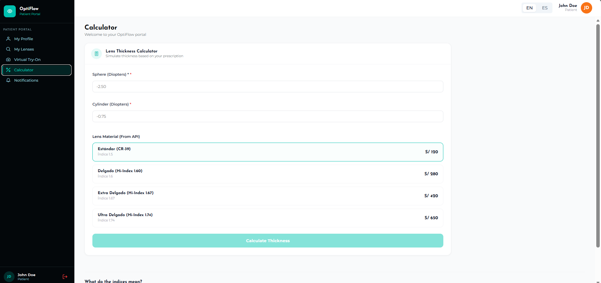

Recomendación: Agregar un texto de ayuda breve debajo de cada campo de prescripción, por ejemplo: "Encuéntralo en tu receta óptica. Ejemplo: -2.50"

#### PROBLEMA #3: La fecha de entrega estimada vencida no genera ninguna alerta visual para el paciente

Severidad: 3

Heurística violada: Usabilidad — Visibilidad del estado del sistema / Information Architecture: Is it credible?

Problema: En la pantalla My Lenses, el campo de fecha estimada de entrega se muestra siempre con el mismo estilo y el mismo ícono de reloj, sin importar si la fecha ya pasó. En el caso de LAB-0001, la fecha estimada es 2026-05-10 y la sesión de evaluación se realizó el 13 de junio de 2026, por lo que el pedido acumula más de un mes de retraso; sin embargo, la interfaz no ofrece ninguna señal visual de alerta: ni cambio de color, ni badge de "retrasado", ni mensaje al paciente. El código no realiza ninguna comparación entre order.estimatedDate y la fecha actual. Esto priva al paciente de información crítica sobre el estado real de su pedido y puede generar confusión o pérdida de confianza en el sistema.

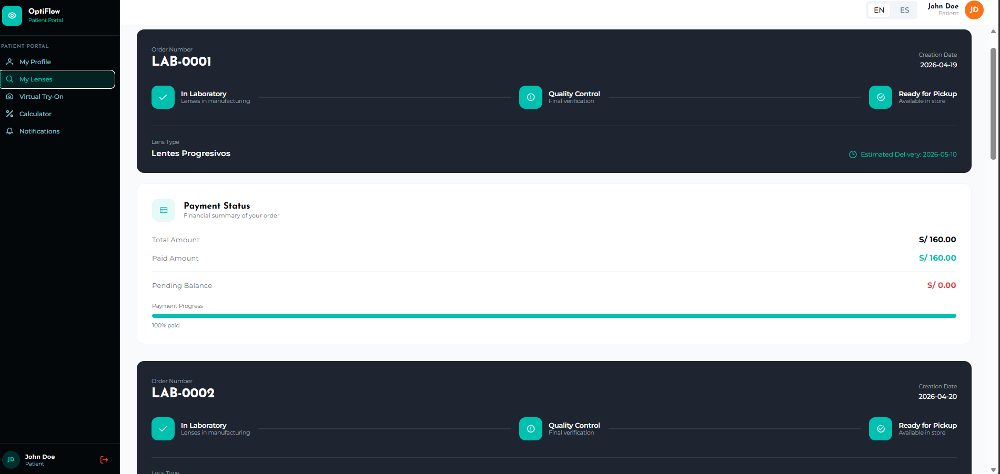

Recomendación: Mostrar el campo en rojo con un ícono de advertencia y un texto como "Delayed — estimated date has passed" si la fecha ya pasó y el pedido no está en estado DELIVERED. Esto también aplica a la heurística de IA "Is it credible?", que cuestiona si el contenido está actualizado y es confiable para el usuario.

### PROBLEMA #4: El botón de avance de estado en el tablero Kanban no es 
visible hasta que el usuario pasa el cursor sobre la tarjeta

**Severidad:** 3

**Heurística violada:** Usabilidad — Reconocer antes que recordar

**Problema:** En el tablero Kanban del módulo de Órdenes de Laboratorio, cada 
tarjeta de trabajo contiene una acción para avanzar el pedido al siguiente estado 
del flujo (por ejemplo, de "En Producción" a "Control de Calidad"). Sin embargo, 
esta acción no es visible en ningún momento mientras el usuario navega el tablero: 
solo aparece cuando el cursor se posiciona directamente sobre la tarjeta. Un usuario 
que ingrese por primera vez al módulo no tiene ninguna pista visual de que esa acción 
existe, lo que lo obliga a explorar la interfaz por ensayo y error para descubrirla.

Esto viola directamente la heurística de Reconocer antes que recordar, que establece 
que las acciones y opciones deben estar visibles en el momento apropiado para que el 
usuario no tenga que recordar información entre distintas partes de la aplicación. 
En un sistema ERP utilizado por múltiples empleados con distintos niveles de 
experiencia, ocultar la acción principal de una tarjeta genera fricción especialmente 
para usuarios nuevos, quienes no saben que deben "buscar" interacciones pasando el 
cursor. La frecuencia de uso de esta acción es alta, ya que avanzar el estado de los 
pedidos es la tarea central del módulo, lo que eleva la severidad del problema.

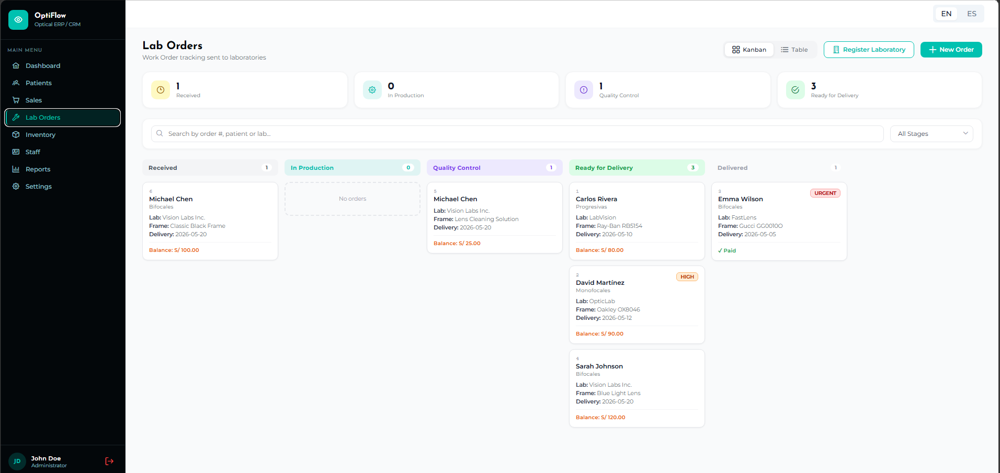

**Recomendación:** Mostrar el botón de avance de estado con visibilidad permanente 
dentro de la tarjeta, utilizando una opacidad reducida en reposo que aumente al hacer 
hover, o bien reubicando la acción como un elemento siempre visible en la parte 
inferior de la tarjeta. Otra alternativa es incluir la acción de avance dentro del 
modal de detalle de la orden, donde el flujo de estados ya está expuesto de forma 
explícita al usuario.


### PROBLEMA #5: Los gráficos del Dashboard no cuentan con ninguna 
alternativa de texto accesible para usuarios con discapacidad visual

**Severidad:** 3

**Heurística violada:** Inclusive Design — Proporciona experiencias comparables / 
Information Architecture: Is it accessible?

**Problema:** El Dashboard principal de OptiFlow presenta la información de gestión 
más crítica del sistema —tasa de conversión de los últimos meses e ingresos 
semanales— de forma exclusiva a través de visualizaciones gráficas: un gráfico de 
líneas y un gráfico de barras. No existe ninguna tabla de datos, resumen numérico 
ni descripción textual que acompañe a estas visualizaciones. Para un usuario que 
utilice lector de pantalla, o que presente algún tipo de discapacidad visual como 
visión disminuida o daltonismo, estos gráficos son completamente inaccesibles como 
fuentes de información, ya que su contenido no puede ser interpretado por tecnologías 
de asistencia.

Según el principio de Inclusive Design de Proporcionar experiencias comparables, la 
interfaz debe asegurar que todos los usuarios puedan realizar las mismas tareas de 
manera conveniente, sin pérdida de calidad en el contenido. Que la información de 
ingresos y conversión —datos críticos para la toma de decisiones del administrador— 
sea inaccesible para un segmento de usuarios constituye una brecha significativa. 
Esto también viola la heurística de IA "Is it accessible?", que cuestiona si el 
contenido puede consumirse en todos los canales y dispositivos esperados, incluyendo 
tecnologías de asistencia. Según la OMS (2016), el 20% de la población vive con 
algún tipo de condición especial, lo que hace relevante considerar este escenario 
incluso en un sistema ERP interno.

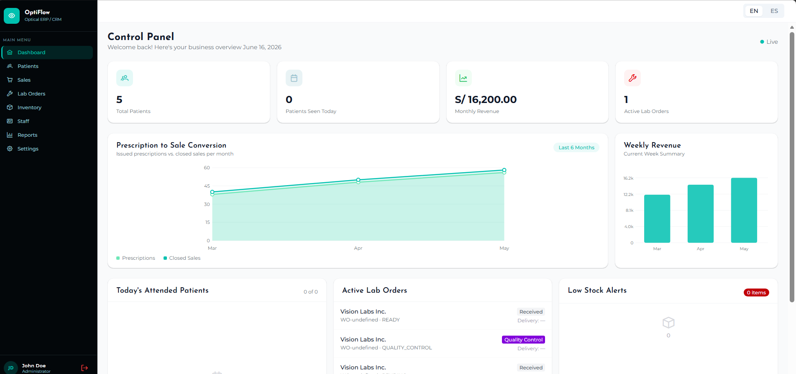

**Recomendación:** Agregar debajo de cada gráfico una sección con los valores 
numéricos principales presentados en formato de texto o tabla compacta, de modo 
que la información sea legible sin depender de la visualización. Esto beneficia 
tanto a usuarios con tecnologías de asistencia como a aquellos que prefieren 
leer cifras exactas en lugar de estimarlas visualmente en un gráfico.

## Video about the product

Link: https://upcedupe-my.sharepoint.com/:v:/g/personal/u202411310_upc_edu_pe/IQCyPNM0VCOYSZUO_Vr4WSBUAaESNK7ZTkJOEedmMZgOmWA?e=w1d7Dc&nav=eyJyZWZlcnJhbEluZm8iOnsicmVmZXJyYWxBcHAiOiJTdHJlYW1XZWJBcHAiLCJyZWZlcnJhbFZpZXciOiJTaGFyZURpYWxvZy1MaW5rIiwicmVmZXJyYWxBcHBQbGF0Zm9ybSI6IldlYiIsInJlZmVycmFsTW9kZSI6InZpZXcifX0%3D


## Conclusiones 

### Conclusiones y recomendaciones

La evaluación empírica de OptiFlow demuestra que centralizar la gestión 
clínica, logística y comercial elimina los silos de información y la pérdida 
de trazabilidad que saturan a las ópticas. Las entrevistas validaron las 
hipótesis del modelo Lean UX: la automatización del flujo de trabajo y de las 
notificaciones erradica la dependencia de canales informales, lo cual reduce 
drásticamente los costos por refabricación y mitiga la insatisfacción del 
paciente frente a las demoras. La entrega final del producto consolida un 
sistema completamente funcional con frontend y backend integrados y 
desplegados, cubriendo los bounded contexts de IAM, Clinical, Sales, Lab and 
Orders, Inventory, Subscription, Analytics y Patient Center. En conclusión, 
la plataforma resuelve la latencia sistémica y mejora significativamente la 
capacidad operativa y de conversión del negocio, constituyendo una solución 
viable y lista para su adopción en entornos reales de gestión óptica.

Como recomendaciones para iteraciones futuras del producto, se sugiere 
incorporar notificaciones push en tiempo real para mantener al paciente 
informado sobre el avance de su pedido sin necesidad de ingresar activamente 
a la plataforma. A nivel de experiencia de usuario, los hallazgos de la 
evaluación heurística indican que deben priorizarse mejoras en la visibilidad 
del estado del sistema, particularmente en el portal del paciente, donde la 
ausencia de alertas para pedidos retrasados y la falta de contexto en la 
calculadora de grosor representan oportunidades concretas de mejora. 
Finalmente, se recomienda integrar un módulo de inteligencia de negocios más 
robusto que permita a la gerencia acceder a métricas de rendimiento 
consolidadas y configurables, complementando los reportes actuales con 
capacidades de exportación y análisis comparativo por períodos.

## Bibliografía

DelveInsight. (2025). *Healthcare asset management: Optimizing resources for better patient care*. https://www.delveinsight.com/blog/healthcare-asset-management-for-better-patient-care

GE HealthCare. (s.f.). *Asset management in hospitals: The positive impact of tracking and keeping your monitor fleet up-to-date*. https://clinicalview.gehealthcare.com/article/asset-management-hospitals-positive-impact-tracking-and-keeping-your-monitor-fleet-date

Glasson. (2025). *Why some eye care pros still use paper records*. Glasson.app. https://www.glasson.app/blog/why-do-some-eye-care-professionals-still-hold-onto-paper-records-and-the-surprising-reasons-behind-it/

Glasson. (2026). *Why optometry software matters: Transforming your practice in 2026*. Glasson.app. https://www.glasson.app/blog/why-optometry-software-matters-transforming-your-practice-in-2026/

Gestión. (2025, enero 12). *Nuevo competidor del mercado de lentes llega a Perú: Triplicará inversión para 2025*. Diario Gestión. https://gestion.pe/economia/empresas/nuevo-competidor-del-mercado-de-lentes-llega-a-peru-triplicara-inversion-para-2025-opticas-miopia-noticia/

Infomercado. (2026, marzo 23). *Opticalia llega a Lima y proyecta sumar 300 asociados para competir en el retail óptico*. https://infomercado.pe/opticalia-llega-a-lima-y-proyecta-sumar-300-asociados-para-competir-en-el-retail-optico/

Informes de Expertos. (2026). *Mercado de gafas en Perú: Tamaño de la industria, participación, crecimiento, informe, análisis 2026–2035*. https://www.informesdeexpertos.com/informes/mercado-de-gafas-en-peru

Kivicare. (2024). *Medical error reduction: The role of electronic health records (EHRs)*. https://laravel.kivicare.io/the-impact-of-ehrs-on-reducing-medical-errors/

MedLaunch. (2026). *10 key patient wait time statistics clinics can't ignore*. https://medlaunch.health/blogs/medical-insights/patient-wait-time-statistics/

Modaengafas. (2026). *Opticalia fija en 50 ópticas su objetivo en Perú para 2026*. https://modaengafas.com/opticalia-fija-en-50-opticas-su-objetivo-en-peru-para-2026

The HIPAA Journal. (2025). *HIPAA compliance for optometrists and ophthalmology practices*. The HIPAA Journal. https://www.hipaajournal.com/hipaa-compliance-for-optometrists/

## ANEXO